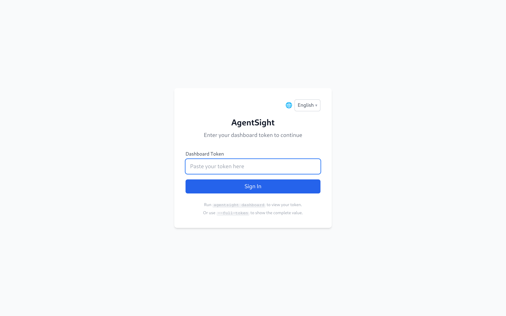
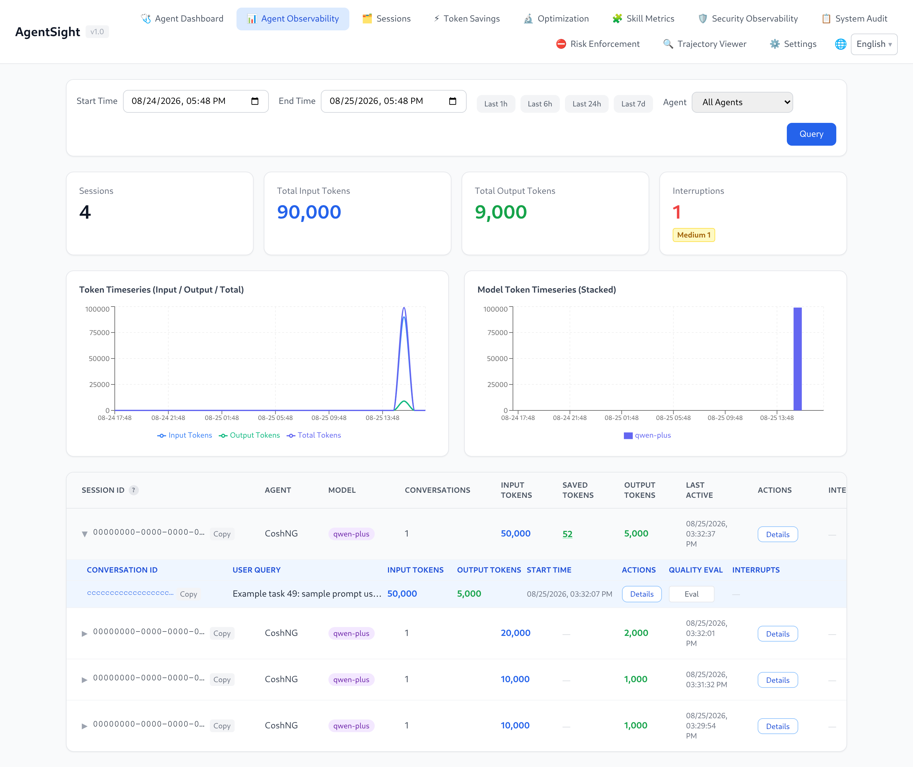
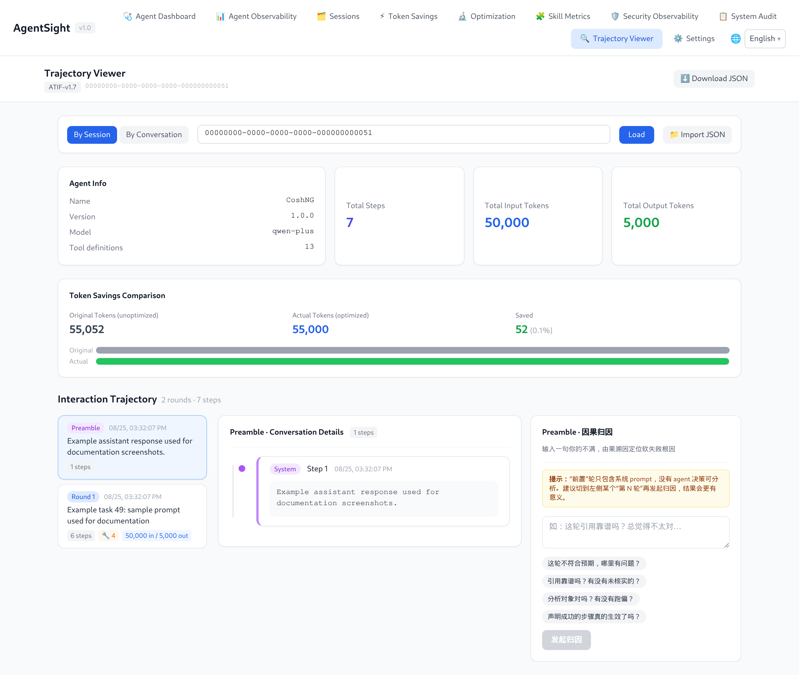

# AgentSight Quick Start

[中文版](../../../zh/agent-observability/agentsight/QUICKSTART.md)

This page takes you from an empty machine to a Dashboard showing your own Agent traffic.
The commands were verified on an Alibaba Cloud Linux 4 host (kernel 6.6) running AgentSight 0.11;
the sample output keeps the real layout but uses placeholder IDs and round numbers, so nothing you
see below is a real capture.

## 1. Check the prerequisites

```bash
uname -r                                  # kernel must be >= 5.8
ls /sys/kernel/btf/vmlinux                # BTF must exist
id -u                                     # tracing needs root (0) or CAP_BPF
```

If `/sys/kernel/btf/vmlinux` is missing, the kernel was built without BTF and the eBPF probes
cannot load. Use a kernel with `CONFIG_DEBUG_INFO_BTF=y`.

## 2. Install

```bash
# Recommended: system mode, because eBPF needs root
sudo anolisa install agentsight

# Alternative on Alibaba Cloud Linux / Anolis with the repo configured
sudo yum install agentsight

# Developers building from source
cd src/agentsight && make build-all
```

> Use `make build-all` for source builds. It builds the Dashboard frontend, the main binary, and
> `agentsight-enforcer` in that order. Plain `make build` skips the enforcer, and `serve` then logs
> `AgentSight enforcement unavailable` on every start.

## 3. Start the service

```bash
sudo systemctl enable --now agentsight.service
systemctl is-active agentsight.service
```

The packaged unit starts a supervisor that runs both workers: `agentsight trace` (eBPF capture)
and `agentsight serve --host 0.0.0.0` (API + Dashboard). It also pulls in
`agentsight-enforcer.service` when that package is installed.

Data is written to `/var/log/sysak/.agentsight` with a private umask, so CLI queries against
service-owned data need `sudo`.

## 4. Produce some traffic

AgentSight only records processes it recognises as Agents, so run an Agent task. Any supported
Agent works — cosh, Claude Code, Codex, Qwen Code, OpenClaw, Hermes, AgentScope. Example with
cosh-ng in headless mode:

```bash
cosh-core --headless --approval-mode trust "explain what load average means in one sentence"
```

Confirm the process was recognised while it runs:

```bash
$ sudo agentsight discover
已发现 AI Agent（共 1 个）:
============================================================

  CoshNG [PID: 10000]
    类别: custom
    命令:  /usr/libexec/anolisa/cosh-ng/cosh-shell ...

总计: 1 个 Agent
```

> `discover` and `token` print in Chinese regardless of locale. `token` has a `--json` flag for
> language-neutral output; `discover` does not, so parse its text or query `/api/agent-health` when
> you need machine-readable discovery data.

## 5. Check that data landed

```bash
$ sudo agentsight summary --last 24
AgentSight Summary (last 24h)

Sessions      10
  Tokens      100.0K in / 10.0K out / 110.0K total

Interruptions 1
  critical    0
  high        0
  medium      1
  low         0

Tokenless     10% saved (110.0K -> 99.0K, 20 ops)
```

`summary` is the fastest health check: sessions and Tokens, interruptions grouped by severity, and
Tokenless savings if that component is installed. Each data source degrades on its own — a missing
database contributes zeros instead of failing the whole report.

## 6. Open the Dashboard

```bash
$ sudo agentsight dashboard --no-open

AgentSight 仪表盘状态
=====================

  认证:    已启用
  本机:    http://127.0.0.1:7396 (无需认证)
  局域网:   http://192.168.1.10:7396/?token=<TOKEN>
  公网:    http://203.0.113.10:7396/?token=<TOKEN>
```

- From the same host, open `http://127.0.0.1:7396` — loopback access skips authentication.
- From your laptop, use the printed URL including `?token=…`, and make sure the firewall or
  security group allows TCP 7396.

Without a valid token the Dashboard shows the login screen:



Paste the token from `agentsight dashboard --no-open` and you land on the Agent Observability page.
It lists sessions with their Token totals and interruption badges; clicking a row expands the
conversations inside that session:



Use **Details** on any row to open the step-by-step trajectory of that session or conversation:



## 7. Know where things live

| Item | Path |
|---|---|
| Binary | `/usr/local/bin/agentsight` |
| Configuration | `/etc/agentsight/config.json` |
| Databases and Dashboard token | `/var/log/sysak/.agentsight/` |
| systemd units | `agentsight.service`, `agentsight-enforcer.service` |
| Default Dashboard port | 7396 |

## Next steps

- Your Agent is not detected → [Agent discovery rules](configuration.md#agent-discovery-rules)
- A task failed or hung → [Interruption detection](interruption-detection.md)
- You want every flag → [CLI reference](cli-reference.md)
- You want the Dashboard tour → [Dashboard guide](dashboard.md)
- Nothing shows up at all → [Troubleshooting](troubleshooting.md)
