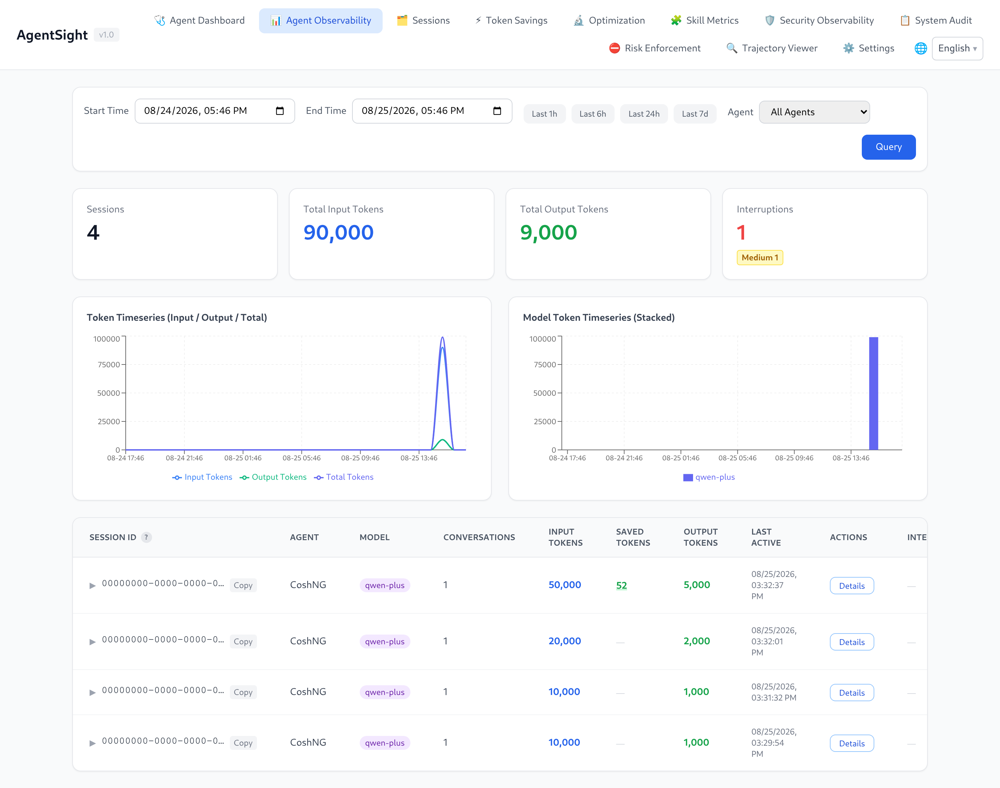

# AgentSight

[中文版](../../../zh/agent-observability/agentsight/README.md)

AgentSight is a zero-instrumentation observability tool for AI Agents. It attaches eBPF probes
to processes that are already running, so it records LLM calls, Token consumption, tool calls,
and session interruptions without any change to Agent code, prompts, or configuration.



## Start here

- [Quick start](QUICKSTART.md) — install, start tracing, produce the first session, open the Dashboard.
- [Dashboard guide](dashboard.md) — token access, page-by-page walkthrough.
- [CLI reference](cli-reference.md) — every command, flag, and real output.
- [Configuration](configuration.md) — config file, feature switches, Agent discovery rules.

## What you can do with it

| Goal | Read next |
|---|---|
| See which Agents are running and what they cost in Tokens | [Quick start](QUICKSTART.md) |
| Find out why an Agent task stalled, failed, or looped | [Interruption detection](interruption-detection.md) |
| Replay one session step by step (prompts, tool calls, results) | [Dashboard guide](dashboard.md#trajectory-viewer) |
| Add an Agent that AgentSight does not recognise yet | [Configuration](configuration.md#agent-discovery-rules) |
| Run it as a service, in a container, or on macOS | [Deployment](deployment.md) |
| Query data from scripts, Prometheus, or another system | [Data and storage](data-and-storage.md) |
| Combine it with Tokenless, agent-sec-core, or cosh | [Integrations](integrations.md) |
| Fix "no data", 401, or port problems | [Troubleshooting](troubleshooting.md) |

## Capabilities

| Capability | What it gives you |
|---|---|
| Zero-instrumentation capture | eBPF uprobes read plaintext from TLS calls; no SDK, proxy, or env var in the Agent |
| Agent auto-discovery | Recognises Agent processes by command line (cosh, Claude Code, Codex, Qwen Code, OpenClaw, Hermes, AgentScope, and custom rules) |
| Token accounting | Input/output/cached Tokens per Agent, session, conversation, and model |
| Session and conversation view | Sessions group conversations; each conversation keeps its LLM calls, messages, and tool calls |
| Interruption detection | 18 interruption types (crash, timeout, rate limit, context overflow, dead loop, tool failure, …) with severity and root-cause detail |
| Trajectory export | Any session, conversation, or trace exports as ATIF v1.7 JSON |
| Dashboard | Web UI with time-range filters, Token charts, latency percentiles, interruption badges, and per-step replay |
| Machine-readable output | `--json` on most commands, Prometheus `/metrics`, and a documented HTTP API |

## Requirements

| Requirement | Value |
|---|---|
| OS | Linux (x86_64); macOS runs a reduced trajectory-only mode |
| Kernel | >= 5.8 with BTF enabled |
| Privileges | root (or `CAP_BPF` + `CAP_PERFMON`) for `agentsight trace` |
| Install mode | system mode — eBPF needs root |
| Disk | A few hundred MB under `/var/log/sysak/.agentsight` (size-capped, see [Data and storage](data-and-storage.md)) |

> **macOS**: only `agentsight trace` (scans local Agent JSONL session files, no eBPF) and
> `agentsight serve` (Dashboard) are available. Every other command needs the Linux eBPF pipeline.

## How it works

```
Agent process ──TLS write/read──▶ eBPF uprobe ─┐
Agent process ──execve/exit─────▶ eBPF probe  ─┼─▶ parser ─▶ aggregator ─▶ analyzer
                                                │      (HTTP/SSE)   (req↔resp)   (tokens, audit)
                                                │                                     │
                                          ring buffer                                 ▼
                                                                    GenAI semantic events
                                                                              │
                                              ┌───────────────────────────────┼──────────────────┐
                                              ▼                               ▼                  ▼
                                      SQLite databases              interruption detector   external log export
                                              │                               │
                                              └────────▶ HTTP API + Dashboard ◀┘
```

Two processes do the work, and the packaged service starts both:

| Process | Role |
|---|---|
| `agentsight trace` | Loads eBPF probes, discovers Agents, writes events to SQLite (needs root) |
| `agentsight serve` | Serves the HTTP API and the Dashboard from the same SQLite databases |

Details: [ARCHITECTURE.md](../../../../../src/agentsight/docs/ARCHITECTURE.md) in the source tree.

## Terminology

| Term | Meaning |
|---|---|
| Session | One Agent run as the Agent itself identifies it (a `session_id` from the Agent, e.g. a cosh session) |
| Conversation | One request/response cycle inside a session, including its tool calls |
| Trace | One captured LLM HTTP call (request + streamed response) |
| Interruption | A detected abnormal end or stall of a conversation, with a type and a severity |
| Agent name | The label a discovery rule assigns to a process, e.g. `CoshNG`, `Claude`, `Codex` |
| Trajectory | A session or conversation exported in ATIF v1.7 format for replay or offline analysis |

## Install and first run

```bash
# system mode is required — eBPF needs root
sudo anolisa install agentsight

# start tracing and the Dashboard together
sudo systemctl enable --now agentsight.service

# print the Dashboard URL and access token
sudo agentsight dashboard --no-open
```

Full walkthrough with expected output: [Quick start](QUICKSTART.md).

## Reference pages

| Page | Content |
|---|---|
| [Quick start](QUICKSTART.md) | Install, verify capture, first Dashboard visit |
| [Dashboard guide](dashboard.md) | Authentication and all Dashboard pages |
| [CLI reference](cli-reference.md) | `trace`, `serve`, `dashboard`, `token`, `audit`, `discover`, `metrics`, `summary`, `interruption`, `skill-metrics` |
| [Configuration](configuration.md) | `config.json` schema, feature switches, runtime limits, discovery rules |
| [Interruption detection](interruption-detection.md) | The 18 interruption types and the triage workflow |
| [Deployment](deployment.md) | systemd, foreground, container/sidecar, macOS, upgrade, uninstall |
| [Data and storage](data-and-storage.md) | Databases, retention, HTTP API, Prometheus, ATIF export |
| [Integrations](integrations.md) | Tokenless, agent-sec-core, enforcer, cosh, Prometheus |
| [Troubleshooting](troubleshooting.md) | No data, 401, unreachable port, database growth |
