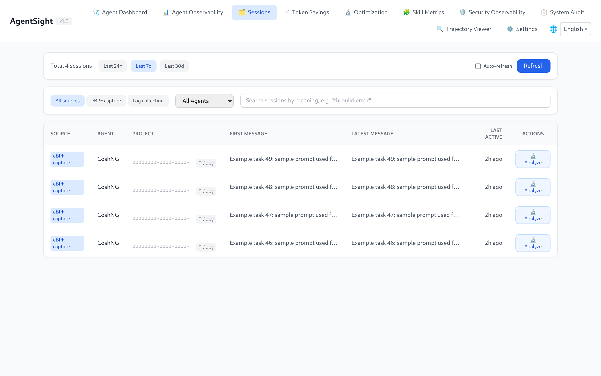
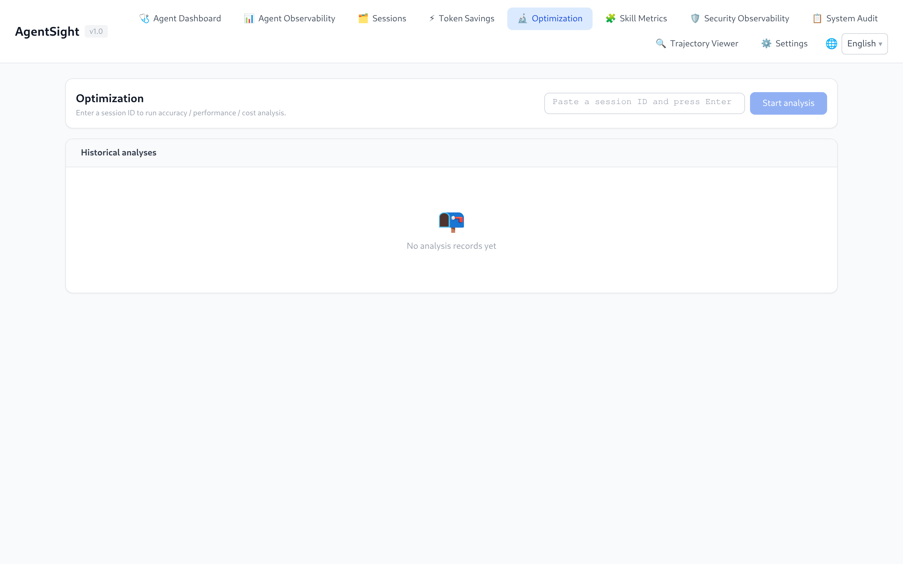
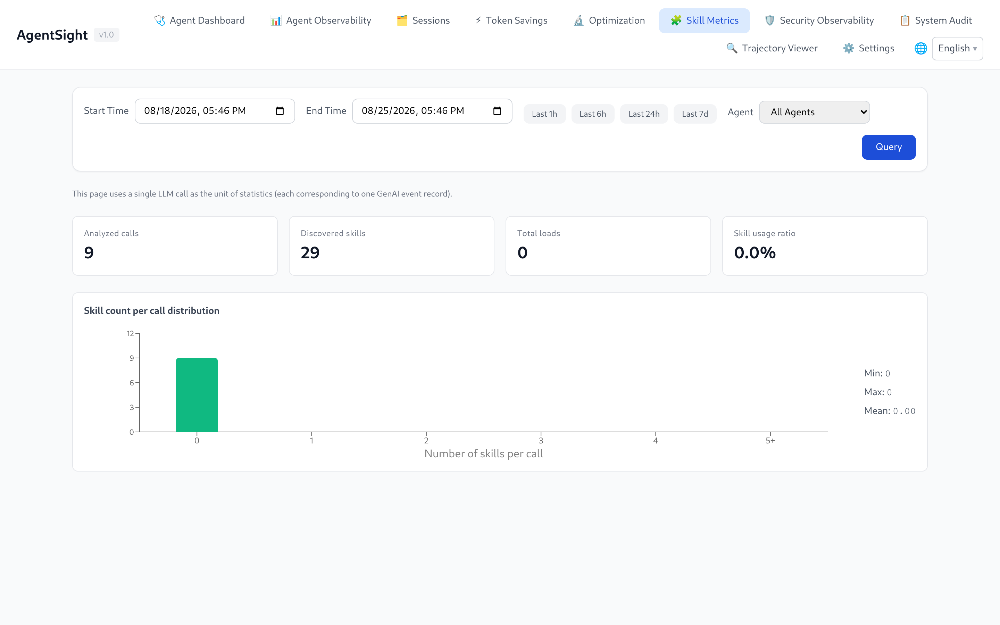
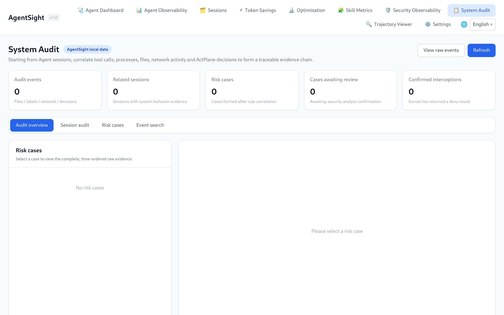
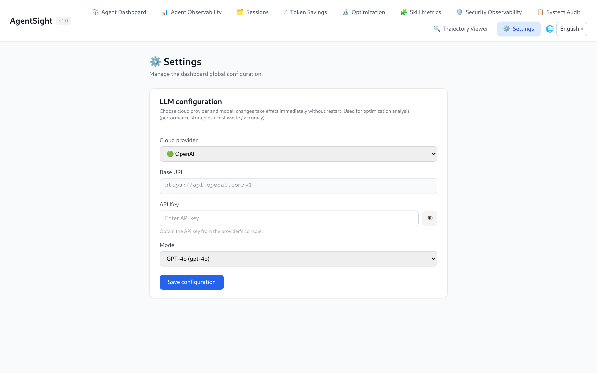

# AgentSight Dashboard Guide

[中文版](../../../zh/agent-observability/agentsight/dashboard.md)

The Dashboard is a web UI embedded in the `agentsight` binary. It reads the same SQLite databases
the tracer writes, so it needs no extra service. Default address: `http://127.0.0.1:7396`.

## Start it

```bash
# local only (default)
sudo agentsight serve

# reachable from other hosts
sudo agentsight serve --host 0.0.0.0 --port 7396
```

The packaged `agentsight.service` already runs `serve --host 0.0.0.0` alongside the tracer, so on a
normal install you only need to open the URL. Binding to `0.0.0.0` exposes the port on every
interface — restrict it in your firewall or cloud security group first.

## Authentication

Token authentication is on by default.

| Access path | What is required |
|---|---|
| `http://127.0.0.1:7396` from the same host | Nothing; loopback requests skip authentication |
| `http://<host>:7396` from elsewhere | The Dashboard token, as `?token=<TOKEN>` in the URL, as `Authorization: Bearer <TOKEN>`, or typed into the login form |


The token is generated on the first `serve` start (64 hex characters) and stored next to the
databases in `/var/log/sysak/.agentsight/.dashboard_token`. It is reused across restarts. Read it
with:

```bash
sudo agentsight dashboard --no-open
```

A successful login exchanges the token for an httpOnly session cookie, so you do not have to keep
the token in the URL.

To turn authentication off — only sensible on a trusted internal network:

```json
{ "server": { "auth": { "enabled": false } } }
```

```bash
sudo systemctl reload agentsight.service
```

> The login screen suggests `agentsight dashboard --full-token`. That flag does not exist in 0.11;
> `sudo agentsight dashboard --no-open` already prints the complete token.

## Navigation and page availability

The navigation bar only shows pages the host can actually serve. AgentSight probes for companion
components on every page load and reports the result through `GET /api/auth/status`:

| Page | Appears when |
|---|---|
| Agent Dashboard, Agent Observability, Sessions, Optimization, Skill Metrics, Trajectory Viewer, Settings | Always |
| Token Savings | `tokenless` is installed, or its statistics database exists |
| Security Observability, System Audit | `agent-sec-core` is installed (daemon or CLI) |
| Risk Enforcement | `agentsight-enforcer` is installed or its socket exists |

So a Dashboard that shows fewer entries than this guide is not broken — the matching component is
simply not installed.

Most pages share the same header: a start/end time range with `Last 1h / 6h / 24h / 7d` shortcuts,
an Agent filter, and a **Query** button. Pages that show cost or savings figures wait for you to
press **Query**; the observability pages load the last 24 hours immediately.

## Agent Dashboard

Live Agent health plus the interruption inbox: every unresolved event with its type, severity,
session, and conversation. **Resolve** closes an event, **Details** opens the captured evidence.
The latency panel switches between the last 24 hours, 7 days, and 30 days.


"No agents discovered" only means no Agent process is running right now; historical sessions stay
visible on the other pages.

## Agent Observability

The main analysis page: session count, input/output Tokens, interruption count by severity, Token
time series (total and per model), and the session table.


Click a session row to expand the conversations it contains. Each conversation row shows the user
query, its Tokens, an interruption badge, and a quality **Eval** action:


The `SAVED TOKENS` column is filled in when Tokenless is active for that session.

## Sessions

A session browser rather than a metrics page: filter by capture source (`eBPF capture` versus
`Log collection`), filter by Agent, or search sessions by meaning — the search uses the configured
optimization LLM to rank candidates by intent, e.g. "fix build error".



**Analyze** sends the session to the Optimization page.

## Token Savings

Compares actual Token consumption against the baseline Tokenless would have consumed, broken down by
optimization type, plus a savings ranking and concrete tips.


Press **Query** after choosing a range; the page starts empty on purpose. Setup:
[Integrations](integrations.md#tokenless-token-savings).

## Optimization

Runs LLM-assisted analysis over one session in six dimensions: `perf`, `perf-issues`, `cost`,
`cost-waste`, `accuracy`, and `summary`. Analyses need an LLM configured on the Settings page and
take roughly 10–60 seconds; results are stored, so the page also lists earlier runs.



## Skill Metrics

Skill adoption computed on demand from GenAI events: analyzed calls, discovered Skills, load counts,
usage ratio, per-call distribution, and a weekly hotness ranking. The unit of counting is one LLM
call.



## Security Observability and System Audit

Present when agent-sec-core is installed. Security Observability shows scan verdicts (prompt
injection, PII, code scanning) per session and run; System Audit aggregates audit events into cases
you can review and, with the enforcer present, contain.



## Trajectory Viewer

Loads any session or conversation as an ATIF v1.7 trajectory: Agent metadata, step and Token totals,
Tokenless comparison, and the full interaction timeline — system preamble, each round, tool calls,
and results. **Download JSON** exports the trajectory; **Import JSON** replays one captured
elsewhere.


This is the page to open when you need to know exactly what the Agent sent and received.

## Settings

Configures the LLM used by the optimization and semantic-search features (provider, base URL, model,
API key). The key is masked when read back and stored in `optimization_config.json` next to the
databases.



## Language

The UI follows the browser language and offers a manual switch in the top-right corner; the choice
persists across reloads.

## Query the API instead

Everything on these pages comes from the HTTP API, and the route list is served by the API itself:

```bash
curl -s http://127.0.0.1:7396/api/docs | python3 -m json.tool | head -30

# remote access needs the token
curl -s -H "Authorization: Bearer $TOKEN" http://<host>:7396/api/sessions
```

See [Data and storage](data-and-storage.md#http-api) for the endpoint groups.

## Related pages

- [Interruption detection](interruption-detection.md) — what the badges mean
- [Configuration](configuration.md#dashboard-authentication) — authentication switch
- [Troubleshooting](troubleshooting.md) — 401, unreachable port, empty pages
