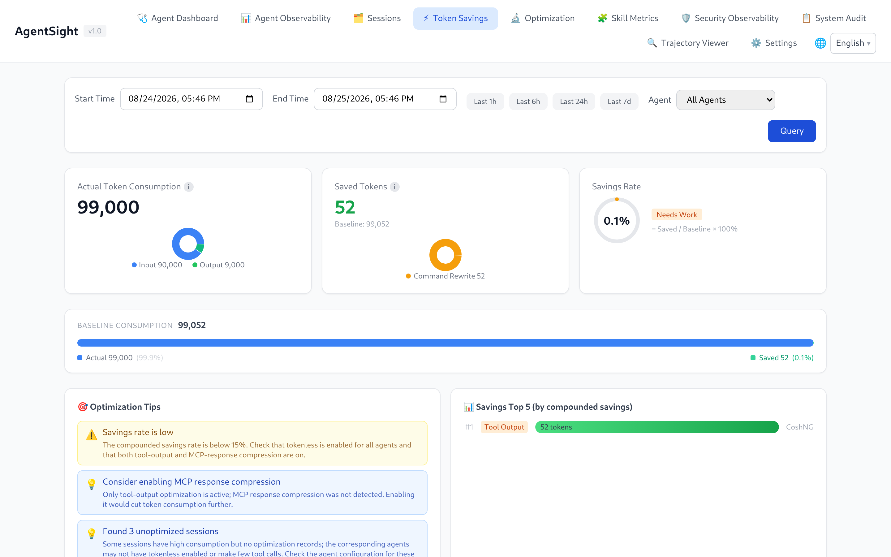

# AgentSight Integrations

[中文版](../../../zh/agent-observability/agentsight/integrations.md)

AgentSight observes Agents without being wired into them, and it shows data from the other ANOLISA
components when they happen to be installed. Nothing on this page is required to use AgentSight.

## Supported Agents

Any process matched by a discovery rule is traced. The shipped rule set (31 rules) covers:

| Agent | Reported name |
|---|---|
| cosh (Copilot Shell) | `Cosh` |
| cosh-ng (`cosh-shell`, `cosh-core`, `cosh-cli`) | `CoshNG` |
| Claude Code | `Claude` |
| Codex CLI | `Codex` |
| Qwen Code | `QwenCode` |
| OpenClaw (gateway) | `OpenClaw` |
| Hermes | `Hermes` |
| AgentScope | `AgentScope` |
| Runloop Node server | `Runloop` |

Anything else works too — add a rule, as described in
[Agent discovery rules](configuration.md#agent-discovery-rules). Two details worth knowing:

- **OpenClaw** is observed through its `openclaw-gateway` daemon, not the client. If Token data is
  missing, check that the client actually reaches the gateway.
- **Codex CLI** statically links its TLS library, so AgentSight falls back to byte-pattern matching
  and a per-version offset table. A brand-new Codex release may need a refreshed entry in
  `codex_offsets`.

## Tokenless: Token savings

With [Tokenless](../../token-saving/tokenless/QUICKSTART.md) installed, AgentSight shows how many
Tokens compression actually saved — no configuration on either side:

- the Token Savings page compares actual consumption against the baseline, by optimization type;
- the `SAVED TOKENS` column appears next to each session on the Agent Observability page;
- the Trajectory Viewer shows original versus optimized Tokens for the loaded session;
- `agentsight summary` includes a savings line;
- `GET /api/token-savings` exposes the same numbers.



The page reads Tokenless's own statistics database, so numbers appear only after Tokenless has
optimized something. A savings figure of 0 usually means Tokenless is installed but not active for
the Agent that produced those sessions.

## agent-sec-core: security observability and audit

When [agent-sec-core](../../agent-security/agent-sec-core/QUICKSTART.md) is installed, two more
Dashboard pages appear:

| Page | Content |
|---|---|
| Security Observability | Prompt-injection, PII, and code-scan verdicts per session and per run |
| System Audit | Audit events aggregated into cases you can review, and contain when the enforcer is present |

AgentSight detects the component by its daemon socket or its CLI binary, so the pages stay reachable
even while the daemon restarts.

One side effect worth knowing: agent-sec-core and Tokenless hooks run as short-lived helper
processes, and AgentSight records those too. They can dominate `agentsight audit` output — filter
them out with repeated `--exclude`:

```bash
sudo agentsight audit --last 1 --exclude agent-sec-cli --exclude observability_hook.py
```

## agentsight-enforcer: risk enforcement

`agentsight-enforcer` is the privileged daemon that can block risky Agent actions. It ships with the
package and is started by `agentsight-enforcer.service`. When its socket
(`/run/agentsight/enforcer.sock`) is missing, `serve` logs:

```
AgentSight enforcement unavailable: enforcer I/O failed: No such file or directory (os error 2)
```

Capture and analysis are unaffected; only the Risk Enforcement page and the
`/api/enforcement/*` endpoints disappear. Start the unit, or build with `make build-all` if you
built from source.

## cosh: ask in natural language

AgentSight ships a conversational Skill for cosh, so Token and audit questions can be asked in the
terminal instead of through the CLI:

- "How many Tokens did I use today?"
- "Show me today's LLM calls"
- "Were there any interruptions in the last hour?"

## Prometheus and Grafana

```bash
curl -s http://127.0.0.1:7396/metrics
```

`/metrics` is loopback-only by design. Scrape it with a node-local Prometheus agent (or a local
reverse proxy) using the counters `agentsight_token_input_total`, `agentsight_token_output_total`,
`agentsight_token_total_total`, and `agentsight_llm_requests_total`, all labelled by `agent`.

For richer panels, poll the JSON API instead — `/api/timeseries` for Token trends,
`/api/metrics/latency` for latency percentiles, `/api/interruptions/count` for open problems.

## Trajectories for offline analysis

`GET /api/export/atif/session/{id}` returns an ATIF v1.7 trajectory containing prompts, tool calls,
results, and Token totals. Use it to feed evaluation pipelines, attach a reproduction to a bug
report, or import the session into another AgentSight instance through the Trajectory Viewer.

## Related pages

- [Configuration](configuration.md) — add rules for your own Agent
- [Dashboard guide](dashboard.md#navigation-and-page-availability) — which pages appear when
- [Data and storage](data-and-storage.md#http-api) — API details
