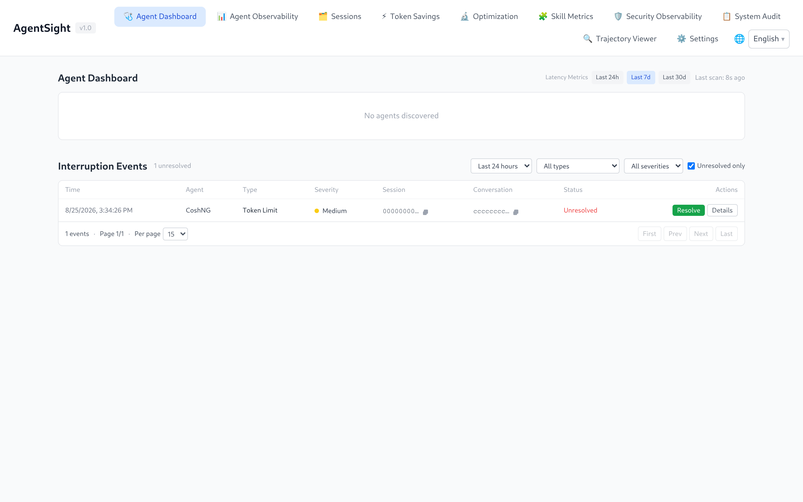

# Interruption Detection

[中文版](../../../zh/agent-observability/agentsight/interruption-detection.md)

An "interruption" is AgentSight's term for a conversation that did not end the way it should:
an error from the model provider, a stream that stopped mid-answer, an Agent that crashed, or an
Agent that keeps calling the same tool without making progress. AgentSight labels each one with a
type, a severity, and the evidence it was derived from, so you can go from "the Agent got stuck" to
"which call failed and why" without reading raw logs.

Detection is on by default (`features.interruption_detection.enabled`).

## Where the signals come from

| Source | What it detects |
|---|---|
| Captured LLM calls | HTTP status codes, error bodies, `finish_reason`, missing output, call duration |
| Cross-call analysis inside one conversation | Repeated tool sequences, repeated similar answers, Token burn without progress, repeated identical errors |
| Process health checks | Agent processes that disappear or hang mid-session |
| `dmesg` scan at startup | OOM kills that happened while AgentSight itself was down |

Because everything is derived from traffic AgentSight already captures, no Agent-side change is
needed to enable any of it.

## Interruption types

18 types, each with a default severity:

| Type | Default severity | Triggered when |
|---|---|---|
| `agent_crash` | critical | The Agent process disappears mid-session, or a `dmesg` scan shows it was OOM-killed (`oom: true` in the detail) |
| `dead_loop` | critical | Cross-call analysis finds a loop (see [Dead-loop handling](#dead-loop-handling)) |
| `retry_storm` | critical | The same error type repeats at least 5 times within one conversation |
| `auth_error` | high | HTTP 401/403, or an error body mentioning `invalid_api_key` / `unauthorized` |
| `network_timeout` | high | HTTP 408/504, or a gateway-level timeout error |
| `service_unavailable` | high | HTTP 502/503, or an error body mentioning `overloaded` / `service_unavailable` |
| `context_overflow` | high | `context_length_exceeded` or a comparable context-bound error |
| `sse_truncated` | high | A streamed response ends without a normal `finish_reason` and the call lasted at least 1 second |
| `empty_response` | high | HTTP 200 with no output messages and no error |
| `resource_exhaustion` | high | HTTP 402, or an error body about quota / billing limits (distinct from per-minute rate limiting) |
| `state_machine_error` | high | Malformed provider response or an invalid Agent state transition |
| `llm_error` | high | Fallback for any other HTTP status >= 400 |
| `rate_limit` | medium | HTTP 429 or an error containing `rate_limit` |
| `token_limit` | medium | `finish_reason = length` and output Tokens >= 95% of `max_tokens` |
| `safety_filter` | medium | `finish_reason = content_filter` from the provider's safety policy |
| `slow_response` | medium | The call succeeded but took at least 120 seconds |
| `tool_failure` | medium | A tool or function result reports failure |
| `unauthorized_action` | medium | A tool call was denied by a permission system or sandbox (`EPERM`, `EACCES`, sandbox denial) |

`llm_error` is the lowest-priority match, so a call that fits a specific type is never reported as
the generic one.

## Severity

| Severity | Weight | Meaning in practice |
|---|---|---|
| `critical` | 4 | The Agent cannot finish the task, or it is burning Tokens with no progress |
| `high` | 3 | The current conversation failed; a retry may succeed |
| `medium` | 2 | The answer was degraded or truncated, or one tool call failed |
| `low` | 1 | Informational |

Severity is a property of the type, so it is comparable across Agents and hosts.

## Triage workflow

### 1. How many, how bad

```bash
$ sudo agentsight interruption count --last 24
Unresolved interruptions (last 24 hour(s)):

  Total:    1
  Critical: 0
  High:     0
  Medium:   1
  Low:      0
```

### 2. Which kinds

```bash
$ sudo agentsight interruption stats --last 48
TYPE                 SEVERITY    COUNT
----------------------------------------
token_limit          medium          1
```

### 3. Which events

```bash
$ sudo agentsight interruption list --last 24
INTERRUPTION_ID                    TYPE          SEVERITY  OCCURRED_AT              RESOLVED  AGENT    SESSION_ID
------------------------------------------------------------------------------------------------------------------
11111111222222223333333344444444   token_limit   medium    2026-01-01 12:00:00.000  no        CoshNG   00000000-11...

Total: 1 event(s)
```

Useful filters: `--severity critical`, `--agent CoshNG`, `--unresolved`, `--limit`, `--json`.

All IDs shown in this page's examples are placeholders — use the ones from your own output.

> `--type` accepts every interruption type in this page's table. `agentsight interruption list
> --help` prints the exact set of accepted values.

### 4. What exactly happened

```bash
$ sudo agentsight interruption get 11111111222222223333333344444444
Interruption Event Detail
============================================================
  ID:           11111111222222223333333344444444
  Type:         token_limit
  Severity:     medium
  Occurred At:  2026-01-01 12:00:00.000 (1767268800000000000ns)
  Resolved:     no
  Session ID:   00000000-1111-2222-3333-444444444444
  Conversation: aaaaaaaabbbbbbbbccccccccdddddddd
  Trace ID:     chatcmpl-00000000-1111-2222-3333-444444444444
  PID:          10000
  Agent:        CoshNG
  Detail:
{
  "model": "qwen-plus",
  "output_tokens": 4096,
  "max_tokens": 4096,
  "ratio": 1.0
}
```

The `Detail` block is type-specific: the ratio for `token_limit`, the duration and threshold for
`slow_response`, the repeated tool signature for `dead_loop`, `oom: true` for an OOM-killed Agent.

### 5. See it in context, then close it

Use the session or conversation ID to pull the full picture, then open that session in the Dashboard's
Trajectory Viewer to read the actual messages:

```bash
sudo agentsight interruption session 00000000-1111-2222-3333-444444444444
sudo agentsight interruption conversation aaaaaaaabbbbbbbbccccccccdddddddd
sudo agentsight interruption resolve 11111111222222223333333344444444
```

Resolving only marks the event as handled; it never deletes data.

## In the Dashboard

The Agent Dashboard page is the interruption inbox: filter by time range, type, severity, and
"unresolved only", then use **Resolve** or **Details** on each row.



Interruption counts also appear as badges next to sessions and conversations on the Agent
Observability page, so you can see which session a problem belongs to before opening it:


## Dead-loop handling

Dead loops are detected by comparing calls inside one conversation, using three rules:

| Rule | Default threshold |
|---|---|
| The same tool sequence (tool name + argument fingerprint) repeats | 5 consecutive calls |
| Similar model output repeats (Jaccard similarity) | 3 consecutive outputs above 0.85 similarity |
| Input Tokens keep growing while output stays the same | Token burn without progress |

The comparison window is the last 10 calls. Identical tool names with different arguments do not
count as a loop, so a terminal tool running different commands is not flagged.

AgentSight reports dead loops out of the box. It can also stop them, which is off by default:

```json
{ "deadloop": { "enabled": true, "kill_after_count": 3 } }
```

With this enabled, the ladder is: below the threshold nothing happens, at the threshold the Agent
process receives `SIGTERM`, and any further detection escalates to `SIGKILL`.

Keep it off in production and on shared or multi-tenant hosts: AgentSight signals the matched process
directly, so a false positive terminates live work, and one Agent's loop can take down a process
other tenants depend on. Detection and reporting run regardless, so the safe pattern on those hosts
is to alert on `dead_loop` events and let an operator decide. Enable auto-stop only where a killed
Agent is acceptable — isolated test machines, single-tenant batch runners, or a control plane whose
Agents are restartable.

## Retention and size

```json
"features": {
  "interruption_detection": {
    "enabled": true,
    "retention_days": 30,
    "max_db_size_mb": 100
  }
}
```

Events live in `/var/log/sysak/.agentsight/interruption_events.db`. Older events are purged after
`retention_days`, and the database is trimmed when it exceeds `max_db_size_mb`.

## API access

```bash
TOKEN=$(sudo cat /var/log/sysak/.agentsight/.dashboard_token)
BASE=http://127.0.0.1:7396

curl -s "$BASE/api/interruptions?limit=20"
curl -s "$BASE/api/interruptions/count"
curl -s "$BASE/api/interruptions/stats"
curl -s "$BASE/api/interruptions/session-counts"
curl -s -X POST "$BASE/api/interruptions/11111111222222223333333344444444/resolve"
```

`count` and `stats` always report unresolved events only. Add
`-H "Authorization: Bearer $TOKEN"` for non-loopback access.

## Related pages

- [CLI reference](cli-reference.md#agentsight-interruption) — every flag
- [Dashboard guide](dashboard.md#agent-dashboard) — the inbox UI
- [Configuration](configuration.md#dead-loop-auto-stop) — detection and auto-stop switches
