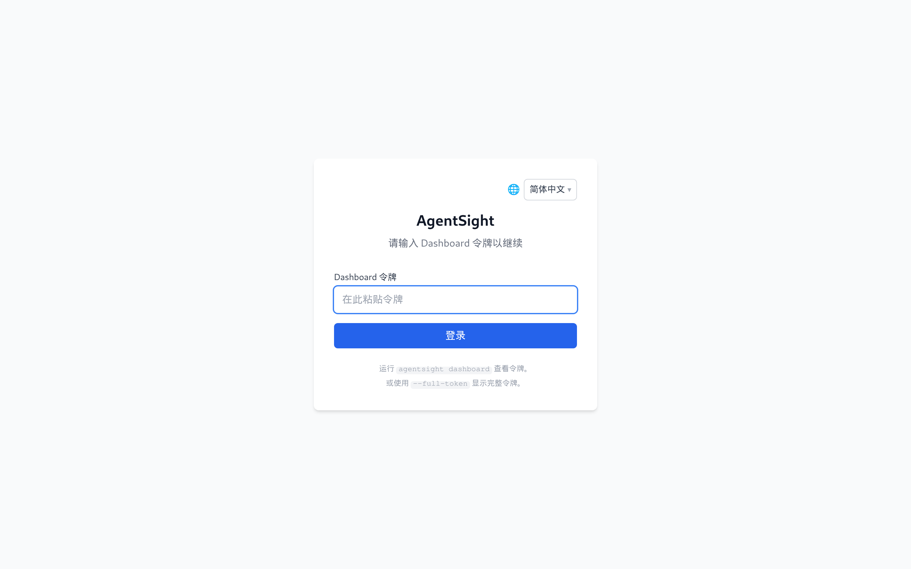
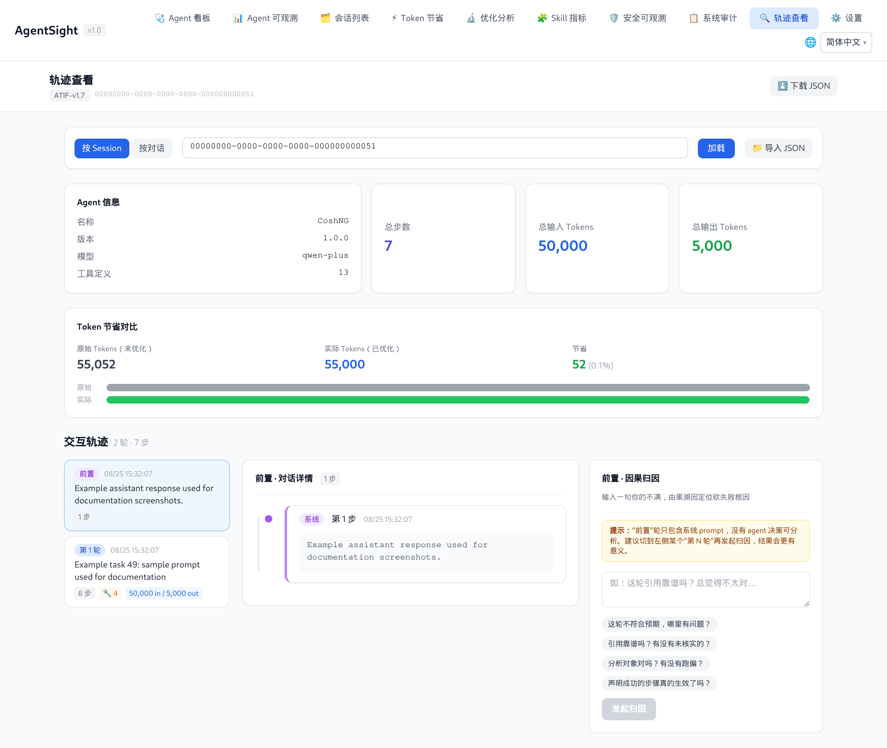

# AgentSight 快速开始

[English](../../../en/agent-observability/agentsight/QUICKSTART.md)

这一页带你从一台空机器走到「Dashboard 上能看到自己的 Agent 流量」。下面的命令在一台 Alibaba Cloud
Linux 4（内核 6.6）主机上以 AgentSight 0.11 验证过；示例输出保留了真实的排版格式，但 ID 一律用占位
值、数字一律取整，因此你看到的都不是真实采集结果。

## 1. 检查前置条件

```bash
uname -r                                  # 内核必须 >= 5.8
ls /sys/kernel/btf/vmlinux                # BTF 必须存在
id -u                                     # 追踪需要 root（0）或 CAP_BPF
```

如果 `/sys/kernel/btf/vmlinux` 不存在，说明内核编译时没开 BTF，eBPF 探针无法加载，需要换用带
`CONFIG_DEBUG_INFO_BTF=y` 的内核。

## 2. 安装

```bash
# 推荐：system 模式，因为 eBPF 需要 root
sudo anolisa install agentsight

# 已配置仓库的 Alibaba Cloud Linux / Anolis 也可以
sudo yum install agentsight

# 开发者从源码构建
cd src/agentsight && make build-all
```

> 源码构建请用 `make build-all`，它会依次构建 Dashboard 前端、主二进制和 `agentsight-enforcer`。
> 只跑 `make build` 会跳过 enforcer，之后每次启动 `serve` 都会打印
> `AgentSight enforcement unavailable`。

## 3. 启动服务

```bash
sudo systemctl enable --now agentsight.service
systemctl is-active agentsight.service
```

安装包里的 unit 会启动一个守护脚本，同时拉起两个工作进程：`agentsight trace`（eBPF 采集）和
`agentsight serve --host 0.0.0.0`（API + Dashboard）；如果装了 enforcer 包，它还会顺带拉起
`agentsight-enforcer.service`。

数据写入 `/var/log/sysak/.agentsight`，且使用私有 umask，因此查询服务产生的数据需要 `sudo`。

## 4. 产生一些流量

AgentSight 只记录被识别为 Agent 的进程，所以要先跑一个 Agent 任务。cosh、Claude Code、Codex、
Qwen Code、OpenClaw、Hermes、AgentScope 都可以。下面用 cosh-ng 的 headless 模式举例：

```bash
cosh-core --headless --approval-mode trust "用一句话说明 Linux 中 load average 的含义"
```

趁进程还在跑，确认它被识别到了：

```bash
$ sudo agentsight discover
已发现 AI Agent（共 1 个）:
============================================================

  CoshNG [PID: 10000]
    类别: custom
    命令:  /usr/libexec/anolisa/cosh-ng/cosh-shell ...

总计: 1 个 Agent
```

## 5. 确认数据落库

```bash
$ sudo agentsight summary --last 24
AgentSight Summary (last 24h)

Sessions      10
  Tokens      100.0K in / 10.0K out / 110.0K total

Interruptions 1
  critical    0
  high        0
  medium      1
  low         0

Tokenless     10% saved (110.0K -> 99.0K, 20 ops)
```

`summary` 是最快的体检命令：会话数与 Token、按严重级别分组的中断、以及装了 Tokenless 时的节省量。
各数据源互相独立降级——某个数据库缺失只会让对应行显示为 0，不会让整份报告失败。

## 6. 打开 Dashboard

```bash
$ sudo agentsight dashboard --no-open

AgentSight 仪表盘状态
=====================

  认证:    已启用
  本机:    http://127.0.0.1:7396 (无需认证)
  局域网:   http://192.168.1.10:7396/?token=<TOKEN>
  公网:    http://203.0.113.10:7396/?token=<TOKEN>
```

- 在本机直接打开 `http://127.0.0.1:7396`，本机回环访问免认证。
- 从自己的笔记本访问，请使用打印出来的带 `?token=…` 的地址，并确认防火墙或安全组放行 TCP 7396。

没有有效令牌时，Dashboard 显示登录页：



把 `agentsight dashboard --no-open` 打印的令牌粘进去，就会进入 Agent 可观测页面。这里按会话列出
Token 汇总和中断标记，点击某一行会展开该会话下的对话：


任意一行的**详情**按钮可以打开该会话或对话的逐步轨迹：



## 7. 记住关键路径

| 内容 | 路径 |
|---|---|
| 二进制 | `/usr/local/bin/agentsight` |
| 配置文件 | `/etc/agentsight/config.json` |
| 数据库与 Dashboard 令牌 | `/var/log/sysak/.agentsight/` |
| systemd unit | `agentsight.service`、`agentsight-enforcer.service` |
| Dashboard 默认端口 | 7396 |

## 下一步

- 自己的 Agent 没被识别 → [Agent 发现规则](configuration.md#agent-发现规则)
- 任务失败或卡住 → [中断检测](interruption-detection.md)
- 想看全部参数 → [CLI 参考](cli-reference.md)
- 想逐页了解界面 → [Dashboard 指南](dashboard.md)
- 完全没有数据 → [排查](troubleshooting.md)
