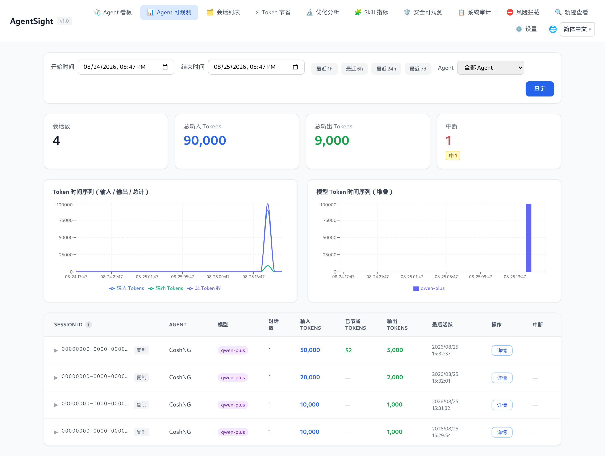

# AgentSight

[English](../../../en/agent-observability/agentsight/README.md)

AgentSight 是面向 AI Agent 的零侵入可观测性工具。它把 eBPF 探针挂到已经在运行的进程上，记录 LLM
调用、Token 消耗、工具调用和会话中断——不需要改 Agent 代码、提示词或配置。



## 从这里开始

- [快速开始](QUICKSTART.md)——安装、启动追踪、产生第一条会话、打开 Dashboard。
- [Dashboard 指南](dashboard.md)——令牌访问方式与逐页说明。
- [CLI 参考](cli-reference.md)——所有命令、参数与真实输出。
- [配置](configuration.md)——配置文件、功能开关、Agent 发现规则。

## 你能用它做什么

| 目标 | 阅读 |
|---|---|
| 看清有哪些 Agent 在跑、各花了多少 Token | [快速开始](QUICKSTART.md) |
| 查清某个 Agent 任务为什么卡住、失败或空转 | [中断检测](interruption-detection.md) |
| 逐步回放一次会话（提示词、工具调用、结果） | [Dashboard 指南](dashboard.md#轨迹查看) |
| 让 AgentSight 认识一个它还不识别的 Agent | [配置](configuration.md#agent-发现规则) |
| 以服务、容器或 macOS 形态运行 | [部署](deployment.md) |
| 从脚本、Prometheus 或其他系统取数据 | [数据与存储](data-and-storage.md) |
| 与 Tokenless、agent-sec-core、cosh 配合 | [集成](integrations.md) |
| 解决“没数据”“401”“端口打不开” | [排查](troubleshooting.md) |

## 能力一览

| 能力 | 具体价值 |
|---|---|
| 零侵入采集 | eBPF uprobe 从 TLS 调用中读取明文，Agent 侧无需 SDK、代理或环境变量 |
| Agent 自动发现 | 按命令行识别 Agent 进程（cosh、Claude Code、Codex、Qwen Code、OpenClaw、Hermes、AgentScope，也支持自定义规则） |
| Token 计账 | 按 Agent、会话、对话、模型统计输入/输出/缓存 Token |
| 会话与对话视图 | 会话包含多个对话；每个对话保留自己的 LLM 调用、消息与工具调用 |
| 中断检测 | 18 种中断类型（崩溃、超时、限流、上下文溢出、死循环、工具失败……），带严重级别和根因证据 |
| 轨迹导出 | 任意会话、对话或单次调用都能导出为 ATIF v1.7 JSON |
| Dashboard | Web 界面：时间范围筛选、Token 曲线、延迟分位、中断标记、逐步回放 |
| 机器可读输出 | 多数命令支持 `--json`，另有 Prometheus `/metrics` 和文档化的 HTTP API |

## 前置条件

| 条件 | 要求 |
|---|---|
| 操作系统 | Linux（x86_64）；macOS 只有精简的轨迹采集模式 |
| 内核 | >= 5.8，且开启 BTF |
| 权限 | `agentsight trace` 需要 root（或 `CAP_BPF` + `CAP_PERFMON`） |
| 安装模式 | system 模式——eBPF 需要 root |
| 磁盘 | `/var/log/sysak/.agentsight` 下几百 MB，有容量上限，见[数据与存储](data-and-storage.md) |

> **macOS**：只提供 `agentsight trace`（扫描本地 Agent JSONL 会话文件，无 eBPF）和
> `agentsight serve`（Dashboard）。其余命令都依赖 Linux 上的 eBPF 流水线。

## 工作方式

```
Agent 进程 ──TLS 读写──▶ eBPF uprobe ─┐
Agent 进程 ──execve/exit─▶ eBPF 探针  ─┼─▶ 解析 ─▶ 聚合 ─▶ 分析
                                       │   (HTTP/SSE) (请求↔响应) (Token、审计)
                                       │                            │
                                   ring buffer                      ▼
                                                            GenAI 语义事件
                                                                    │
                                    ┌───────────────────────────────┼──────────────┐
                                    ▼                               ▼              ▼
                              SQLite 数据库                    中断检测器      外部日志导出
                                    │                               │
                                    └──────▶ HTTP API + Dashboard ◀─┘
```

真正干活的是两个进程，安装包里的服务会同时拉起它们：

| 进程 | 职责 |
|---|---|
| `agentsight trace` | 加载 eBPF 探针、发现 Agent、把事件写入 SQLite（需 root） |
| `agentsight serve` | 基于同一批 SQLite 提供 HTTP API 与 Dashboard |

更细的设计见源码目录中的 [ARCHITECTURE.md](../../../../../src/agentsight/docs/ARCHITECTURE.md)。

## 术语

| 术语 | 含义 |
|---|---|
| 会话（Session） | Agent 自己标识的一次运行（来自 Agent 的 `session_id`，例如一次 cosh 会话） |
| 对话（Conversation） | 会话内的一次请求-响应循环，含其中的工具调用 |
| 调用（Trace） | 一次被捕获的 LLM HTTP 调用（请求 + 流式响应） |
| 中断（Interruption） | 被检测到的对话异常结束或停滞，带类型和严重级别 |
| Agent 名称 | 发现规则给进程打的标签，如 `CoshNG`、`Claude`、`Codex` |
| 轨迹（Trajectory） | 以 ATIF v1.7 格式导出的会话或对话，可用于回放和离线分析 |

## 安装与首次运行

```bash
# 必须 system 模式——eBPF 需要 root
sudo anolisa install agentsight

# 同时启动追踪与 Dashboard
sudo systemctl enable --now agentsight.service

# 打印 Dashboard 地址与访问令牌
sudo agentsight dashboard --no-open
```

完整流程与真实输出见[快速开始](QUICKSTART.md)。

## 参考页面

| 页面 | 内容 |
|---|---|
| [快速开始](QUICKSTART.md) | 安装、验证采集、第一次打开 Dashboard |
| [Dashboard 指南](dashboard.md) | 认证方式与所有 Dashboard 页面 |
| [CLI 参考](cli-reference.md) | `trace`、`serve`、`dashboard`、`token`、`audit`、`discover`、`metrics`、`summary`、`interruption`、`skill-metrics` |
| [配置](configuration.md) | `config.json` 结构、功能开关、运行时上限、发现规则 |
| [中断检测](interruption-detection.md) | 18 种中断类型与排查流程 |
| [部署](deployment.md) | systemd、前台、容器/Sidecar、macOS、升级、卸载 |
| [数据与存储](data-and-storage.md) | 数据库、保留策略、HTTP API、Prometheus、ATIF 导出 |
| [集成](integrations.md) | Tokenless、agent-sec-core、enforcer、cosh、Prometheus |
| [排查](troubleshooting.md) | 没数据、401、端口不通、数据库增长 |
