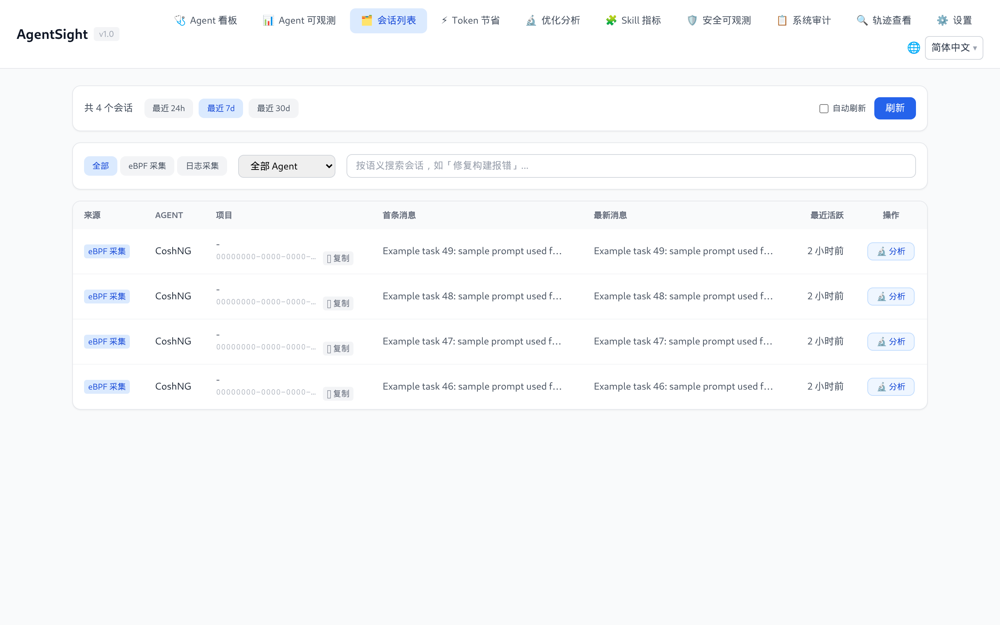
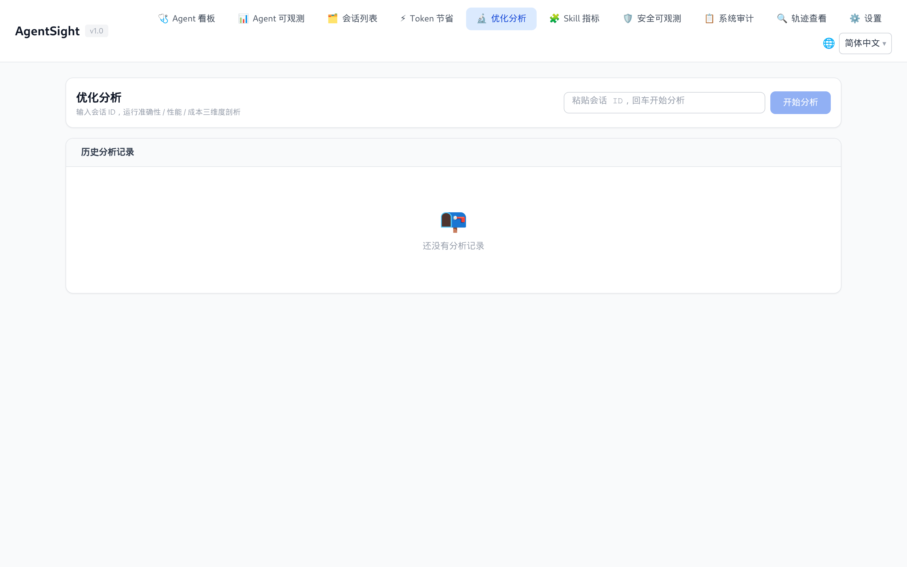
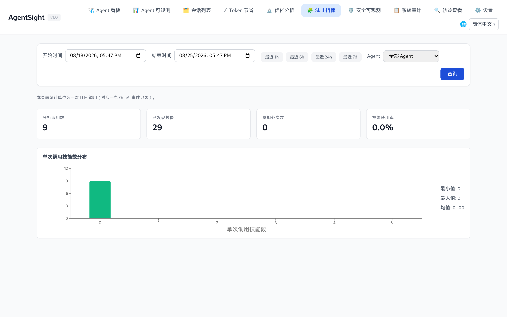
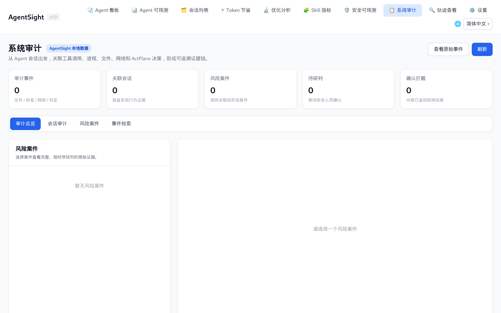
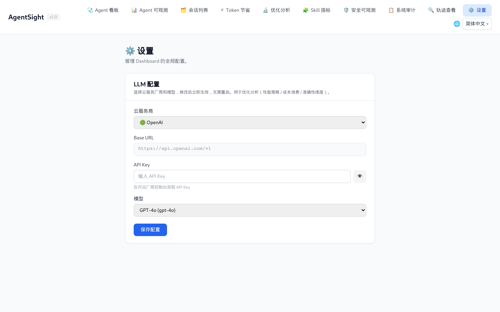

# AgentSight Dashboard 指南

[English](../../../en/agent-observability/agentsight/dashboard.md)

Dashboard 是内嵌在 `agentsight` 二进制中的 Web 界面。它读取 tracer 写入的同一批 SQLite 数据库，不需要
额外服务。默认地址：`http://127.0.0.1:7396`。

## 启动

```bash
# 仅本机（默认）
sudo agentsight serve

# 允许其他主机访问
sudo agentsight serve --host 0.0.0.0 --port 7396
```

安装包里的 `agentsight.service` 已经在 tracer 旁边运行了 `serve --host 0.0.0.0`，所以正常安装之后你只
需要打开地址。绑定 `0.0.0.0` 意味着端口暴露在所有网卡上，请先在防火墙或云安全组里限制访问。

## 认证

令牌认证默认开启。

| 访问方式 | 需要什么 |
|---|---|
| 本机访问 `http://127.0.0.1:7396` | 不需要，回环请求免认证 |
| 从其他机器访问 `http://<host>:7396` | 需要 Dashboard 令牌：URL 上带 `?token=<TOKEN>`、请求头 `Authorization: Bearer <TOKEN>`，或在登录框里输入 |


令牌在首次启动 `serve` 时生成（64 位十六进制），保存在数据库旁边的
`/var/log/sysak/.agentsight/.dashboard_token`，重启后复用。查看方式：

```bash
sudo agentsight dashboard --no-open
```

登录成功后令牌会换成 httpOnly 会话 cookie，因此不必一直把令牌挂在 URL 上。

关闭认证——只在可信内网这样做：

```json
{ "server": { "auth": { "enabled": false } } }
```

```bash
sudo systemctl reload agentsight.service
```

> `sudo agentsight dashboard --no-open` 会打印完整令牌；登录页也指向这个命令。

## 导航与页面可见性

导航栏只显示当前主机真正能提供的页面。AgentSight 每次加载页面都会探测伴生组件，并通过
`GET /api/auth/status` 返回结果：

| 页面 | 出现条件 |
|---|---|
| Agent 看板、Agent 可观测、会话列表、优化分析、Skill 指标、轨迹查看、设置 | 始终显示 |
| Token 节省 | 装了 `tokenless`，或其统计数据库已存在 |
| 安全可观测、系统审计 | 装了 `agent-sec-core`（daemon 或 CLI 均可） |
| 风险拦截 | 装了 `agentsight-enforcer` 或其 socket 存在 |

所以看到的导航项比本文少并不是坏了——只是对应组件没装。

大多数页面共用同一个查询头：起止时间 + `最近 1 小时 / 6 小时 / 24 小时 / 7 天` 快捷按钮、Agent 过滤
和**查询**按钮。展示成本与节省数字的页面需要你先点**查询**；可观测类页面会直接加载最近 24 小时。

## Agent 看板

实时 Agent 健康状态 + 中断收件箱：列出每条未解决事件的类型、严重级别、会话与对话。**解决**用于关闭
事件，**详情**用于查看采集到的证据。延迟面板可在最近 24 小时、7 天、30 天之间切换。


显示「未发现 Agent」只代表此刻没有 Agent 进程在跑，历史会话仍然保留在其他页面。

## Agent 可观测

主分析页：会话数、输入/输出 Token、按严重级别统计的中断数、Token 时序（总量与按模型）以及会话表格。


点击会话行会展开其中的对话。每条对话展示用户问题、Token、中断标记，以及质量评估入口：


当该会话启用了 Tokenless 时，「节省 Token」列才会有数值。

## 会话列表

这是一个会话浏览器而不是指标页：可以按采集来源（`eBPF 采集` 与 `日志采集`）筛选、按 Agent 筛选，或者
按语义搜索会话——搜索会调用配置好的优化 LLM，按意图对候选会话排序，例如「修构建报错」。



**分析**按钮会把该会话送到优化分析页。

## Token 节省

把实际 Token 消耗与「不做压缩的基线」对比，按优化类型拆分，并给出节省排行和具体建议。


选好时间范围后需要点**查询**；这个页面初始为空是设计如此。接入方式见
[集成](integrations.md#tokenlesstoken-节省)。

## 优化分析

对单个会话跑 LLM 辅助分析，共 6 个维度：`perf`、`perf-issues`、`cost`、`cost-waste`、`accuracy`、
`summary`。分析需要在设置页配置 LLM，耗时大约 10–60 秒；结果会持久化，因此页面同时列出历史分析。



## Skill 指标

基于 GenAI 事件按需计算 Skill 采纳情况：分析的调用数、发现的 Skill 数、加载次数、使用率、每次调用的
Skill 数量分布，以及按周的热度排行。统计单位是一次 LLM 调用。



## 安全可观测与系统审计

装了 agent-sec-core 时出现。安全可观测按会话和运行展示扫描结论（提示词注入、PII、代码扫描）；
系统审计把审计事件聚合成可评审的案例，装了 enforcer 时还能执行处置。



## 轨迹查看

把任意会话或对话加载为 ATIF v1.7 轨迹：Agent 元信息、步骤与 Token 汇总、Tokenless 对比，以及完整的
交互时间线——系统前置、每一轮、工具调用与结果。**下载 JSON** 导出轨迹，**导入 JSON** 可以回放在别处
采集的轨迹。


需要确认「Agent 到底发了什么、收到了什么」时，就打开这一页。

## 设置

配置优化分析与语义搜索所使用的 LLM（供应商、Base URL、模型、API Key）。Key 回读时会脱敏，保存在数据
库旁边的 `optimization_config.json`。



## 语言

界面默认跟随浏览器语言，右上角可以手动切换，选择会在刷新后保留。

## 也可以直接调 API

页面上的所有数据都来自 HTTP API，而路由清单由服务自己提供：

```bash
curl -s http://127.0.0.1:7396/api/docs | python3 -m json.tool | head -30

# 非本机访问需要令牌
curl -s -H "Authorization: Bearer $TOKEN" http://<host>:7396/api/sessions
```

各类端点见[数据与存储](data-and-storage.md#http-api)。

## 相关页面

- [中断检测](interruption-detection.md)——界面上的中断标记是什么意思
- [配置](configuration.md#dashboard-认证)——认证开关
- [排查](troubleshooting.md)——401、端口不通、页面空白
