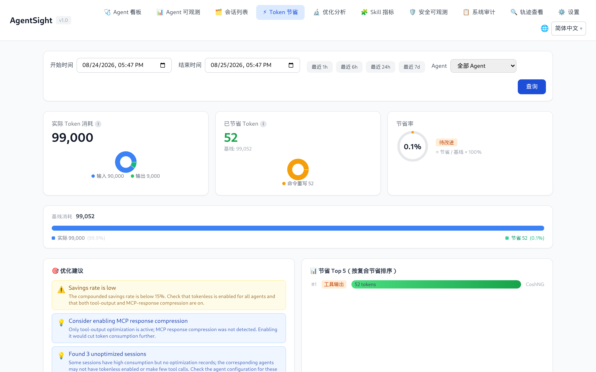

# AgentSight 集成

[English](../../../en/agent-observability/agentsight/integrations.md)

AgentSight 观测 Agent 时不需要被嵌进 Agent 里；同样，当机器上恰好装了其他 ANOLISA 组件时，它会把这些
组件的数据一并展示出来。本页内容都不是使用 AgentSight 的必要条件。

## 支持的 Agent

只要被发现规则命中的进程都会被追踪。随包发布的规则集（31 条）覆盖：

| Agent | 上报名称 |
|---|---|
| cosh（Copilot Shell） | `Cosh` |
| cosh-ng（`cosh-shell`、`cosh-core`、`cosh-cli`） | `CoshNG` |
| Claude Code | `Claude` |
| Codex CLI | `Codex` |
| Qwen Code | `QwenCode` |
| OpenClaw（gateway） | `OpenClaw` |
| Hermes | `Hermes` |
| AgentScope | `AgentScope` |
| Runloop Node 服务 | `Runloop` |

其他 Agent 也能支持——按 [Agent 发现规则](configuration.md#agent-发现规则)加一条规则即可。两个细节：

- **OpenClaw** 观测的是它的 `openclaw-gateway` 守护进程，而不是客户端。缺 Token 数据时，先确认客户端
  确实连上了 gateway。
- **Codex CLI** 静态链接 TLS 库，AgentSight 会退化到字节模式匹配加逐版本 offset 表。刚发布的 Codex
  版本可能需要更新 `codex_offsets` 条目。

## Tokenless：Token 节省

装了 [Tokenless](../../token-saving/tokenless/QUICKSTART.md) 后，AgentSight 会展示压缩实际省下了多少
Token，两侧都不需要额外配置：

- Token 节省页按优化类型对比实际消耗与基线；
- Agent 可观测页面的每个会话旁出现「节省 Token」列；
- 轨迹查看页显示该会话优化前后的 Token 对比；
- `agentsight summary` 多出一行节省信息；
- `GET /api/token-savings` 暴露同样的数字。



该页面读取的是 Tokenless 自己的统计数据库，因此只有 Tokenless 真正优化过之后才会有数字。节省量为 0
通常意味着 Tokenless 装了但没有对产生这些会话的 Agent 生效。

## agent-sec-core：安全可观测与审计

装了 [agent-sec-core](../../agent-security/agent-sec-core/QUICKSTART.md) 后，Dashboard 会多出两页：

| 页面 | 内容 |
|---|---|
| 安全可观测 | 按会话与运行展示提示词注入、PII、代码扫描的结论 |
| 系统审计 | 把审计事件聚合成可评审的案例；装了 enforcer 时还能执行处置 |

AgentSight 通过 daemon socket 或 CLI 二进制来识别该组件，因此 daemon 重启期间页面依然可达。

一个需要知道的副作用：agent-sec-core 与 Tokenless 的 hook 都是短生命周期的辅助进程，AgentSight 也会
记录它们，很容易把 `agentsight audit` 的输出占满。用多个 `--exclude` 过掉即可：

```bash
sudo agentsight audit --last 1 --exclude agent-sec-cli --exclude observability_hook.py
```

## agentsight-enforcer：风险拦截

`agentsight-enforcer` 是可以拦截高风险 Agent 动作的特权守护进程，随安装包发布，由
`agentsight-enforcer.service` 启动。当它的 socket（`/run/agentsight/enforcer.sock`）不存在时，`serve`
会打印：

```
AgentSight enforcement unavailable: enforcer I/O failed: No such file or directory (os error 2)
```

采集与分析不受影响，只是风险拦截页面和 `/api/enforcement/*` 端点会消失。启动对应 unit 即可；源码构建
请使用 `make build-all`。

## cosh：用自然语言提问

AgentSight 为 cosh 提供了对话式 Skill，Token 和审计相关的问题可以直接在终端里问，而不必敲 CLI：

- 「我今天用了多少 Token？」
- 「把今天的 LLM 调用列出来」
- 「最近一小时有中断吗？」

## Prometheus 与 Grafana

```bash
curl -s http://127.0.0.1:7396/metrics
```

`/metrics` 按设计只允许本机访问。请用节点本地的 Prometheus agent（或本机反向代理）抓取，指标为
`agentsight_token_input_total`、`agentsight_token_output_total`、`agentsight_token_total_total`、
`agentsight_llm_requests_total`，均带 `agent` 标签。

想做更丰富的看板，可以直接轮询 JSON API——`/api/timeseries` 看 Token 趋势、`/api/metrics/latency` 看延迟
分位、`/api/interruptions/count` 看未处理问题数。

## 用轨迹做离线分析

`GET /api/export/atif/session/{id}` 返回 ATIF v1.7 轨迹，包含提示词、工具调用、结果与 Token 汇总。可以
用它喂评测流水线、给缺陷报告附上可复现材料，或通过轨迹查看页导入到另一个 AgentSight 实例。

## 相关页面

- [配置](configuration.md)——为自己的 Agent 添加规则
- [Dashboard 指南](dashboard.md#导航与页面可见性)——哪些页面在什么条件下出现
- [数据与存储](data-and-storage.md#http-api)——API 细节
