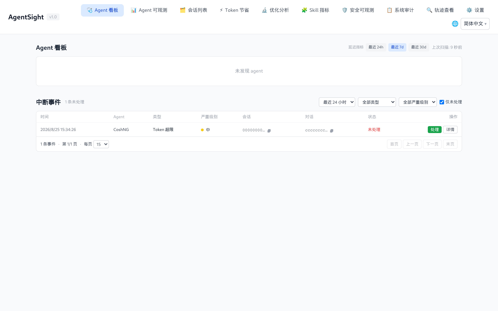
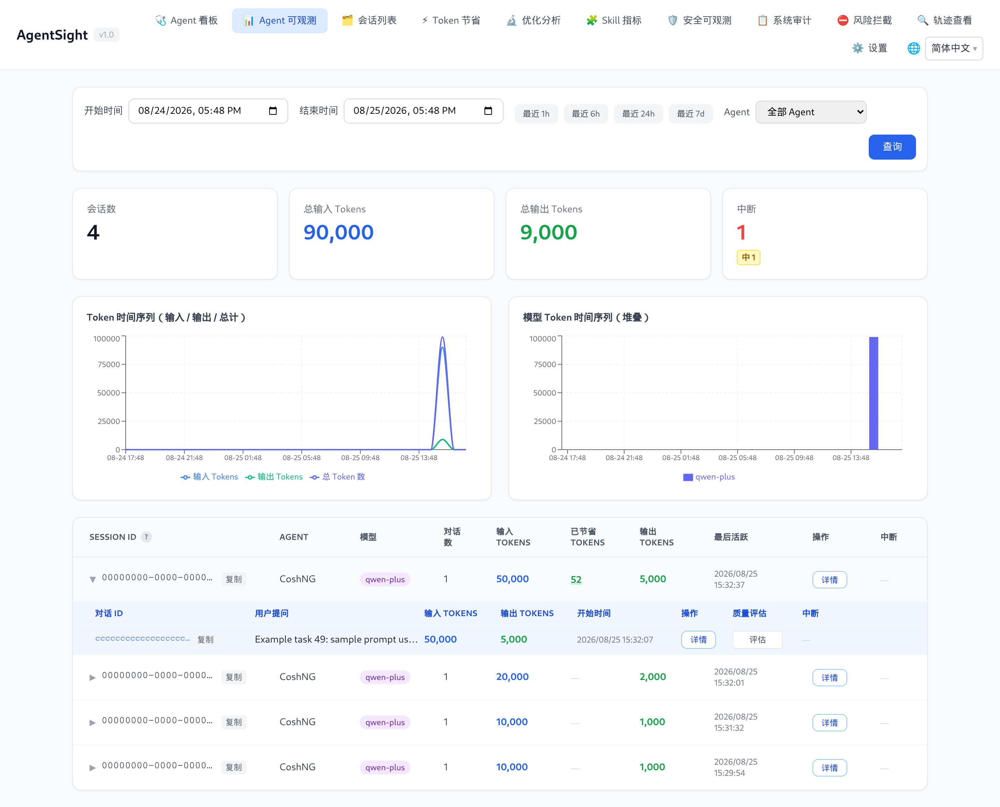

# 中断检测

[English](../../../en/agent-observability/agentsight/interruption-detection.md)

「中断」是 AgentSight 对「一次对话没有正常结束」的统称：模型服务返回错误、流式回答中途断掉、Agent
进程崩了、Agent 反复调同一个工具却毫无进展，都算。AgentSight 会给每一次中断打上类型、严重级别，并保留
它是从哪条证据推出来的，让你从「这个 Agent 卡住了」直接跳到「哪一次调用失败、为什么失败」，不用翻原始
日志。

中断检测默认开启（`features.interruption_detection.enabled`）。

## 信号来自哪里

| 来源 | 能发现什么 |
|---|---|
| 采集到的 LLM 调用 | HTTP 状态码、错误体、`finish_reason`、无输出、调用耗时 |
| 同一对话内的跨调用分析 | 重复的工具序列、重复的相似回答、Token 空烧、同一错误反复出现 |
| 进程健康检查 | 会话中途消失或挂死的 Agent 进程 |
| 启动时扫描 `dmesg` | AgentSight 自己不在线期间发生的 OOM kill |

因为这些信号全部来自 AgentSight 本来就在采集的流量，所以启用任何一项都不需要改 Agent。

## 中断类型

共 18 种，每种都有默认严重级别：

| 类型 | 默认级别 | 触发条件 |
|---|---|---|
| `agent_crash` | critical | Agent 进程在会话中途消失，或 `dmesg` 扫描确认被 OOM 杀掉（详情里带 `oom: true`） |
| `dead_loop` | critical | 跨调用分析判定进入循环，见[死循环处理](#死循环处理) |
| `retry_storm` | critical | 同一对话内同一类错误重复出现 ≥ 5 次 |
| `auth_error` | high | HTTP 401/403，或错误体含 `invalid_api_key` / `unauthorized` |
| `network_timeout` | high | HTTP 408/504，或网关层超时错误 |
| `service_unavailable` | high | HTTP 502/503，或错误体含 `overloaded` / `service_unavailable` |
| `context_overflow` | high | `context_length_exceeded` 或同类上下文超限错误 |
| `sse_truncated` | high | 流式响应结束时没有正常的 `finish_reason`，且调用已持续 ≥ 1 秒 |
| `empty_response` | high | HTTP 200 但既没有输出消息也没有错误 |
| `resource_exhaustion` | high | HTTP 402，或错误体涉及配额/计费额度（区别于每分钟限流） |
| `state_machine_error` | high | 响应格式非法，或 Agent 状态机发生非法跃迁 |
| `llm_error` | high | 其余 HTTP 状态码 >= 400 的兜底类型 |
| `rate_limit` | medium | HTTP 429，或错误体含 `rate_limit` |
| `token_limit` | medium | `finish_reason = length` 且输出 Token ≥ `max_tokens` 的 95% |
| `safety_filter` | medium | 供应商安全策略返回 `finish_reason = content_filter` |
| `slow_response` | medium | 调用成功但耗时 ≥ 120 秒 |
| `tool_failure` | medium | 工具/函数返回失败结果 |
| `unauthorized_action` | medium | 工具调用被权限系统或沙箱拒绝（`EPERM`、`EACCES`、sandbox denied） |

`llm_error` 的匹配优先级最低，因此能命中具体类型的调用不会被归成这个泛化类型。

## 严重级别

| 级别 | 权重 | 实际含义 |
|---|---|---|
| `critical` | 4 | Agent 无法完成任务，或在没有进展的情况下持续烧 Token |
| `high` | 3 | 当前这次对话失败了，重试可能成功 |
| `medium` | 2 | 回答被降级或截断，或某次工具调用失败 |
| `low` | 1 | 提示性信息 |

严重级别是类型自带的属性，因此跨 Agent、跨机器可比。

## 排查流程

### 1. 有多少、有多严重

```bash
$ sudo agentsight interruption count --last 24
Unresolved interruptions (last 24 hour(s)):

  Total:    1
  Critical: 0
  High:     0
  Medium:   1
  Low:      0
```

### 2. 都是哪几类

```bash
$ sudo agentsight interruption stats --last 48
TYPE                 SEVERITY    COUNT
----------------------------------------
token_limit          medium          1
```

### 3. 具体是哪几条

```bash
$ sudo agentsight interruption list --last 24
INTERRUPTION_ID                    TYPE          SEVERITY  OCCURRED_AT              RESOLVED  AGENT    SESSION_ID
------------------------------------------------------------------------------------------------------------------
11111111222222223333333344444444   token_limit   medium    2026-01-01 12:00:00.000  no        CoshNG   00000000-11...

Total: 1 event(s)
```

常用过滤：`--severity critical`、`--agent CoshNG`、`--unresolved`、`--limit`、`--json`。

本页示例中的所有 ID 都是占位值，请替换成你自己输出里的实际 ID。

> `--type` 接受本页表格里的每一种中断类型。`agentsight interruption list --help` 会打印当前接受的
> 全部取值。

### 4. 到底发生了什么

```bash
$ sudo agentsight interruption get 11111111222222223333333344444444
Interruption Event Detail
============================================================
  ID:           11111111222222223333333344444444
  Type:         token_limit
  Severity:     medium
  Occurred At:  2026-01-01 12:00:00.000 (1767268800000000000ns)
  Resolved:     no
  Session ID:   00000000-1111-2222-3333-444444444444
  Conversation: aaaaaaaabbbbbbbbccccccccdddddddd
  Trace ID:     chatcmpl-00000000-1111-2222-3333-444444444444
  PID:          10000
  Agent:        CoshNG
  Detail:
{
  "model": "qwen-plus",
  "output_tokens": 4096,
  "max_tokens": 4096,
  "ratio": 1.0
}
```

`Detail` 的内容随类型而变：`token_limit` 给出占比，`slow_response` 给出耗时与阈值，`dead_loop` 给出重复
的工具特征，被 OOM 杀掉的 Agent 会带上 `oom: true`。

### 5. 回到上下文，然后关闭它

拿会话或对话 ID 把全貌捞出来，再在 Dashboard 的轨迹查看页读原始消息：

```bash
sudo agentsight interruption session 00000000-1111-2222-3333-444444444444
sudo agentsight interruption conversation aaaaaaaabbbbbbbbccccccccdddddddd
sudo agentsight interruption resolve 11111111222222223333333344444444
```

「解决」只是把事件标记为已处理，不会删除任何数据。

## 在 Dashboard 里

Agent 看板就是中断收件箱：按时间范围、类型、严重级别以及「仅未解决」筛选，然后对每行执行**解决**或
**详情**。



Agent 可观测页面会在会话和对话旁边显示中断标记，因此在点开之前就能看出问题属于哪个会话：



## 死循环处理

死循环是通过比较同一对话内的多次调用识别的，共三条规则：

| 规则 | 默认阈值 |
|---|---|
| 相同工具序列（工具名 + 参数指纹）重复 | 连续 5 次调用 |
| 模型输出高度相似并重复（Jaccard 相似度） | 连续 3 次，相似度 > 0.85 |
| 输入 Token 持续增长而输出不变 | Token 空烧、无进展 |

比较窗口为最近 10 次调用。工具名相同但参数不同不算循环，因此终端工具执行不同命令不会被误判。

死循环的上报是开箱可用的；「顺手把它停掉」则默认关闭：

```json
{ "deadloop": { "enabled": true, "kill_after_count": 3 } }
```

开启后的处置梯度是：低于阈值只记录不动手，达到阈值向 Agent 进程发 `SIGTERM`，再次检测到就升级为
`SIGKILL`。

生产环境以及共享/多租户机器上请保持关闭：AgentSight 直接向命中的进程发信号，一次误判就会打断正在进行的
工作，而某一个 Agent 的循环可能连带杀掉其他租户依赖的进程。检测与上报本身不受这个开关影响，因此这类机器
上更安全的做法是对 `dead_loop` 事件告警、由人决定是否处置。只在「杀掉 Agent 进程可以接受」的场景开启自动
终止——隔离的测试机、单租户的批量任务机，或 Agent 可随时重启的控制面。

## 保留与容量

```json
"features": {
  "interruption_detection": {
    "enabled": true,
    "retention_days": 30,
    "max_db_size_mb": 100
  }
}
```

事件存放在 `/var/log/sysak/.agentsight/interruption_events.db`。超过 `retention_days` 的事件会被清理，
数据库超过 `max_db_size_mb` 时会被裁剪。

## API 访问

```bash
TOKEN=$(sudo cat /var/log/sysak/.agentsight/.dashboard_token)
BASE=http://127.0.0.1:7396

curl -s "$BASE/api/interruptions?limit=20"
curl -s "$BASE/api/interruptions/count"
curl -s "$BASE/api/interruptions/stats"
curl -s "$BASE/api/interruptions/session-counts"
curl -s -X POST "$BASE/api/interruptions/11111111222222223333333344444444/resolve"
```

`count` 与 `stats` 固定只统计未解决事件。非本机访问请加
`-H "Authorization: Bearer $TOKEN"`。

## 相关页面

- [CLI 参考](cli-reference.md#agentsight-interruption)——全部参数
- [Dashboard 指南](dashboard.md#agent-看板)——收件箱界面
- [配置](configuration.md#死循环自动终止)——检测与自动处置开关
