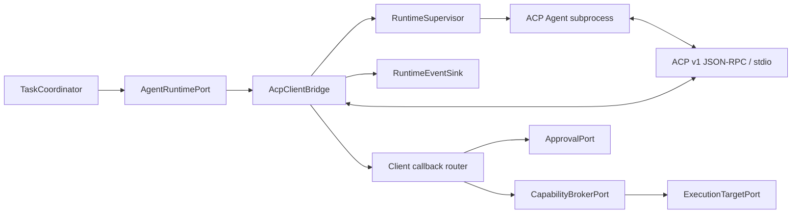
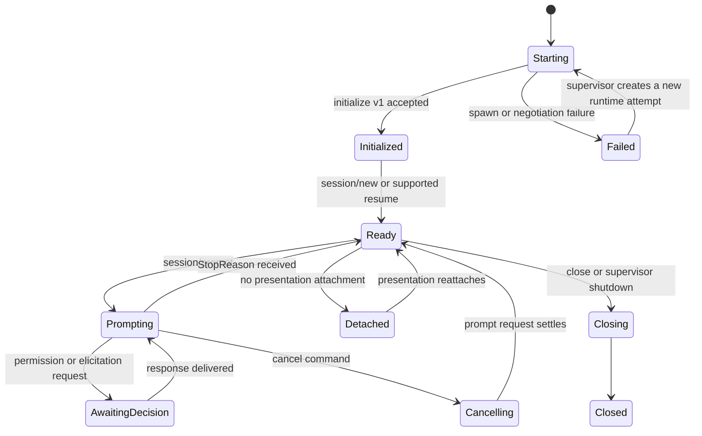

# Phase 2 ACP Client Bridge Design

[中文版](design_zh.md)

Status: first implementation slice in the uncommitted candidate worktree;
not present on baseline `6c115aefe04ace0d169a24fa7cd55ad7c1befa52`
and not accepted as a production bridge.

Related documents: [phase plan](../../README.md),
[acceptance report](acceptance.md), and the narrower
[local ACP Runtime MVP](../../task-plane/acp-mvp/design.md).

## 1. Decision

The ACP Client Bridge makes COSH an ACP client behind the neutral
`AgentRuntimePort`. It launches a local Agent subprocess, speaks ACP v1 over
newline-delimited JSON-RPC on stdio, and translates the Agent lifecycle into
COSH Task events. The bridge never owns Tasks, approvals, OS policy, shell
PTYs, or Web delivery.

The version contract has two independent axes:

| Axis | Phase 2 decision |
| --- | --- |
| ACP wire protocol | v1; send `initialize.protocolVersion = 1` |
| Rust SDK | Pin official `agent-client-protocol = 2.0.0`; cosh-ng MSRV and RPM build baseline are Rust 1.88 |
| Capability evolution | Negotiate at initialization; omitted means unsupported |
| Transport | Local subprocess stdio only |
| Streamable HTTP | Not a Phase 2 dependency; the transport remains a draft proposal |
| ACP v2 | Out of scope |

An SDK package version is not an ACP wire version. No code or configuration
may infer wire compatibility from a crate or schema artifact version.

## 2. Goals and non-goals

### Goals

- Run conforming ACP v1 Agents without making their types the COSH domain
  model.
- Preserve a durable `TaskId` and `RunId` across Agent process restarts.
- Map ACP sessions only to `AgentSessionId` bindings.
- Stream Agent messages, plans, tool calls, usage, and terminal references as
  ordered Runtime events.
- Route every permission, filesystem, and terminal callback through the COSH
  Capability Broker and Approval Service.
- Fail closed when version, capability, identity, or callback scope cannot be
  proven.
- Keep the existing cosh-core bridge available as a separate runtime adapter.

### Non-goals

- Using ACP as the Gateway API for Shell, Web, DingTalk, or Feishu.
- Making an ACP connection or session the durable Task source of truth.
- Supporting remote ACP transports, ACP v2, or custom ACP extensions in the
  first implementation.
- Giving an ACP Agent direct access to a host PTY or filesystem.
- Translating the internal cosh-core JSONL protocol in place. It remains a
  separate bridge.
- Guaranteeing process-transparent resume when an Agent does not advertise a
  compatible load or resume capability.

### Implemented first-slice boundary

The candidate adds a synchronous `AcpV1Codec` and `AcpV1RuntimeBridge` under
`cosh-gateway::runtime`. Official SDK v1 types validate JSON-RPC frames, while
runtime-local projections prevent SDK types from entering
`cosh-gateway-contracts`. The bridge composes one `RuntimeSupervisor`, which
remains the only child-process lifecycle implementation and continues to
enforce direct launch, cleared environment, pinned cwd,
bounded stdout/stderr, and process-group reap.

This slice implements exact v1 initialization, immutable capability copying,
one opaque session, text prompts, validated `session/update`, prompt terminal
responses, correlated permission responses, cancel settlement, unsupported
callback rejection, and bounded fail-closed decoding. It does not yet map ACP
observations into durable Runtime/Task events or route filesystem, terminal,
and permission operations through production Broker/Approval services.

The candidate also provides fixed built-in profiles for the installed
`codex-acp` and `claude-agent-acp` adapters. The resolver accepts only an exact
profile executable, canonicalizes it and the workspace, copies only
allowlisted environment variables, and never invokes a shell, package runner,
download, or network bootstrap. It is still a library API: no installed COSH
entrypoint or session driver invokes it.

## 3. Current source evidence

The pinned baseline has useful adapter and lifecycle code but no ACP
implementation. The candidate worktree additionally contains the bounded
first slice described above and pins the official SDK in `Cargo.lock`.

| Evidence | What exists | Gap relevant to this design |
| --- | --- | --- |
| [`AgentAdapter`](../../../../../crates/cosh-shell/src/adapter/mod.rs) | A provider-neutral name, capabilities, synchronous run, and streamed event callback | It is owned by `cosh-shell`, and its request type contains shell command blocks |
| [`AgentRequest` and `AgentEvent`](../../../../../crates/cosh-shell/src/types/mod.rs) | Run IDs, text deltas, tool events, questions, approvals, completion, and failure | IDs and events are process-local shell types, not durable Task contracts |
| [`CoshCoreAdapter`](../../../../../crates/cosh-shell/src/adapter/cosh_core.rs) | A persistent cosh-core subprocess adapter and provider-session recovery | The adapter is not ACP and couples lifecycle to shell-owned state |
| [`protocol.rs`](../../../../../crates/cosh-core/src/protocol.rs) | Internal JSONL initialization, streaming, approvals, questions, cancellation, and result messages | `CONTROL_PROTOCOL_VERSION = 1` is a COSH-private protocol, not ACP v1 |
| [`headless.rs`](../../../../../crates/cosh-core/src/headless.rs) | Strict internal protocol negotiation and workspace-scoped provider session persistence | It cannot be exposed as ACP without a separate adapter contract |
| [`session.rs`](../../../../../crates/cosh-core/src/session.rs) | `ProviderSessionId` and versioned provider conversation persistence | A provider session is not a Task, Run, or ACP session identity |

No ACP SDK dependency, ACP schema, `initialize` request, ACP JSON-RPC router,
or ACP conformance fixture exists at the baseline commit.

## 4. Ownership and ports



### Bridge-owned state

- ACP process handle, stderr capture, and bounded stdout decoder.
- JSON-RPC request router and outstanding request cancellation handles.
- Negotiated protocol version and immutable connection capabilities.
- `AgentSessionId` to opaque ACP `sessionId` bindings.
- ACP message, tool-call, and terminal correlation tables scoped to a session.
- Ephemeral flow-control state and the last event sequence handed to the Task
  plane.

### State owned elsewhere

| State | Owner |
| --- | --- |
| Task lifecycle, Run attempts, replay cursor | Task Execution Plane |
| Actor, channel, and target identity | Gateway and identity modules |
| Approval request and decision | Approval Service |
| OS authorization and permit | Capability Broker |
| OS process or typed operation | Execution Target |
| ACP subprocess restart policy | Runtime Supervisor |
| User-visible rendering and delivery | Presentation adapters |

The bridge receives typed commands and emits typed events. It must not import
HTTP request types, terminal card models, persistence records, or channel
message types.

## 5. Runtime command contract

The Phase 2 bridge implements the neutral Runtime Port established in Phase 0
and Phase 1. The conceptual commands are:

```text
StartSession { task_id, run_id, workspace, additional_roots, runtime_profile }
ResumeSession { task_id, run_id, agent_session_id }
Prompt { task_id, run_id, agent_session_id, content, idempotency_key }
CancelRun { task_id, run_id, reason }
CloseSession { task_id, agent_session_id, reason }
TerminateRuntime { runtime_instance_id, reason }
```

`StartSession` returns a COSH-created `AgentSessionId` plus an opaque runtime
binding. The ACP `sessionId` is stored inside that binding and is never
returned as `TaskId` or `RunId`.

## 6. ACP profile and capability policy

### Initialization

The bridge sends `initialize` first with:

- `protocolVersion: 1`;
- COSH client implementation information;
- only the client capabilities backed by an accepted COSH implementation.

The response is rejected when it selects a protocol version other than `1`.
Capabilities are copied into an immutable connection snapshot. A missing
optional capability is unsupported, not false-by-accident or subject to
probing.

The initial profile requires the ACP v1 baseline session operations:
`session/new`, `session/prompt`, `session/cancel`, and `session/update`.
Optional methods such as `session/load`, `session/resume`, `session/close`,
`session/list`, `session/delete`, additional directories, config options, and
rich prompt content are called only when advertised.

### Client capability advertisement

The first production profile SHOULD start narrow:

| Capability | Advertise when |
| --- | --- |
| `fs.readTextFile` | A read request can be scoped, authorized, bounded, audited, and served by the Broker path |
| `fs.writeTextFile` | A write can obtain a target-bound permit and produce durable audit evidence |
| `terminal` | All terminal methods are implemented through governed execution handles |
| rich prompt content | The Task schema and presenter can preserve the content without lossy conversion |
| elicitation/config options | Gateway commands and all attached presenters have deterministic handling |

No capability is advertised merely because the official SDK contains its
types.

## 7. Identity and correlation mapping

| ACP field or object | COSH mapping | Invariant |
| --- | --- | --- |
| ACP connection | `RuntimeInstanceId` | Ephemeral; one connection may host several sessions |
| ACP `sessionId` | Opaque value inside `AgentSessionBinding` | Maps only to one `AgentSessionId` |
| JSON-RPC request `id` | `RuntimeRequestId` | Scoped to one connection; not globally durable identity |
| `session/prompt` request | One active Runtime turn for a `RunId` | Retries need a COSH idempotency key; ACP itself does not make prompts idempotent |
| ACP `messageId` | `RuntimeMessageId` with session scope | Groups chunks; must not become event sequence |
| ACP `toolCallId` | `ToolUseId` | Stable within the bound Agent session |
| ACP `terminalId` | Opaque handle bound to a Broker-created `ExecutionId` | Invalid outside its Agent session and target permit |
| permission option ID | Option in a COSH `ApprovalRequest` | Agent-provided label is display data, not authorization policy |

The bridge must reject callbacks carrying an unknown session, tool call,
terminal, or completed request correlation.

## 8. Lifecycle, detach, and replay



Presentation detach has no ACP wire effect. It removes a Shell or Web
subscription while the Task remains authoritative. `session/close` is used
only for an explicit lifecycle decision and only when advertised.

After bridge or Agent restart:

1. The Task plane starts a new Runtime attempt without changing `TaskId`.
2. The bridge initializes a new ACP connection.
3. It uses `session/resume` without replay when advertised and compatible.
4. Otherwise it may use `session/load`, whose `session/update` history is
   marked as replay.
5. If neither method is available, the Run becomes recoverably blocked and
   requires an explicit fresh-session decision. The bridge must not silently
   resend a completed or partially executed prompt.

ACP replay updates are normalized and appended with new COSH event sequence
numbers. Duplicate message chunks are suppressed by the scoped message ID and
content offset when available. The durable event sequence remains the only
presentation replay cursor.

## 9. Event mapping

| ACP input | Runtime/Task event |
| --- | --- |
| agent message chunk | `AgentMessageChunkRecorded` |
| user message chunk during load | `AgentHistoryChunkReplayed` |
| thought chunk | `AgentThoughtChunkRecorded` with redaction/presentation policy |
| plan | `AgentPlanReplaced` |
| tool call | `ToolUseDeclared` |
| tool call update | `ToolUseUpdated` |
| usage update | `AgentUsageUpdated` |
| session info update | `AgentSessionMetadataUpdated` |
| permission request | `ApprovalRequested` after policy normalization |
| prompt StopReason | `RuntimeTurnFinished` with normalized reason |
| JSON-RPC error or process exit | `RuntimeAttemptFailed` with retry classification |

The exact serialized names are frozen by the Phase 0 schema before
implementation. Unknown ACP updates are retained as bounded diagnostic
metadata and produce a compatibility event; they are not presented as
successful tool execution.

## 10. Permission, filesystem, and terminal callbacks

### Permission

`session/request_permission` creates or correlates a COSH approval. The
Approval Service evaluates actor, target, Task state, operation details, and
policy before a response is sent. `allow_always` is only offered when COSH has
a supported durable policy scope; an Agent-provided option cannot create a
broader trust rule by itself. Cancelling a prompt settles outstanding ACP
permission requests with the ACP `cancelled` outcome.

### Filesystem

`fs/read_text_file` and `fs/write_text_file` are translated into typed Broker
requests. Absolute paths are normalized against the session workspace and
accepted additional roots. Symlink, traversal, size, encoding, redaction, and
write-conflict policy is enforced below the bridge. The bridge never opens a
requested path directly.

### Terminal

`terminal/create`, `output`, `wait_for_exit`, `kill`, and `release` map to an
Execution Target handle issued after Broker evaluation. They do not attach to
the user's interactive cosh-shell PTY. Output is bounded at valid UTF-8
boundaries, audited, and retained according to the Task policy. Release is
idempotent; closing a session releases all remaining execution handles.

## 11. Security and approval invariants

- ACP's trusted-editor design assumption is not an OS security boundary.
- Every callback is scoped to the initialized connection, bound Agent session,
  Task, actor, target, and workspace.
- ACP Agent metadata, tool kinds, titles, raw input, and permission options are
  untrusted display data.
- Environment variables and command arguments are redacted before diagnostic
  persistence.
- Stdout accepts only valid bounded ACP JSON-RPC messages; malformed or
  non-protocol output terminates the runtime attempt.
- Stderr is diagnostic-only, bounded, redacted, and never parsed as ACP.
- No filesystem or terminal callback bypasses the Broker even in trust mode.
- A permit is bound to one operation digest, target, actor, Task, and expiry;
  it cannot be reused for another ACP callback.

## 12. Errors, backpressure, and weak connectivity

The first transport is local stdio, so network reconnection does not apply to
the ACP hop. Weak connectivity still affects model providers and remote
Execution Targets behind the Agent or Broker.

| Failure | Required behavior |
| --- | --- |
| Agent executable missing | Fail the Runtime attempt before a session is bound |
| Initialization timeout or wrong version | Terminate the process and report non-retryable compatibility failure |
| Invalid JSON-RPC or stdout contamination | Fail closed and retain bounded diagnostic evidence |
| Agent process exit during prompt | Mark the attempt failed; never infer whether side effects completed |
| Provider/network loss reported by Agent | Preserve Task and Run; classify retry only from structured failure evidence |
| Slow Task event sink | Apply bounded backpressure; cancel and fail before unbounded buffering |
| Client callback timeout | Return an ACP error or cancelled outcome and record the Broker/Approval timeout |
| Duplicate callback or response | Resolve from idempotency/correlation state; never execute twice |
| Task daemon restart | Rebuild bindings from Task state, then resume/load or request a fresh session decision |

## 13. Migration and compatibility

1. Freeze Runtime Port commands, events, IDs, and fixtures in Phase 0.
2. Keep `CoshCoreBridge` as the default Agent runtime through Phase 1.
3. Add the ACP SDK only in the ACP-owned crate or module; do not add ACP types
   to Gateway or Task public schemas.
4. Implement an in-memory fake Agent and conformance fixtures before enabling
   external executables.
5. Gate ACP profiles through explicit runtime configuration and registry
   metadata.
6. Roll back by disabling the ACP runtime profile. Existing cosh-core and
   direct shell paths remain intact.

Persisted bindings include a schema version and runtime kind. They do not
serialize SDK structs. An SDK minor update must pass the same wire fixtures;
changing the SDK major requires an explicit compatibility review even if ACP
wire v1 remains unchanged.

## 14. Implementation tasks

| Work item | Owner | Depends on |
| --- | --- | --- |
| ACP subprocess supervisor and bounded stdio channel | `RuntimeSupervisor` + `AcpClientBridge` | Phase 0 supervision ADR |
| Version and capability negotiation | `AcpClientBridge` | Protocol contract fixtures |
| Session binding repository adapter | `AcpClientBridge` + Task Plane | Identity and persistence schemas |
| Prompt/update normalizer | `AcpClientBridge` | Runtime event schema |
| Permission callback adapter | `AcpClientBridge` + Approval | Approval contract |
| Filesystem callback adapter | `AcpClientBridge` + Broker | Capability request and target scopes |
| Terminal callback adapter | `AcpClientBridge` + Execution Target | Governed execution handle contract |
| Cancellation and shutdown settlement | `RuntimeSupervisor` + `AcpClientBridge` | Runtime lease and Run state machine |
| Compatibility and conformance suite | `AcpClientBridge` | Official ACP v1 schema/SDK fixtures |
| Operator diagnostics | Presentation | Redaction and error taxonomy |

## 15. Test strategy

### Contract tests

- Verify `protocolVersion: 1`, exact version rejection, and capability omission.
- Validate every supported message against the official ACP v1 schema.
- Prove the selected SDK artifact and later upgrades do not change the accepted
  ACP v1 wire fixtures.
- Verify all ID mappings reject cross-session and cross-Task confusion.

### Integration tests

- Launch a deterministic fake ACP Agent over stdio.
- Exercise new, prompt, streaming, permission, cancellation, close, process
  crash, load replay, and resume-without-replay.
- Assert filesystem and terminal requests reach only the Broker fake.
- Assert no callback executes after cancellation, lease loss, or permit expiry.

### Failure and adversarial tests

- Oversized lines, embedded newlines, invalid UTF-8, malformed JSON-RPC,
  unknown response IDs, stdout logs, stderr floods, and partial writes.
- Permission spoofing, terminal ID reuse, path traversal, symlink escape,
  cross-session tool IDs, and duplicate JSON-RPC messages.
- Crash between permit issue and result persistence, with an explicit unknown
  execution outcome instead of a false success.

Full provider, ECS, and manual terminal tests are separate requested gates and
are not implied by this design.

## 16. Open questions

- Which signed/versioned distribution policy should supplement the MVP's fixed
  installed `codex-acp` and `claude-agent-acp` executable profiles?
- Should unsupported `session/resume` fall back to `session/load`
  automatically, or require a profile-level opt-in because replay cost varies?
- Which ACP optional updates are stored verbatim for future presenters without
  expanding the stable Task schema?
- What output and lifetime limits should govern background ACP terminals?

The SDK/toolchain question is resolved for this candidate: Rust 1.88 is the
minimum, SDK 2.0.0 is pinned, and the negotiated stable wire remains v1.

## 17. Normative external references

- [ACP architecture](https://agentclientprotocol.com/get-started/architecture)
- [ACP v1 initialization](https://agentclientprotocol.com/protocol/v1/initialization)
- [ACP v1 session setup](https://agentclientprotocol.com/protocol/v1/session-setup)
- [ACP v1 prompt turn](https://agentclientprotocol.com/protocol/v1/prompt-turn)
- [ACP v1 tool calls and permission](https://agentclientprotocol.com/protocol/v1/tool-calls)
- [ACP v1 filesystem](https://agentclientprotocol.com/protocol/v1/file-system)
- [ACP v1 terminals](https://agentclientprotocol.com/protocol/v1/terminals)
- [ACP v1 cancellation](https://agentclientprotocol.com/protocol/v1/cancellation)
- [ACP v1 transports](https://agentclientprotocol.com/protocol/v1/transports)
- [Official ACP Rust SDK](https://agentclientprotocol.com/libraries/rust)
- [Current SDK 2.0.0 manifest](https://docs.rs/crate/agent-client-protocol/2.0.0/source/Cargo.toml)
- [ACP protocol repository versioning](https://github.com/agentclientprotocol/agent-client-protocol#versioning)
