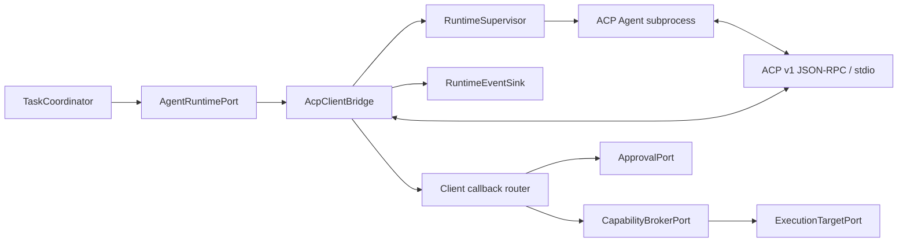
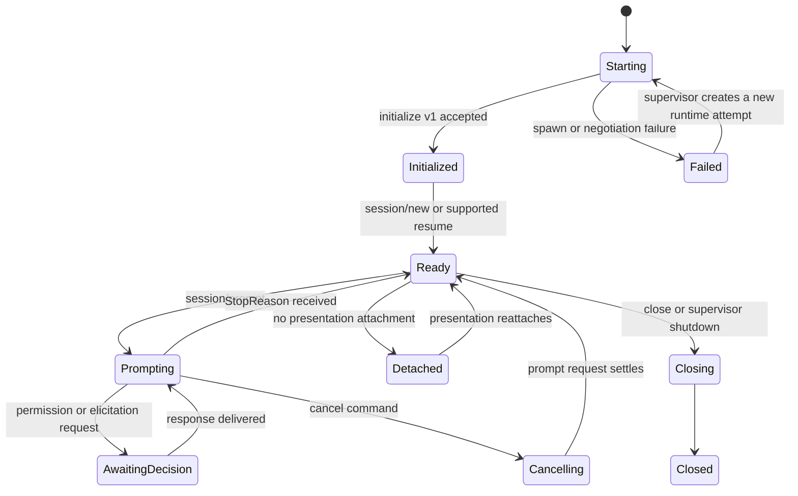

# Phase 2 ACP Client Bridge 设计

[English](design.md)

状态：未提交候选工作树已有第一轮实现切片；固定基线
`6c115aefe04ace0d169a24fa7cd55ad7c1befa52` 不包含该实现，且 production bridge 尚未通过验收。

相关文档：[阶段规划](../../README_zh.md)、[验收报告](acceptance_zh.md)以及更窄的
[Local ACP Runtime MVP](../../task-plane/acp-mvp/design_zh.md)。

## 1. 决策

ACP Client Bridge 让 COSH 通过中立的 `AgentRuntimePort` 成为 ACP Client。
它启动本地 Agent 子进程，在 stdio 上使用 newline-delimited JSON-RPC
通信，并把 Agent 生命周期转换成 COSH Task event。Bridge 不拥有 Task、
approval、OS policy、Shell PTY 或 Web delivery。

版本契约包含两个相互独立的维度：

| 维度 | Phase 2 决策 |
| --- | --- |
| ACP wire protocol | v1；发送 `initialize.protocolVersion = 1` |
| Rust SDK | 准确固定官方 `agent-client-protocol = 2.0.0`；cosh-ng MSRV 与 RPM build baseline 为 Rust 1.88 |
| Capability 演进 | 初始化时协商；省略即不支持 |
| Transport | 只支持本地 subprocess stdio |
| Streamable HTTP | 不作为 Phase 2 依赖；该 transport 仍是 draft proposal |
| ACP v2 | 不在范围内 |

SDK package 版本不是 ACP wire 版本。代码和配置均不得从 crate 或 schema
artifact 版本推断 wire compatibility。

## 2. 目标与非目标

### 目标

- 运行符合 ACP v1 的 Agent，同时避免其类型成为 COSH domain model。
- Agent 进程重启前后保持持久 `TaskId` 和 `RunId`。
- ACP session 只能映射到 `AgentSessionId` binding。
- 把 Agent message、plan、tool call、usage 和 terminal reference 转换成有序
  Runtime event。
- 每个 permission、filesystem 和 terminal callback 都必须经过 COSH
  Capability Broker 与 Approval Service。
- 无法证明 version、capability、identity 或 callback scope 时 fail closed。
- 让现有 cosh-core bridge 继续作为独立 Runtime Adapter 使用。

### 非目标

- 把 ACP 用作 Shell、Web、钉钉或飞书的 Gateway API。
- 让 ACP connection 或 session 成为持久 Task 的事实来源。
- 首版支持远端 ACP transport、ACP v2 或自定义 ACP extension。
- 让 ACP Agent 直接访问宿主 PTY 或 filesystem。
- 原地转换 cosh-core 内部 JSONL protocol。它继续使用独立 bridge。
- 当 Agent 没有声明兼容的 load 或 resume capability 时保证进程无感恢复。

### 已实现的第一轮边界

候选工作树在 `cosh-gateway::runtime` 下增加同步 `AcpV1Codec` 与
`AcpV1RuntimeBridge`。官方 SDK v1 类型负责校验 JSON-RPC frame，runtime-local projection
阻止 SDK 类型进入 `cosh-gateway-contracts`。Bridge 组合一个 `RuntimeSupervisor`，后者继续是
唯一 child-process lifecycle implementation，
保留 direct launch、cleared environment、pinned cwd、bounded stdout/stderr 与
process-group reap。

当前切片实现 exact v1 initialization、immutable capability copy、单一 opaque session、
text prompt、已校验 `session/update`、prompt terminal response、correlated permission
response、cancel settlement、unsupported callback rejection 与 bounded fail-closed decode。
它尚未把 ACP observation 映射到持久 Runtime/Task event，也未把 filesystem、terminal
和 permission operation 接到 production Broker/Approval service。

候选实现还提供固定的内置 profile，只支持已安装的 `codex-acp` 与
`claude-agent-acp` adapter。Resolver 只接受准确的 profile executable，canonicalize executable
与 workspace，只复制 allowlisted environment variable，并且不会调用 shell、package runner、
download 或 network bootstrap。它仍是 library API；有界 Session Driver 已调用它，但尚无已安装
COSH entrypoint。

## 3. 当前源码证据

固定基线已有可复用的 Adapter 和生命周期代码，但不存在 ACP 实现。候选工作树另外包含
上述有界第一轮切片，并在 `Cargo.lock` 中固定官方 SDK。

| 证据 | 已有能力 | 与本设计相关的缺口 |
| --- | --- | --- |
| [`AgentAdapter`](../../../../../crates/cosh-shell/src/adapter/mod.rs) | Provider 中立的名称、capability、同步 run 和流式 event callback | owner 是 `cosh-shell`，request type 包含 Shell command block |
| [`AgentRequest` 和 `AgentEvent`](../../../../../crates/cosh-shell/src/types/mod.rs) | Run ID、text delta、tool event、question、approval、completion 和 failure | ID 与 event 是进程内 Shell 类型，不是持久 Task 契约 |
| [`CoshCoreAdapter`](../../../../../crates/cosh-shell/src/adapter/cosh_core.rs) | 持久 cosh-core 子进程 Adapter 和 provider-session recovery | 该 Adapter 不是 ACP，且生命周期与 Shell owner 的状态耦合 |
| [`protocol.rs`](../../../../../crates/cosh-core/src/protocol.rs) | 内部 JSONL 初始化、streaming、approval、question、cancellation 和 result message | `CONTROL_PROTOCOL_VERSION = 1` 是 COSH 私有协议，不是 ACP v1 |
| [`headless.rs`](../../../../../crates/cosh-core/src/headless.rs) | 严格的内部 protocol negotiation 与 workspace-scoped provider session persistence | 不经过独立 Adapter 契约就不能作为 ACP 暴露 |
| [`session.rs`](../../../../../crates/cosh-core/src/session.rs) | `ProviderSessionId` 与有版本的 provider conversation persistence | Provider session 不是 Task、Run 或 ACP session identity |

基线 commit 上没有 ACP SDK dependency、ACP schema、`initialize` request、ACP
JSON-RPC router 或 ACP conformance fixture。

## 4. Ownership 与 Port



### Bridge 拥有的状态

- ACP process handle、stderr capture 与有界 stdout decoder。
- JSON-RPC request router 和未完成 request 的 cancellation handle。
- 协商后的 protocol version 和不可变 connection capability。
- `AgentSessionId` 到不透明 ACP `sessionId` 的 binding。
- 以 session 为 scope 的 ACP message、tool-call 和 terminal correlation table。
- 临时 flow-control 状态，以及最后交给 Task Plane 的 event sequence。

### 由其他模块拥有的状态

| 状态 | Owner |
| --- | --- |
| Task lifecycle、Run attempt、replay cursor | Task Execution Plane |
| Actor、channel 和 target identity | Gateway 与 identity 模块 |
| Approval request 和 decision | Approval Service |
| OS authorization 与 permit | Capability Broker |
| OS process 或 typed operation | Execution Target |
| ACP subprocess restart policy | Runtime Supervisor |
| 用户可见 rendering 与 delivery | Presentation Adapter |

Bridge 接收 typed command 并产生 typed event。它不得 import HTTP request type、
Terminal card model、persistence record 或 channel message type。

## 5. Runtime Command 契约

Phase 2 Bridge 实现 Phase 0 和 Phase 1 建立的中立 Runtime Port。概念上的
command 如下：

```text
StartSession { task_id, run_id, workspace, additional_roots, runtime_profile }
ResumeSession { task_id, run_id, agent_session_id }
Prompt { task_id, run_id, agent_session_id, content, idempotency_key }
CancelRun { task_id, run_id, reason }
CloseSession { task_id, agent_session_id, reason }
TerminateRuntime { runtime_instance_id, reason }
```

`StartSession` 返回 COSH 创建的 `AgentSessionId` 以及不透明 Runtime binding。
ACP `sessionId` 保存在该 binding 内部，绝不作为 `TaskId` 或 `RunId` 返回。

## 6. ACP Profile 与 Capability Policy

### 初始化

Bridge 首先发送 `initialize`，其中包含：

- `protocolVersion: 1`；
- COSH Client implementation information；
- 仅包含已经由 COSH 验收实现支撑的 Client capability。

如果响应选择的 protocol version 不是 `1`，Bridge 必须拒绝。Capability 会
复制到不可变 connection snapshot。缺失的 optional capability 表示不支持，
不能把它当作意外的 false，也不能通过试探性调用发现。

首版 profile 要求 ACP v1 baseline session operation：`session/new`、
`session/prompt`、`session/cancel` 和 `session/update`。`session/load`、
`session/resume`、`session/close`、`session/list`、`session/delete`、
additional directory、config option 和 rich prompt content 等 optional method
仅在对端声明后调用。

### Client Capability 声明

首个 production profile 应从最小集合开始：

| Capability | 允许声明的条件 |
| --- | --- |
| `fs.readTextFile` | Read request 能被限定 scope、授权、限流、审计并由 Broker 路径处理 |
| `fs.writeTextFile` | Write 能取得 target-bound permit 并产生持久 audit evidence |
| `terminal` | 所有 terminal method 已通过 governed execution handle 实现 |
| rich prompt content | Task schema 和 Presenter 能无损保留该 content |
| elicitation/config option | Gateway command 和所有已 attach Presenter 都能确定性处理 |

不能因为官方 SDK 中存在某种类型就声明相应 capability。

## 7. Identity 与 Correlation 映射

| ACP field 或对象 | COSH 映射 | Invariant |
| --- | --- | --- |
| ACP connection | `RuntimeInstanceId` | 临时身份；一个 connection 可包含多个 session |
| ACP `sessionId` | `AgentSessionBinding` 内部的不透明值 | 只映射一个 `AgentSessionId` |
| JSON-RPC request `id` | `RuntimeRequestId` | Scope 是一个 connection；不是全局持久 identity |
| `session/prompt` request | `RunId` 的一个 active Runtime turn | Retry 需要 COSH idempotency key；ACP 本身不保证 prompt 幂等 |
| ACP `messageId` | 带 session scope 的 `RuntimeMessageId` | 用于组合 chunk；不能成为 event sequence |
| ACP `toolCallId` | `ToolUseId` | 在绑定的 Agent session 内稳定 |
| ACP `terminalId` | 与 Broker 创建的 `ExecutionId` 绑定的不透明 handle | 在 Agent session 和 target permit 外无效 |
| Permission option ID | COSH `ApprovalRequest` 的 option | Agent 提供的 label 是显示数据，不是 authorization policy |

Callback 带有未知 session、tool call、terminal 或已经完成的 request correlation
时，Bridge 必须拒绝。

## 8. 生命周期、Detach 与 Replay



Presentation detach 不产生 ACP wire 操作。它只移除 Shell 或 Web subscription，
Task 继续作为权威状态。只有显式生命周期决策才会发送 `session/close`，且需要
对端声明该 capability。

Bridge 或 Agent 重启后的处理：

1. Task Plane 创建新的 Runtime attempt，但不改变 `TaskId`。
2. Bridge 初始化新的 ACP connection。
3. 对端声明且兼容时，使用不重放历史的 `session/resume`。
4. 否则可使用 `session/load`，其 `session/update` 历史标记为 replay。
5. 两者都不可用时，Run 进入可恢复 blocked 状态，并要求用户明确选择 fresh
   session。Bridge 不得静默重发已完成或部分执行的 prompt。

ACP replay update 在归一化后以新的 COSH event sequence 追加。有 `messageId`
时，使用带 scope 的 message ID 和 content offset 抑制重复 chunk。持久 event
sequence 始终是唯一的 Presentation replay cursor。

## 9. Event 映射

| ACP 输入 | Runtime/Task event |
| --- | --- |
| Agent message chunk | `AgentMessageChunkRecorded` |
| Load 期间的 user message chunk | `AgentHistoryChunkReplayed` |
| Thought chunk | 带 redaction/presentation policy 的 `AgentThoughtChunkRecorded` |
| Plan | `AgentPlanReplaced` |
| Tool call | `ToolUseDeclared` |
| Tool call update | `ToolUseUpdated` |
| Usage update | `AgentUsageUpdated` |
| Session info update | `AgentSessionMetadataUpdated` |
| Permission request | Policy 归一化后的 `ApprovalRequested` |
| Prompt StopReason | 带归一化 reason 的 `RuntimeTurnFinished` |
| JSON-RPC error 或 process exit | 带 retry 分类的 `RuntimeAttemptFailed` |

实现前由 Phase 0 schema 冻结准确 serialized name。未知 ACP update 作为有界
diagnostic metadata 保留并产生 compatibility event，不能显示为成功 tool
execution。

## 10. Permission、Filesystem 与 Terminal Callback

### Permission

`session/request_permission` 创建或关联 COSH approval。Approval Service 在
发送响应前评估 actor、target、Task state、operation detail 与 policy。只有
COSH 支持相应持久 policy scope 时才可提供 `allow_always`；Agent option 本身
不能创建范围更宽的 trust rule。取消 prompt 时，以 ACP `cancelled` outcome
结算未完成的 ACP permission request。

### Filesystem

`fs/read_text_file` 和 `fs/write_text_file` 转换成 typed Broker request。
Absolute path 依据 session workspace 和已接受的 additional root 归一化。
Symlink、traversal、size、encoding、redaction 和 write-conflict policy 在
Bridge 下层执行。Bridge 绝不直接打开 Agent 请求的路径。

### Terminal

`terminal/create`、`output`、`wait_for_exit`、`kill` 和 `release` 映射到
Broker 评估后由 Execution Target 签发的 handle。它们不 attach 到用户交互式
cosh-shell PTY。Output 必须在合法 UTF-8 边界限流，受到审计，并按 Task policy
保留。Release 幂等；关闭 session 时释放所有遗留 execution handle。

## 11. 安全与 Approval Invariant

- ACP 的 trusted-editor 设计假设不是 OS 安全边界。
- 每个 callback 必须限定在初始化 connection、绑定的 Agent session、Task、
  actor、target 与 workspace 内。
- ACP Agent metadata、tool kind、title、raw input 和 permission option 都是不可信
  display data。
- Environment variable 和 command argument 在写入 diagnostic persistence 前必须
  redaction。
- Stdout 只接受合法且有界的 ACP JSON-RPC message；malformed 或非 protocol
  output 会终止 Runtime attempt。
- Stderr 仅用于诊断，必须限流和 redaction，且永不按 ACP 解析。
- 即使在 trust mode，filesystem 或 terminal callback 也不能绕过 Broker。
- Permit 绑定 operation digest、target、actor、Task 和 expiry，不能复用于其他
  ACP callback。

## 12. Error、Backpressure 与弱网

首版 transport 是本地 stdio，因此 ACP hop 不涉及网络重连。弱网仍可能影响
Agent 或 Broker 后方的 model provider 与远端 Execution Target。

| 故障 | 必须的行为 |
| --- | --- |
| Agent executable 不存在 | 在绑定 session 前令 Runtime attempt 失败 |
| 初始化超时或版本错误 | 终止进程并报告不可重试 compatibility failure |
| 非法 JSON-RPC 或 stdout 污染 | Fail closed，并保留有界 diagnostic evidence |
| Prompt 中 Agent process exit | 将 attempt 标记为失败；不推断副作用是否完成 |
| Agent 报告 provider/network loss | 保留 Task 和 Run；只根据结构化 failure evidence 分类 retry |
| Task event sink 过慢 | 使用有界 backpressure；在无限缓冲前 cancel 并失败 |
| Client callback 超时 | 返回 ACP error 或 cancelled outcome，并记录 Broker/Approval timeout |
| 重复 callback 或 response | 通过 idempotency/correlation state 处理；绝不执行两次 |
| Task daemon 重启 | 从 Task state 重建 binding，再 resume/load 或请求 fresh session 决策 |

## 13. 迁移与兼容

1. Phase 0 冻结 Runtime Port command、event、ID 和 fixture。
2. Phase 1 期间继续让 `CoshCoreBridge` 作为默认 Agent Runtime。
3. ACP SDK 只加入 ACP owner 的 crate 或 module；不得把 ACP type 加入 Gateway 或
   Task public schema。
4. 启用外部 executable 前，先实现内存 fake Agent 和 conformance fixture。
5. 通过显式 Runtime 配置和 registry metadata 启用 ACP profile。
6. 回滚方式是禁用 ACP Runtime profile。现有 cosh-core 和 direct Shell 路径
   保持不变。

持久 binding 包含 schema version 和 runtime kind，但不序列化 SDK struct。SDK
minor update 必须继续通过同一套 wire fixture；即使 ACP wire v1 不变，SDK major
变化也需要显式 compatibility review。

## 14. 实现任务

| Work item | Owner | 依赖 |
| --- | --- | --- |
| ACP subprocess supervisor 和有界 stdio channel | `RuntimeSupervisor` + `AcpClientBridge` | Phase 0 supervision ADR |
| Version 与 capability negotiation | `AcpClientBridge` | Protocol contract fixture |
| Session binding repository adapter | `AcpClientBridge` + Task Plane | Identity 和 persistence schema |
| Prompt/update normalizer | `AcpClientBridge` | Runtime event schema |
| Permission callback adapter | `AcpClientBridge` + Approval | Approval contract |
| Filesystem callback adapter | `AcpClientBridge` + Broker | Capability request 和 target scope |
| Terminal callback adapter | `AcpClientBridge` + Execution Target | Governed execution handle contract |
| Cancellation 与 shutdown settlement | `RuntimeSupervisor` + `AcpClientBridge` | Runtime lease 和 Run state machine |
| Compatibility 与 conformance suite | `AcpClientBridge` | 官方 ACP v1 schema/SDK fixture |
| Operator diagnostic | Presentation | Redaction 与 error taxonomy |

## 15. 测试策略

### Contract test

- 验证 `protocolVersion: 1`、准确版本拒绝和 capability omission。
- 使用官方 ACP v1 schema 验证每种已支持 message。
- 证明选定 SDK artifact 及后续升级不会改变已接受的 ACP v1 wire fixture。
- 验证所有 ID mapping 都拒绝跨 session 和跨 Task 混淆。

### Integration test

- 通过 stdio 启动确定性 fake ACP Agent。
- 覆盖 new、prompt、streaming、permission、cancellation、close、process crash、
  load replay 和 resume-without-replay。
- 断言 filesystem 和 terminal request 只到达 Broker fake。
- 断言 cancellation、lease loss 或 permit expiry 后没有 callback 执行。

### Failure 与 adversarial test

- Oversized line、embedded newline、非法 UTF-8、malformed JSON-RPC、未知 response
  ID、stdout log、stderr flood 和 partial write。
- Permission spoofing、terminal ID reuse、path traversal、symlink escape、跨 session
  tool ID 和重复 JSON-RPC message。
- Permit 签发与 result 持久化之间 crash 时，必须报告未知 execution outcome，
  不能产生虚假成功。

完整 provider、ECS 和手工 Terminal 测试需要单独明确请求，本设计不隐含这些
gate 已执行。

## 16. 开放问题

- 哪种 signed/versioned distribution policy 应补充 MVP 固定的已安装 `codex-acp` 与
  `claude-agent-acp` executable profile？
- 不支持 `session/resume` 时，是否自动回退到 `session/load`，还是考虑 replay
  成本差异而要求 profile 显式开启？
- 哪些 ACP optional update 应原样存储以支持未来 Presenter，同时避免扩大稳定
  Task schema？
- Background ACP terminal 应采用怎样的 output 与 lifetime 限制？

SDK/toolchain 问题已在当前候选中解决：最低 Rust 为 1.88，准确固定 SDK 2.0.0，
协商的稳定 wire 仍为 v1。

## 17. 规范性外部资料

- [ACP 架构](https://agentclientprotocol.com/get-started/architecture)
- [ACP v1 初始化](https://agentclientprotocol.com/protocol/v1/initialization)
- [ACP v1 Session Setup](https://agentclientprotocol.com/protocol/v1/session-setup)
- [ACP v1 Prompt Turn](https://agentclientprotocol.com/protocol/v1/prompt-turn)
- [ACP v1 Tool Call 与 Permission](https://agentclientprotocol.com/protocol/v1/tool-calls)
- [ACP v1 Filesystem](https://agentclientprotocol.com/protocol/v1/file-system)
- [ACP v1 Terminal](https://agentclientprotocol.com/protocol/v1/terminals)
- [ACP v1 Cancellation](https://agentclientprotocol.com/protocol/v1/cancellation)
- [ACP v1 Transport](https://agentclientprotocol.com/protocol/v1/transports)
- [官方 ACP Rust SDK](https://agentclientprotocol.com/libraries/rust)
- [当前 SDK 2.0.0 manifest](https://docs.rs/crate/agent-client-protocol/2.0.0/source/Cargo.toml)
- [ACP protocol 仓库版本说明](https://github.com/agentclientprotocol/agent-client-protocol#versioning)
