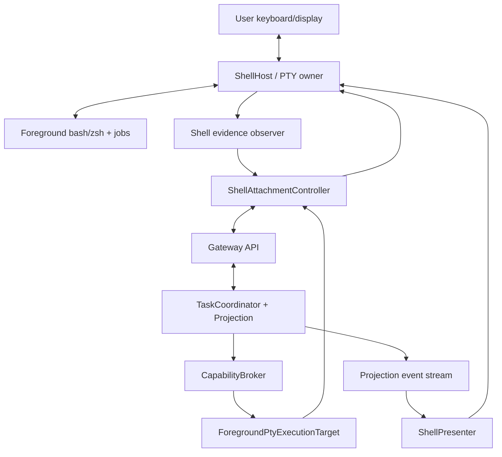

# Phase 2 Shell Attachment Design

[中文版](design_zh.md)

Status: planned, not implemented on baseline
`6c115aefe04ace0d169a24fa7cd55ad7c1befa52`.

Related documents: [phase plan](../../README.md) and
[acceptance report](acceptance.md).

## 1. Decision

cosh-shell remains the owner of the user's foreground PTY, terminal mode, job
control, and direct local shell path. Phase 2 adds a Task attachment beside
that path. The attachment consumes Gateway projections and submits Task
commands; it does not move PTY ownership into the Task daemon or ACP bridge.

This separates three lifecycles that are currently co-located in one process:

```text
ShellSessionId   foreground bash/zsh and PTY lifetime
TaskId           durable user intent and governance lifetime
AgentSessionId   one Agent runtime conversation binding
```

Attach and detach operate on presentation membership. They never imply Agent
session close, Task cancel, or foreground shell termination.

## 2. Goals and non-goals

### Goals

- Preserve native bash/zsh behavior, foreground process groups, signals,
  terminal resize, history, and user takeover.
- Let one shell attach to a durable Task, replay from a cursor, approve,
  answer, cancel, and detach.
- Keep interactive PTY output distinct from durable Task events.
- Continue running user-entered shell commands when the local Gateway or Agent
  runtime is unavailable.
- Route Agent-requested execution through the Capability Broker while keeping
  the existing approved foreground-PTY handoff as one Execution Target.
- Make shell rendering a presenter over stable projections instead of the
  owner of Task state.

### Non-goals

- Moving the interactive PTY master into a daemon in Phase 2.
- Letting Web or ACP peers write directly to the user's foreground PTY.
- Making every direct user shell command a Task action.
- Persisting the terminal screen buffer as the canonical Task transcript.
- Supporting concurrent keystroke control from multiple Shell/Web clients.
- Removing existing adapters, inline cards, native shell mode, or non-AI
  passthrough paths during migration.

## 3. Current source evidence

| Evidence | Current behavior | Phase 2 implication |
| --- | --- | --- |
| [`shell_host/bootstrap.rs`](../../../../../crates/cosh-shell/src/shell_host/bootstrap.rs) | `PtySession` owns master/slave files, child process, parser, and recovery files; bash/zsh become session leaders with a controlling TTY | PTY lifetime and file descriptors remain shell-process owned |
| [`shell_host/raw_runner.rs`](../../../../../crates/cosh-shell/src/shell_host/raw_runner.rs) | Relays input/output, tracks process groups, terminal size, prompt gate, and child exit | Attachment must not block or replace the relay loop |
| [`shell_host/model.rs`](../../../../../crates/cosh-shell/src/shell_host/model.rs) | `ShellHostConfig` defaults to Enhanced and can select hook-free Native mode | Direct local shell remains an explicit compatibility boundary |
| [`runtime/state.rs`](../../../../../crates/cosh-shell/src/runtime/state.rs) | `InlineState` holds approvals, questions, Agent runs, event cursor, cards, shell blocks, and session IDs in memory | Durable Task state must move behind the Gateway; `InlineState` becomes view/cache state |
| [`runtime/dispatcher.rs`](../../../../../crates/cosh-shell/src/runtime/dispatcher.rs) | A shell event snapshot drives inline actions and rendering | Presenter can reuse rendering concepts but not the shell-event domain as Task schema |
| [`runtime/controller.rs`](../../../../../crates/cosh-shell/src/runtime/controller.rs) | Inline rendering also emits approved handoffs to the PTY and captures card input | Task commands and PTY actions need separate ports and explicit correlation |
| [`shell_host/lifecycle.rs`](../../../../../crates/cosh-shell/src/shell_host/lifecycle.rs) | Shell events are redacted and written to `events.jsonl` when the host finishes | This journal is shell evidence, not a durable Task EventStore or Outbox |
| [`adapter/cosh_core.rs`](../../../../../crates/cosh-shell/src/adapter/cosh_core.rs) | Provider session state and recovery live behind the shell adapter | Phase 2 moves Agent runtime ownership behind `AgentRuntimePort` |

The baseline has no Gateway client, Task attachment record, durable replay
cursor, cross-process presenter lease, or attach/detach API.

## 4. Ownership model



### Shell-owned

- PTY master/slave descriptors and foreground child process.
- Terminal raw/cooked mode recovery, resize, signal, and job-control behavior.
- Keystroke capture and local card focus.
- Direct user command input and terminal output.
- A bounded local view cache and last acknowledged Task cursor.

### Gateway/Task-owned

- Task and Run state, Agent binding, approvals, questions, execution records,
  projection sequence, and replay.
- Attachment membership and optional single-writer interaction lease.
- Idempotency and authorization of commands submitted by the shell.

### Broker/Execution Target-owned

- Authorization and permit for Agent-requested shell execution.
- Operation digest, target binding, timeout, result, and unknown-outcome state.

The shell is authoritative only for facts observable from its PTY. It must not
declare a Task action complete before the Task plane commits the corresponding
execution result.

## 5. Shell attachment port

The shell consumes the same versioned Gateway API as other clients. A local
in-process optimization may exist later, but it must obey the same schema and
authorization checks.

Conceptual commands:

```text
AttachTask {
  task_id,
  shell_session_id,
  actor_id,
  after_cursor,
  capabilities,
  client_instance_id
}

DetachTask { task_id, attachment_id, last_applied_cursor, reason }
SubmitPrompt { task_id, expected_version, content, idempotency_key }
ResolveApproval { task_id, approval_id, decision, expected_version, idempotency_key }
AnswerQuestion { task_id, question_id, answer, expected_version, idempotency_key }
CancelRun { task_id, run_id, reason, idempotency_key }
ClaimInteraction { task_id, attachment_id, ttl }
RenewInteraction { task_id, attachment_id, lease_token }
```

`AttachTask` returns an `AttachmentId`, current projection version, an ordered
replay page, and a next cursor. `after_cursor` is a Task event cursor, never a
shell OSC index or ACP message ID.

## 6. Presentation schema

The Shell Presenter maps stable projection items to existing or new card
models. The mapping is one-way:

| Projection item | Shell surface |
| --- | --- |
| Task/Run status | Status or notice panel |
| Agent message chunk | Markdown stream card |
| Plan update | Plan/activity panel |
| Tool declaration/update | Tool invocation row |
| Approval pending/resolved | Approval panel and receipt |
| User question | Question panel |
| Execution output reference | Bounded detail view, fetched on demand |
| Runtime failure/recovery | Recoverable error notice |
| Usage update | Optional status detail |

Terminal layout, color, width, animation, and key binding stay in `ui/`.
Domain status, approval authority, retry policy, and cursor progression do not.

Every rendered item carries `TaskId`, projection sequence, and stable item ID.
The shell records the cursor only after the item has been applied to its local
view model. Rendering a transient frame is not a durable delivery receipt.

## 7. Lifecycle and attach/detach semantics

```mermaid
stateDiagram-v2
    [*] --> LocalOnly
    LocalOnly --> Attaching: attach Task
    Attaching --> Attached: snapshot and replay applied
    Attaching --> Degraded: Gateway unavailable
    Attached --> Attached: live projection items
    Attached --> Capturing: approval or question focus
    Capturing --> Attached: command accepted or focus cancelled
    Attached --> Degraded: stream disconnected
    Degraded --> Attaching: reconnect with cursor
    Attached --> Detaching: user/session request
    Detaching --> LocalOnly: receipt persisted
    LocalOnly --> [*]: foreground shell exits
    Attached --> [*]: shell exits; Task continues
```



### Attach

1. Authenticate the local actor and shell instance.
2. Request a projection snapshot plus events after the shell's stored cursor.
3. Apply replay without executing terminal side effects.
4. Start the live stream only after the snapshot boundary is known.
5. Persist the highest contiguous applied cursor.

### Detach

- Stops the projection subscription and releases any interaction lease.
- Records the last applied cursor and reason.
- Cancels local card capture without deciding the underlying approval or
  question.
- Does not close `AgentSessionId`, cancel `RunId`, stop a Task, or kill the PTY.

### Shell exit

The shell releases the attachment and PTY resources. A durable Task continues
unless the user submitted a separate cancel command. A best-effort detach
failure is recovered by attachment lease expiry.

## 8. Direct local mode

Direct local mode preserves the current terminal promise:

- User-entered shell commands go directly to the foreground bash/zsh PTY.
- Pipes, redirects, interactive programs, signals, and job control do not wait
  for Gateway admission.
- If the Gateway or Agent runtime is unavailable, the shell remains usable and
  reports Agent/Task features as degraded.
- Direct commands may produce redacted shell evidence that a user explicitly
  attaches to a Task, but are not retroactively treated as Agent-authorized
  operations.

Agent-requested commands are different. They require a Task execution request,
Broker permit, and `ForegroundPtyExecutionTarget` handoff before bytes reach
the PTY. The UI must visually distinguish direct user input from Agent-proposed
execution.

The exact launch flag or configuration name for selecting direct-only versus
Gateway-attached startup remains an implementation decision. Phase 2 must not
remove the direct path.

## 9. Foreground PTY execution target

The current approved shell handoff can become an Execution Target adapter with
these invariants:

1. The target is addressable only while the owning `ShellSessionId` and
   attachment are live.
2. A Broker permit includes the command digest, actor, target, Task, expiry,
   and expected shell readiness.
3. The shell verifies the permit and command correlation before enqueueing a
   handoff.
4. Existing prompt/foreground detection prevents injection into a busy or
   alternate-screen program.
5. Output and exit facts are correlated to `ExecutionId` and returned to the
   Task plane.
6. Timeout or disconnect yields a typed interrupted or unknown outcome, never
   an inferred success.

An ACP `terminal/create` is not mapped to this interactive target by default.
It uses a separate governed background execution target. This prevents an
external Agent from taking over the user's live terminal simply because it
requested ACP terminal capability.

## 10. Approval and input capture

The Task plane owns the approval state. The shell owns only presentation and
keyboard capture.

- An approval card is rendered from an `ApprovalView` with a stable version.
- The submitted decision contains `ApprovalId`, expected Task version, actor,
  and idempotency key.
- A local “allow always” control is displayed only when the Approval Service
  exposes an allowed durable policy scope.
- Disconnecting or cancelling card focus does not imply rejection.
- A decision is final only after the Gateway accepts it and a resolved
  projection event is replayed.
- Stale, duplicate, unauthorized, or already-resolved decisions receive typed
  errors and cannot execute a command.

Questions use the same pattern. Secret input is not persisted in the generic
Task timeline; sensitive answers use a dedicated redacted or one-time channel
defined by the Phase 0 contract.

## 11. Replay and delivery

The shell keeps a small local attachment record:

```text
task_id
attachment_id or previous client_instance_id
last_applied_cursor
last_projection_version
updated_at
```

On reconnect it requests events after `last_applied_cursor`. Events must be
applied idempotently by stable item ID and sequence. If the cursor is outside
retention, the Gateway returns a new snapshot and reset boundary; the shell
rebuilds Task cards without replaying terminal side effects or clearing the
PTY screen.

The shell never replays raw PTY input. Shell evidence and Task projections are
separate streams linked by explicit evidence references.

## 12. Errors, weak connectivity, and recovery

| Failure | Required behavior |
| --- | --- |
| Gateway unavailable at startup | Start or retain direct local mode; show bounded degradation notice |
| Stream disconnect | Keep PTY active, stop Task input capture, reconnect with backoff and cursor |
| Replay gap/expired cursor | Rebuild Task view from snapshot and reset boundary |
| Duplicate projection item | Ignore by stable sequence/item ID |
| Command response lost | Retry only with the same idempotency key and reconcile from projection |
| Shell exits during pending approval | Release attachment; approval remains pending until policy timeout or another presenter acts |
| PTY busy when permitted handoff arrives | Queue within a bounded permit lifetime or reject as target unavailable |
| PTY output correlation lost | Record unknown execution outcome and require inspection |
| Task daemon restarts | Keep PTY running; reconnect and rehydrate projection |
| Terminal resize/card redraw failure | Recover terminal mode and preserve Task cursor before retrying presentation |

No Gateway outage may freeze the foreground shell input/output relay.

## 13. Security invariants

- Attachment authentication does not grant OS execution by itself.
- Only the PTY-owning shell process may write to the foreground PTY master.
- Task event text, Agent markdown, and tool titles are untrusted rendering
  input and must not emit control sequences outside the renderer policy.
- Projection replay never executes a command or re-submits a decision.
- Attachments are actor- and client-instance-scoped; stolen IDs are not bearer
  credentials.
- Interaction leases bound concurrent approval/question input without making
  viewers invisible.
- Shell evidence remains redacted and bounded before it crosses the Gateway.
- Direct user commands are labeled as user-originated and cannot be used as
  proof that an Agent-held permit executed.

## 14. Migration plan

1. Extract a presenter-facing projection model without changing PTY behavior.
2. Add a Gateway client and attachment state behind a disabled feature path.
3. Render read-only Task replay next to current inline state.
4. Move prompt, cancel, approval, and question commands to the Gateway path.
5. Adapt approved foreground handoff to `ExecutionTargetPort`.
6. Remove Task-authoritative fields from `InlineState` only after parity and
   restart tests pass.
7. Keep direct local mode and existing cosh-core path available as rollback.

During migration, one user action must have exactly one owner. Dual-writing a
local approval and a Task approval is prohibited.

## 15. Dependencies and task breakdown

| Work item | Owner | Depends on |
| --- | --- | --- |
| Gateway attachment client | Shell attachment | Phase 1 Gateway API |
| Durable cursor cache | Shell attachment | Projection cursor contract |
| Shell projection presenter | `ui/` | Phase 0 presentation schema |
| Task command input adapter | Shell attachment | Task command/idempotency contract |
| Interaction lease handling | Shell + Task Plane | Attachment schema |
| Foreground PTY target adapter | `shell_host/` + Execution Target | Broker permit contract |
| Evidence reference adapter | Shell evidence owner | Evidence schema and redaction policy |
| Degraded direct-mode UX | `ui/` + runtime | Gateway health taxonomy |
| Attach/detach/replay tests | Shell attachment | Deterministic Gateway fake |

New production code follows existing owner rules: PTY mechanics stay in
`shell_host/`, UI in `ui/`, and Task attachment orchestration in its approved
runtime owner. It must not add new root implementation modules.

## 16. Test strategy

### Pure and protocol tests

- Cursor application, stable item deduplication, projection-to-card mapping,
  and idempotent command encoding.
- Attach/detach state transitions, interaction lease expiry, and stale
  decision rejection.
- Terminal control-sequence sanitization for untrusted projection content.

### Shell host integration tests

- Direct user commands, job control, `Ctrl+C`, resize, alternate screen, and
  foreground process behavior with Gateway connected and disconnected.
- Detach while a Task is running without killing the PTY or Task.
- Daemon restart and cursor replay without duplicated cards or command
  execution.
- Governed foreground handoff only at a safe prompt boundary.
- PTY owner exit produces a typed target-unavailable or unknown outcome.

### Manual acceptance

Manual TTY testing is required before release because terminal mode recovery
and visual card behavior are not fully proven by scripted PTYs. It must be
requested and recorded against the exact candidate commit; this planning work
does not perform that gate.

## 17. Open questions

- Is one Task attachment per shell sufficient initially, or must a shell show
  several Tasks concurrently?
- Which client holds the default interaction lease when Shell and Web are both
  attached?
- Should direct local commands be attachable as evidence automatically or only
  after explicit user selection?
- What retention and encryption are required for the local cursor cache?
- Which existing inline state fields can be removed in Phase 2 versus a later
  compatibility phase?
