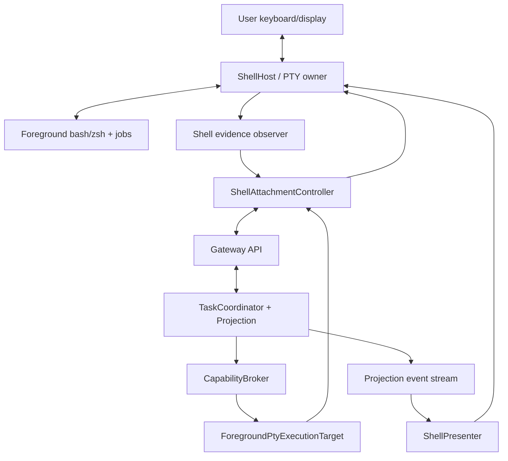

# Phase 2 Shell Attachment 设计

[English](design.md)

状态：规划中，在基线
`6c115aefe04ace0d169a24fa7cd55ad7c1befa52` 上尚未实现。

相关文档：[阶段规划](../../README_zh.md)和[验收报告](acceptance_zh.md)。

## 1. 决策

cosh-shell 继续拥有用户 foreground PTY、terminal mode、job control 和 direct
local shell 路径。Phase 2 在该路径旁增加 Task attachment。Attachment 消费
Gateway projection 并提交 Task command，不把 PTY ownership 移入 Task daemon
或 ACP Bridge。

这会拆开目前共处一个进程的三种生命周期：

```text
ShellSessionId   foreground bash/zsh 与 PTY lifetime
TaskId           持久用户意图与治理 lifetime
AgentSessionId   一个 Agent Runtime conversation binding
```

Attach 和 detach 只作用于 Presentation membership，绝不隐含关闭 Agent
session、取消 Task 或终止 foreground shell。

## 2. 目标与非目标

### 目标

- 保留原生 bash/zsh 行为、foreground process group、signal、terminal resize、
  history 和用户接管能力。
- 让一个 Shell attach 到持久 Task，并可从 cursor replay、approve、answer、
  cancel 和 detach。
- 区分交互式 PTY output 与持久 Task event。
- Local Gateway 或 Agent Runtime 不可用时，继续运行用户输入的 shell command。
- Agent 请求的执行必须经过 Capability Broker，同时把现有 approved foreground
  PTY handoff 保留为一种 Execution Target。
- 让 Shell rendering 成为稳定 projection 上的 Presenter，不再拥有 Task state。

### 非目标

- Phase 2 把交互式 PTY master 移入 daemon。
- 允许 Web 或 ACP peer 直接向用户 foreground PTY 写入。
- 把每一条用户直接输入的 shell command 都变成 Task action。
- 把 Terminal screen buffer 作为规范 Task transcript 持久化。
- 支持多个 Shell/Web Client 并发控制 keystroke。
- 迁移期间删除现有 Adapter、inline card、native Shell mode 或 non-AI
  passthrough 路径。

## 3. 当前源码证据

| 证据 | 当前行为 | Phase 2 含义 |
| --- | --- | --- |
| [`shell_host/bootstrap.rs`](../../../../../crates/cosh-shell/src/shell_host/bootstrap.rs) | `PtySession` 拥有 master/slave file、child process、parser 和 recovery file；bash/zsh 成为带 controlling TTY 的 session leader | PTY lifetime 与 file descriptor 继续由 Shell process 拥有 |
| [`shell_host/raw_runner.rs`](../../../../../crates/cosh-shell/src/shell_host/raw_runner.rs) | Relay input/output，跟踪 process group、terminal size、prompt gate 和 child exit | Attachment 不得阻塞或替代 relay loop |
| [`shell_host/model.rs`](../../../../../crates/cosh-shell/src/shell_host/model.rs) | `ShellHostConfig` 默认 native mode，并可禁用 AI classification | Direct local shell 继续作为明确 compatibility boundary |
| [`runtime/state.rs`](../../../../../crates/cosh-shell/src/runtime/state.rs) | `InlineState` 在内存保存 approval、question、Agent run、event cursor、card、shell block 和 session ID | 持久 Task state 必须移到 Gateway 后方；`InlineState` 变成 view/cache state |
| [`runtime/dispatcher.rs`](../../../../../crates/cosh-shell/src/runtime/dispatcher.rs) | Shell event snapshot 驱动 inline action 和 rendering | Presenter 可复用 rendering 概念，但不能把 shell-event domain 当作 Task schema |
| [`runtime/controller.rs`](../../../../../crates/cosh-shell/src/runtime/controller.rs) | Inline rendering 同时向 PTY 发射 approved handoff 并 capture card input | Task command 与 PTY action 需要独立 Port 和显式 correlation |
| [`shell_host/lifecycle.rs`](../../../../../crates/cosh-shell/src/shell_host/lifecycle.rs) | Host 结束时对 Shell event 脱敏并写入 `events.jsonl` | 该 journal 是 Shell evidence，不是持久 Task EventStore 或 Outbox |
| [`adapter/cosh_core.rs`](../../../../../crates/cosh-shell/src/adapter/cosh_core.rs) | Provider session state 和 recovery 位于 Shell Adapter 后 | Phase 2 把 Agent Runtime ownership 移到 `AgentRuntimePort` 后方 |

基线不存在 Gateway Client、Task attachment record、持久 replay cursor、跨进程
Presenter lease 或 attach/detach API。

## 4. Ownership Model



### Shell 拥有

- PTY master/slave descriptor 和 foreground child process。
- Terminal raw/cooked mode recovery、resize、signal 和 job-control 行为。
- Keystroke capture 与本地 card focus。
- 用户直接输入的 command 和 Terminal output。
- 有界 local view cache 与最后确认的 Task cursor。

### Gateway/Task 拥有

- Task 与 Run state、Agent binding、approval、question、execution record、
  projection sequence 和 replay。
- Attachment membership 与可选 single-writer interaction lease。
- Shell 提交 command 的 idempotency 与 authorization。

### Broker/Execution Target 拥有

- Agent 请求的 shell execution authorization 与 permit。
- Operation digest、target binding、timeout、result 与 unknown-outcome state。

Shell 只对 PTY 可观测事实具有权威性。Task Plane 提交对应 execution result
之前，Shell 不得宣告 Task action 完成。

## 5. Shell Attachment Port

Shell 消费与其他 Client 相同的 versioned Gateway API。未来可以加入本地
in-process 优化，但必须遵循相同 schema 与 authorization check。

概念 command：

```text
AttachTask {
  task_id,
  shell_session_id,
  actor_id,
  after_cursor,
  capabilities,
  client_instance_id
}

DetachTask { task_id, attachment_id, last_applied_cursor, reason }
SubmitPrompt { task_id, expected_version, content, idempotency_key }
ResolveApproval { task_id, approval_id, decision, expected_version, idempotency_key }
AnswerQuestion { task_id, question_id, answer, expected_version, idempotency_key }
CancelRun { task_id, run_id, reason, idempotency_key }
ClaimInteraction { task_id, attachment_id, ttl }
RenewInteraction { task_id, attachment_id, lease_token }
```

`AttachTask` 返回 `AttachmentId`、当前 projection version、有序 replay page 与
next cursor。`after_cursor` 是 Task event cursor，绝不是 Shell OSC index 或 ACP
message ID。

## 6. Presentation Schema

Shell Presenter 把稳定 projection item 映射到现有或新增 card model。映射是
单向的：

| Projection item | Shell Surface |
| --- | --- |
| Task/Run status | Status 或 notice panel |
| Agent message chunk | Markdown stream card |
| Plan update | Plan/activity panel |
| Tool declaration/update | Tool invocation row |
| Approval pending/resolved | Approval panel 与 receipt |
| User question | Question panel |
| Execution output reference | 按需获取的有界 detail view |
| Runtime failure/recovery | Recoverable error notice |
| Usage update | 可选 status detail |

Terminal layout、color、width、animation 与 key binding 留在 `ui/`。Domain
status、approval authority、retry policy 与 cursor progression 不得留在 UI。

每个 rendered item 都携带 `TaskId`、projection sequence 与稳定 item ID。
只有 item 已应用到 local view model 后，Shell 才记录 cursor。渲染一个临时
frame 不等于持久 delivery receipt。

## 7. 生命周期与 Attach/Detach 语义

```mermaid
stateDiagram-v2
    [*] --> LocalOnly
    LocalOnly --> Attaching: attach Task
    Attaching --> Attached: snapshot and replay applied
    Attaching --> Degraded: Gateway unavailable
    Attached --> Attached: live projection items
    Attached --> Capturing: approval or question focus
    Capturing --> Attached: command accepted or focus cancelled
    Attached --> Degraded: stream disconnected
    Degraded --> Attaching: reconnect with cursor
    Attached --> Detaching: user/session request
    Detaching --> LocalOnly: receipt persisted
    LocalOnly --> [*]: foreground shell exits
    Attached --> [*]: shell exits; Task continues
```



### Attach

1. 验证 local actor 和 Shell instance。
2. 请求 projection snapshot 以及 Shell 已存 cursor 之后的 event。
3. 应用 replay，但不执行 Terminal side effect。
4. 已知 snapshot boundary 后才启动 live stream。
5. 持久化最高的连续 applied cursor。

### Detach

- 停止 projection subscription 并释放 interaction lease。
- 记录最后 applied cursor 与 reason。
- 取消本地 card capture，但不对底层 approval 或 question 作决定。
- 不关闭 `AgentSessionId`、不取消 `RunId`、不停止 Task，也不杀死 PTY。

### Shell 退出

Shell 释放 attachment 和 PTY resource。除非用户另行提交 cancel command，持久
Task 继续运行。Best-effort detach 失败由 attachment lease expiry 恢复。

## 8. Direct Local Mode

Direct local mode 保持现有 Terminal 承诺：

- 用户输入的 shell command 直接进入 foreground bash/zsh PTY。
- Pipe、redirect、interactive program、signal 和 job control 不等待 Gateway
  admission。
- Gateway 或 Agent Runtime 不可用时，Shell 保持可用，并把 Agent/Task feature
  显示为 degraded。
- Direct command 可产生脱敏 Shell evidence，并由用户明确 attach 到 Task，但不能
  追溯解释为经过 Agent authorization 的 operation。

Agent 请求的 command 不同。Bytes 进入 PTY 前，必须有 Task execution request、
Broker permit 与 `ForegroundPtyExecutionTarget` handoff。UI 必须明显区分用户
直接输入和 Agent-proposed execution。

选择 direct-only 或 Gateway-attached startup 的准确 launch flag 或 config name
留给实现决定。Phase 2 不得移除 direct path。

## 9. Foreground PTY Execution Target

现有 approved shell handoff 可以演进为 Execution Target Adapter，并满足：

1. 只有 owner `ShellSessionId` 和 attachment 存活时，该 target 才可寻址。
2. Broker permit 包含 command digest、actor、target、Task、expiry 和预期 shell
   readiness。
3. Shell 在 handoff 入队前验证 permit 与 command correlation。
4. 使用现有 prompt/foreground detection 防止向 busy 或 alternate-screen program
   注入。
5. Output 与 exit fact 关联到 `ExecutionId` 并返回 Task Plane。
6. Timeout 或 disconnect 产生 typed interrupted/unknown outcome，不能推断成功。

ACP `terminal/create` 默认不映射到该交互式 target。它使用独立的 governed
background execution target，避免外部 Agent 仅因请求 ACP terminal capability
就接管用户 live terminal。

## 10. Approval 与 Input Capture

Task Plane 拥有 approval state。Shell 只拥有 Presentation 与 keyboard capture。

- Approval card 从带稳定 version 的 `ApprovalView` 渲染。
- 提交的 decision 包含 `ApprovalId`、expected Task version、actor 和 idempotency
  key。
- 只有 Approval Service 暴露可用持久 policy scope 时，才显示本地
  “allow always” control。
- Disconnect 或取消 card focus 不表示 reject。
- 只有 Gateway 接受 decision 并 replay resolved projection event 后，decision
  才算最终完成。
- Stale、duplicate、unauthorized 或已 resolved decision 返回 typed error，且不能
  执行 command。

Question 使用相同模式。Secret input 不写入通用 Task timeline；敏感 answer 使用
Phase 0 contract 定义的专用脱敏或 one-time channel。

## 11. Replay 与 Delivery

Shell 保存很小的本地 attachment record：

```text
task_id
attachment_id or previous client_instance_id
last_applied_cursor
last_projection_version
updated_at
```

重连时请求 `last_applied_cursor` 之后的 event。必须按稳定 item ID 和 sequence
幂等应用。如果 cursor 已超出 retention，Gateway 返回新 snapshot 和 reset
boundary；Shell 重建 Task card，但不 replay Terminal side effect，也不清空 PTY
screen。

Shell 永不 replay raw PTY input。Shell evidence 与 Task projection 是通过显式
evidence reference 关联的独立 stream。

## 12. Error、弱网与 Recovery

| 故障 | 必须的行为 |
| --- | --- |
| 启动时 Gateway 不可用 | 启动或保留 direct local mode；显示有界 degradation notice |
| Stream disconnect | 保持 PTY active，停止 Task input capture，带 backoff 和 cursor 重连 |
| Replay gap/expired cursor | 从 snapshot 和 reset boundary 重建 Task view |
| 重复 projection item | 按稳定 sequence/item ID 忽略 |
| Command response 丢失 | 只使用相同 idempotency key retry，并通过 projection 对账 |
| Pending approval 时 Shell 退出 | 释放 attachment；approval 保持 pending，直到 policy timeout 或其他 Presenter 处理 |
| Permitted handoff 到达时 PTY busy | 在有界 permit lifetime 内排队，或按 target unavailable 拒绝 |
| PTY output correlation 丢失 | 记录 unknown execution outcome 并要求检查 |
| Task daemon 重启 | 保持 PTY 运行；重连并 rehydrate projection |
| Terminal resize/card redraw 失败 | 恢复 Terminal mode，保存 Task cursor 后重试 Presentation |

Gateway 故障不得冻结 foreground shell input/output relay。

## 13. 安全 Invariant

- Attachment authentication 本身不授予 OS execution。
- 只有拥有 PTY 的 Shell process 可以写 foreground PTY master。
- Task event text、Agent markdown 和 tool title 都是不可信 rendering input，不得
  在 renderer policy 外发出 control sequence。
- Projection replay 永不执行 command 或重新提交 decision。
- Attachment 带 actor 和 client-instance scope；窃取 ID 不等于获得 bearer
  credential。
- Interaction lease 限制并发 approval/question input，但 viewer 仍可见。
- Shell evidence 跨越 Gateway 前保持脱敏和有界。
- Direct user command 标记为 user-originated，不能作为 Agent-held permit 已执行的
  证明。

## 14. 迁移计划

1. 在不改变 PTY 行为的前提下抽取 Presenter-facing projection model。
2. 在默认关闭的 feature path 后添加 Gateway Client 和 attachment state。
3. 在当前 inline state 旁渲染 read-only Task replay。
4. 把 prompt、cancel、approval 和 question command 移到 Gateway 路径。
5. 把 approved foreground handoff 适配到 `ExecutionTargetPort`。
6. 只有 parity 与 restart test 通过后，才从 `InlineState` 移除 Task-authoritative
   field。
7. 保留 direct local mode 与现有 cosh-core 路径用于 rollback。

迁移期间一个用户 action 只能有一个 owner。禁止同时写 local approval 与 Task
approval。

## 15. 依赖与任务分解

| Work item | Owner | 依赖 |
| --- | --- | --- |
| Gateway attachment client | Shell attachment | Phase 1 Gateway API |
| Durable cursor cache | Shell attachment | Projection cursor contract |
| Shell projection presenter | `ui/` | Phase 0 presentation schema |
| Task command input adapter | Shell attachment | Task command/idempotency contract |
| Interaction lease handling | Shell + Task Plane | Attachment schema |
| Foreground PTY target adapter | `shell_host/` + Execution Target | Broker permit contract |
| Evidence reference adapter | Shell evidence owner | Evidence schema 和 redaction policy |
| Degraded direct-mode UX | `ui/` + runtime | Gateway health taxonomy |
| Attach/detach/replay test | Shell attachment | Deterministic Gateway fake |

新增 production code 遵守现有 owner rule：PTY mechanics 留在 `shell_host/`，UI
留在 `ui/`，Task attachment orchestration 留在批准的 Runtime owner。不得新增
root implementation module。

## 16. 测试策略

### Pure 与 Protocol Test

- Cursor application、稳定 item deduplication、projection-to-card mapping 与
  idempotent command encoding。
- Attach/detach state transition、interaction lease expiry 和 stale decision
  rejection。
- 不可信 projection content 的 Terminal control-sequence sanitization。

### Shell Host Integration Test

- Gateway 连接和断开时的 direct user command、job control、`Ctrl+C`、resize、
  alternate screen 和 foreground process 行为。
- Task 运行时 detach，不杀死 PTY 或 Task。
- Daemon restart 与 cursor replay 不产生重复 card 或 command execution。
- Governed foreground handoff 只在安全 prompt boundary 执行。
- PTY owner 退出后产生 typed target-unavailable 或 unknown outcome。

### 手工验收

Release 前需要手工 TTY test，因为 scripted PTY 不能完全证明 terminal mode
recovery 和可视 card 行为。必须对准确 candidate commit 单独请求和记录；本次
规划工作不执行该 gate。

## 17. 开放问题

- 首版是否一个 Shell 只需 attach 一个 Task，还是必须同时展示多个 Task？
- Shell 与 Web 都 attach 时，默认 interaction lease 归哪个 Client？
- Direct local command 应自动可 attach 为 evidence，还是只允许用户显式选择？
- Local cursor cache 需要怎样的 retention 与 encryption？
- 哪些现有 inline state field 可以在 Phase 2 移除，哪些应留到后续兼容阶段？
