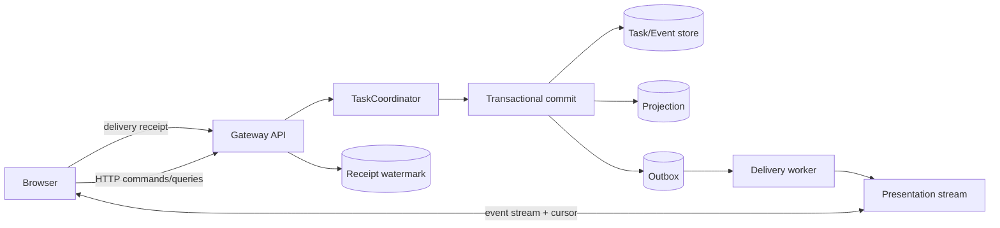
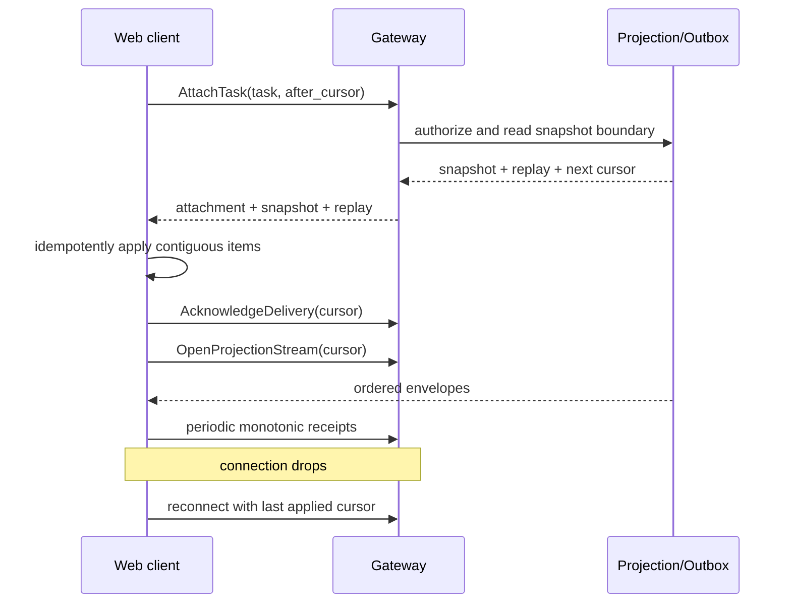

# Phase 2 Web and Presentation Design

[中文版](design_zh.md)

Status: planned, not implemented on baseline
`6c115aefe04ace0d169a24fa7cd55ad7c1befa52`.

Related documents: [phase plan](../../README.md) and
[acceptance report](acceptance.md).

## 1. Decision

The Phase 2 Web client is a presentation adapter over the COSH Gateway API and
versioned Task projections. It never connects to ACP, an Agent subprocess, a
PTY, the Task database, or the Outbox table directly.

The first delivery profile uses:

- versioned HTTP JSON commands and queries through the Gateway;
- an ordered server event stream with a replay cursor;
- transactional Projection and Outbox writes in the Task plane;
- per-client delivery receipts for the highest contiguous applied cursor;
- snapshot reset when a cursor is outside retention.

SSE is the preferred first stream binding because commands remain explicit
HTTP requests and reconnect uses a cursor. WebSocket can be added behind the
same Presentation Port later; it is not ACP remote transport and must not
change Task semantics.

## 2. Goals and non-goals

### Goals

- View Task state and Agent progress from a browser without logging into a
  shell.
- Attach, detach, replay, prompt, approve, answer, cancel, and inspect results
  through the same Gateway contract used by other clients.
- Deliver ordered projection changes reliably across refresh, reconnect,
  device sleep, weak networks, and daemon restart.
- Keep presentation-specific layout separate from Task and Runtime schemas.
- Support multiple viewers while controlling concurrent interactive actions.
- Preserve redaction, authorization, and target scope on every read and
  command.

### Non-goals

- Implementing an in-browser ACP client or exposing ACP stdio over WebSocket.
- Rendering or controlling the user's foreground PTY.
- Making browser local storage the source of truth.
- Giving the Web server direct database, Outbox, Agent, or OS execution access.
- Guaranteeing exactly-once network delivery. The design provides ordered
  at-least-once delivery with idempotent application and receipts.
- General DingTalk/Feishu channel adapters in Phase 2.
- A full Warp-style terminal emulator or code editor.

## 3. Current source evidence

| Evidence | Current behavior | Phase 2 gap |
| --- | --- | --- |
| [`ui/agent_render`](../../../../../crates/cosh-shell/src/ui/agent_render/mod.rs) | Terminal-specific panels, markdown, approval, question, activity, and tool rendering | Rendering models are not a versioned network projection contract |
| [`runtime/dispatcher.rs`](../../../../../crates/cosh-shell/src/runtime/dispatcher.rs) | In-process shell event snapshots drive UI actions | No cross-process replay, authorization, or delivery receipt |
| [`runtime/state.rs`](../../../../../crates/cosh-shell/src/runtime/state.rs) | View and lifecycle state is held in `InlineState` | State is process-local and shell-specific |
| [`shell_host/lifecycle.rs`](../../../../../crates/cosh-shell/src/shell_host/lifecycle.rs) | Redacted shell events are written to a local JSONL journal | The journal is not a Task projection, EventStore, or Web API |
| [`cosh-core/protocol.rs`](../../../../../crates/cosh-core/src/protocol.rs) | Internal JSONL streams contain messages, tools, questions, approvals, and results | This private protocol cannot be exposed to a browser |
| [`cosh-core/session.rs`](../../../../../crates/cosh-core/src/session.rs) | Provider conversations are persisted by workspace | Provider history is not an authorized multi-client Task view |

The baseline has no Web crate, browser bundle, Gateway HTTP API, SSE endpoint,
Task projection, Outbox, delivery receipt, or Web authentication path.

## 4. Architecture and ownership



### Gateway-owned

- Authentication, actor resolution, authorization, rate limits, schema
  negotiation, command validation, and idempotency admission.
- Query and stream endpoints over the Presentation Port.
- Receipt validation and attachment lifecycle commands.

### Task-plane-owned

- Canonical Task events, aggregate state, projection, event sequence, Outbox
  records, attachment records, and interaction leases.
- Atomic command result: Task event, projection update, and Outbox record are
  committed in one transaction boundary.

### Delivery-worker-owned

- Claiming pending Outbox records, publishing ordered projection envelopes,
  retry/backoff, lease recovery, and delivery metrics.
- It does not interpret domain policy or mark a user action accepted.

### Browser-owned

- Layout, filters, local navigation, an idempotent view reducer, last applied
  cursor, and ephemeral input drafts.
- Browser state is disposable and never authorizes a Task transition.

## 5. Gateway surface

Exact paths are frozen by the Phase 1 Gateway API, but the Phase 2 Web adapter
requires these conceptual operations:

```text
CreateTask
GetTaskProjection
ListAuthorizedTasks
AttachTask
DetachTask
SubmitPrompt
ResolveApproval
AnswerQuestion
CancelRun
ClaimInteraction / RenewInteraction / ReleaseInteraction
ReadExecutionOutput
OpenProjectionStream(after_cursor)
AcknowledgeDelivery(highest_contiguous_cursor)
```

Every mutation carries:

```text
actor identity resolved by Gateway
task_id
expected aggregate/projection version where applicable
idempotency_key
client_instance_id
attachment_id when attached interaction is required
```

The Web adapter receives typed errors for unauthorized, conflict, stale
version, already resolved, invalid state, rate limited, and temporarily
unavailable outcomes. It must not infer success from an HTTP connection close.

## 6. Projection schema

The projection is optimized for safe presentation, not runtime rehydration.

### Task summary

```text
TaskSummaryView {
  task_id,
  title,
  status,
  current_run_id?,
  target_summary,
  created_at,
  updated_at,
  version,
  unread_or_attention_state
}
```

### Task detail

```text
TaskDetailView {
  summary,
  agent_session_summary?,
  plan,
  timeline_items,
  pending_approvals,
  pending_questions,
  executions,
  usage?,
  attachments,
  available_actions,
  projection_version,
  snapshot_cursor
}
```

### Stream envelope

```text
ProjectionEnvelope {
  schema_version,
  task_id,
  sequence,
  item_id,
  event_type,
  occurred_at,
  projection_version,
  payload,
  redaction_class,
  replay
}
```

`available_actions` is advisory UI data; Gateway command validation remains
authoritative. Raw model payloads, secrets, environment values, unbounded
terminal output, and provider credentials never enter the generic projection.

## 7. Runtime and ACP event presentation

The Task plane normalizes runtime-specific events before presentation:

| Domain projection item | Web component |
| --- | --- |
| Task/Run state | Header and status timeline |
| Agent message/thought chunks | Grouped message blocks with policy-based visibility |
| Agent plan | Structured plan list |
| Tool use and update | Tool activity card |
| Approval pending/resolved | Decision card and immutable receipt |
| Question pending/answered | Input card and answer state |
| Execution state/output reference | Execution card and paged output viewer |
| Usage update | Context/cost indicator |
| Runtime failure/recovery | Recovery notice and allowed actions |

ACP `messageId`, `toolCallId`, `terminalId`, and `sessionId` are never public
Task identities. A presenter may receive a stable normalized message/tool item
ID. It does not consume ACP JSON-RPC.

## 8. Outbox and transaction semantics

For every user-visible Task transition, one database transaction must:

1. validate the aggregate version and command idempotency key;
2. append the canonical Task event;
3. update the current projection;
4. insert one or more ordered Outbox records;
5. persist the command result or idempotency record.

If the transaction rolls back, none of these effects is visible. If it
commits, a delivery worker can recover the Outbox record after process crash.

Outbox ordering is per Task. A global sequence may exist for operations, but
Web replay relies on the Task stream cursor. Delivery workers use a bounded
claim lease and make duplicate publication safe. They may compact superseded
high-frequency progress updates only when the projection contract explicitly
permits it; approvals, decisions, execution outcomes, and terminal states are
not lossy.

The Outbox is not deleted because one browser received an item. Retention is
governed by canonical event/projection policy and per-client receipt
watermarks.

## 9. Delivery receipt semantics

A delivery receipt means the client reducer applied every envelope up to a
contiguous cursor. It does not mean the user saw the item, approved it, or
accepted its result.

```text
DeliveryReceipt {
  actor_id,
  client_instance_id,
  attachment_id,
  task_id,
  highest_contiguous_cursor,
  projection_version,
  acknowledged_at
}
```

Rules:

- Receipts advance monotonically and cannot skip a gap.
- The Gateway authenticates and scopes every receipt.
- A receipt for an unknown, expired, or other Task attachment is rejected.
- Duplicate receipts are idempotent.
- A stale lower cursor is ignored, not treated as a detach.
- Receipt absence triggers retry or retention, not command rollback.
- One device's receipt does not advance another device's watermark.
- Detach includes the last applied cursor but remains a separate lifecycle
  command.

## 10. Attach, replay, and reconnect



To avoid snapshot/stream races, the attach response includes an atomic
snapshot boundary. The stream starts strictly after that boundary or includes
deduplicable overlap.

If the requested cursor is retained, the server replays after it. If it is
expired, the server returns a typed `cursor_reset` with a fresh snapshot and
new boundary. The client replaces its Task reducer state but keeps local input
drafts only after checking their Task version.

## 11. Commands, approvals, and concurrency

Prompt, approval, question, and cancellation submissions use an idempotency
key generated before the first network attempt. On timeout, the client retries
with the same key or reconciles from the projection.

Approval rules:

- The browser never receives a Broker permit or execution credential.
- A decision includes `ApprovalId` and expected Task version.
- The Gateway resolves actor and attachment scope, then Task policy accepts or
  rejects the transition.
- A UI success state appears only after command acceptance and resolved
  projection reconciliation.
- “Always allow” is shown only for policy scopes supplied by the Approval
  Service.
- Sensitive questions use a dedicated contract; generic projections contain
  only redacted completion state.

Multiple clients can view a Task. Mutating conversational controls require an
interaction lease or conflict-safe aggregate version, according to the command
contract. Approval policy may intentionally allow another authorized device
to decide without the conversational lease; that exception must be explicit
and audited.

## 12. Security and privacy

- Gateway authentication and authorization precede every query, stream,
  receipt, and command.
- Browser cookies or tokens use origin, expiry, rotation, CSRF, and secure
  transport controls appropriate to the deployment mode.
- Task authorization is checked on reconnect and on every command; a prior
  attachment is not permanent access.
- Projection payloads are escaped and sanitized against HTML, Markdown, URL,
  and terminal-control injection.
- Execution output is fetched by an authorized, expiring reference with byte
  and line bounds; it is not embedded without limit in the event stream.
- Secrets and raw credentials never enter generic timeline items, logs, URLs,
  or browser local storage.
- Delivery receipts and view telemetry must not contain prompt or output
  content.
- The Web adapter cannot call `ExecutionTargetPort`, `AgentRuntimePort`, or the
  Task store directly.

## 13. Errors and weak networks

| Failure | Required behavior |
| --- | --- |
| Browser offline or sleeping | Keep last safe projection, mark stale, reconnect with cursor |
| Stream drop or proxy timeout | Exponential backoff with jitter; commands remain separate requests |
| Duplicate/out-of-order envelope | Buffer only within a bound, apply contiguous sequence, request replay on gap |
| Cursor expired | Replace reducer from an authorized snapshot reset |
| Command response lost | Retry with same idempotency key and reconcile from projection |
| Gateway restart | Resume from Outbox/EventStore without losing committed changes |
| Delivery worker crash | Claim lease expires; another worker republishes safely |
| Receipt write failure | Continue bounded replay; do not claim user action failed |
| Authorization revoked | Close stream, clear sensitive cached Task data, require reauthentication |
| Execution output unavailable | Preserve typed metadata and provide retry/inspection action |
| Slow client | Disconnect after bounded queue; client replays later from cursor |

The event stream is not a heartbeat-based source of truth. A client marks its
view current only after it has applied a contiguous cursor from an authorized
snapshot or stream.

## 14. Migration plan

1. Freeze Web-safe projection and stream envelope schemas in Phase 0.
2. Implement transactional projections and Outbox in Phase 1.
3. Add read-only Task list/detail queries and a deterministic Web presenter.
4. Add attach, cursor replay, live stream, and receipts.
5. Add idempotent prompt and cancel commands.
6. Add approval/question controls after interaction lease and sensitive-input
   policy are accepted.
7. Add execution output inspection by bounded reference.
8. Keep Web disabled by configuration for rollback; Shell direct mode remains
   independent.

No migration step reads cosh-core JSONL or shell `InlineState` directly from
the Web layer.

## 15. Dependencies and task breakdown

| Work item | Owner | Depends on |
| --- | --- | --- |
| Web-safe projection schemas | Presentation contract owner | Phase 0 schemas and redaction classes |
| HTTP command/query adapter | Gateway | Phase 1 Gateway API |
| Transactional Outbox publisher | Task Plane | EventStore/projection transaction ADR |
| Ordered stream adapter | Presentation delivery | Outbox claim and cursor contract |
| Delivery receipt endpoint/store | Gateway + Task Plane | Attachment identity |
| Browser reducer and components | Web presentation | Projection golden fixtures |
| Interaction lease UX | Web + Task Plane | Lease commands and conflict taxonomy |
| Approval/question UX | Web presentation | Approval and sensitive-input contracts |
| Output reference viewer | Web + Execution evidence | Authorized bounded-output API |
| Weak-network integration suite | Web presentation | Deterministic proxy/failure harness |

## 16. Test strategy

### Contract and reducer tests

- JSON schema compatibility for snapshots, envelopes, commands, errors, and
  receipts.
- Golden rendering for every projection item and redaction class.
- Duplicate, overlap, gap, reset, and out-of-order reducer behavior.
- Bounded Markdown/HTML/URL injection fixtures.

### Transaction and delivery tests

- Crash before and after event/projection/Outbox transaction commit.
- Delivery worker lease expiry, retry, duplicate publication, and ordering.
- Receipt monotonicity, gap rejection, multi-device watermarks, and detach.
- Cursor retention reset and snapshot/stream race coverage.

### End-to-end tests

- Create/attach/prompt/stream/approve/cancel/detach/reattach against fake
  Runtime and Execution Target ports.
- Browser refresh, offline interval, Gateway restart, slow stream, lost command
  response, and authorization revocation.
- Confirm that no Web path can reach ACP, a PTY, Task storage, or Execution
  Target directly.

Real provider, ECS, public-network, and browser screenshot validation require
separate explicit requests. They are not performed by this design work.

## 17. Open questions

- Is SSE sufficient for the first deployment environment, or does a known
  proxy require an alternate stream binding immediately?
- What Task event and receipt retention periods satisfy weak-network clients
  without unbounded storage?
- Which views are available to read-only collaborators versus Task operators?
- Should interaction leases be per Task, per Run, or per pending input?
- Which execution outputs may be cached by a service worker, if any?
- Is the first Web surface local-only, remotely exposed through an existing
  control plane, or both? The answer changes authentication deployment, not
  Task semantics.
