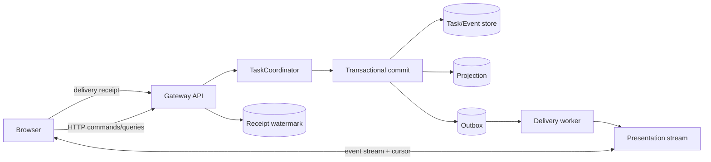
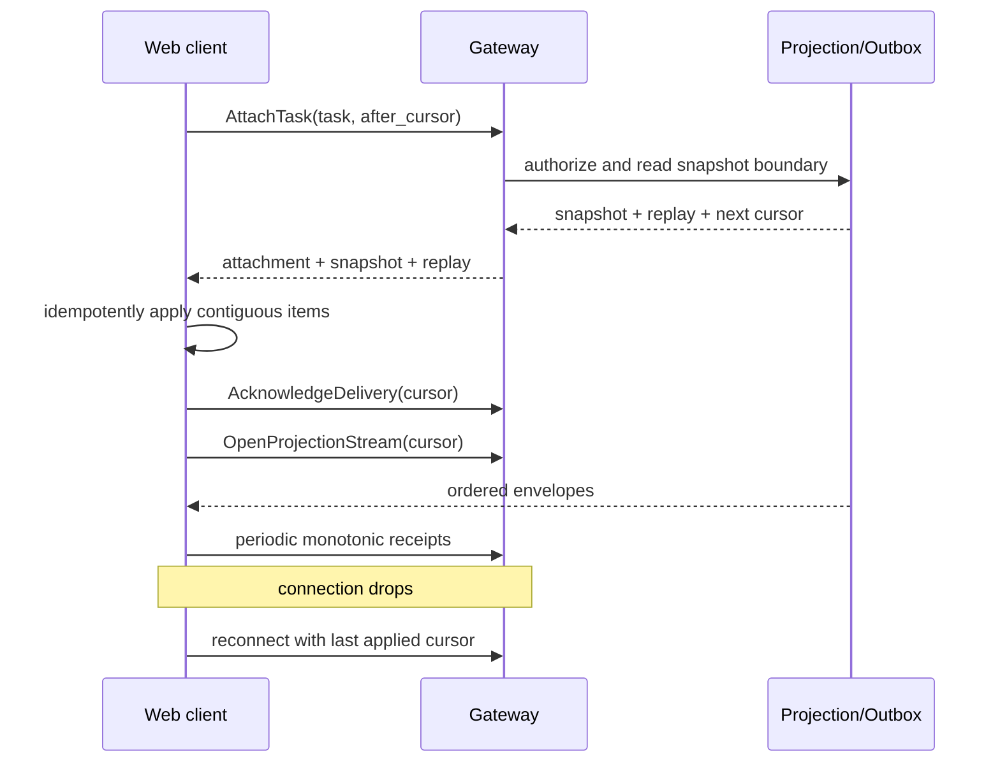

# Phase 2 Web 与 Presentation 设计

[English](design.md)

状态：规划中，在基线
`6c115aefe04ace0d169a24fa7cd55ad7c1befa52` 上尚未实现。

相关文档：[阶段规划](../../README_zh.md)和[验收报告](acceptance_zh.md)。

## 1. 决策

Phase 2 Web Client 是 COSH Gateway API 与 versioned Task projection 上的
Presentation Adapter。它永不直接连接 ACP、Agent subprocess、PTY、Task
database 或 Outbox table。

首个 delivery profile 使用：

- 通过 Gateway 传输 versioned HTTP JSON command 和 query；
- 带 replay cursor 的有序 server event stream；
- Task Plane 内 transactional Projection 与 Outbox write；
- 每个 Client 对最高连续 applied cursor 的 delivery receipt；
- Cursor 超出 retention 时执行 snapshot reset。

首版 stream binding 优先选择 SSE，因为 command 继续使用显式 HTTP request，
reconnect 使用 cursor。未来可以在相同 Presentation Port 后增加 WebSocket；
它不是 ACP remote transport，也不得改变 Task 语义。

## 2. 目标与非目标

### 目标

- 无需登录 Shell 即可从 Browser 查看 Task state 与 Agent progress。
- 通过与其他 Client 相同的 Gateway contract 实现 attach、detach、replay、
  prompt、approve、answer、cancel 和 result inspection。
- 在 refresh、reconnect、device sleep、弱网和 daemon restart 时可靠交付有序
  projection change。
- 让 Presentation-specific layout 与 Task/Runtime schema 分离。
- 在限制并发 interactive action 的同时支持多个 viewer。
- 对每次 read 和 command 保持 redaction、authorization 与 target scope。

### 非目标

- 实现 in-browser ACP Client 或在 WebSocket 上暴露 ACP stdio。
- 渲染或控制用户 foreground PTY。
- 让 Browser local storage 成为事实来源。
- 让 Web server 直接访问 database、Outbox、Agent 或 OS execution。
- 保证 exactly-once network delivery。本设计提供有序 at-least-once delivery、
  幂等 application 与 receipt。
- Phase 2 实现通用钉钉/飞书 Channel Adapter。
- 实现完整的 Warp 风格 Terminal emulator 或 code editor。

## 3. 当前源码证据

| 证据 | 当前行为 | Phase 2 缺口 |
| --- | --- | --- |
| [`ui/agent_render`](../../../../../crates/cosh-shell/src/ui/agent_render/mod.rs) | Terminal-specific panel、markdown、approval、question、activity 与 tool rendering | Rendering model 不是 versioned network projection contract |
| [`runtime/dispatcher.rs`](../../../../../crates/cosh-shell/src/runtime/dispatcher.rs) | In-process Shell event snapshot 驱动 UI action | 没有跨进程 replay、authorization 或 delivery receipt |
| [`runtime/state.rs`](../../../../../crates/cosh-shell/src/runtime/state.rs) | View 和 lifecycle state 保存在 `InlineState` | 状态是 process-local 且 Shell-specific |
| [`shell_host/lifecycle.rs`](../../../../../crates/cosh-shell/src/shell_host/lifecycle.rs) | 脱敏 Shell event 写入 local JSONL journal | Journal 不是 Task projection、EventStore 或 Web API |
| [`cosh-core/protocol.rs`](../../../../../crates/cosh-core/src/protocol.rs) | 内部 JSONL stream 包含 message、tool、question、approval 和 result | 该私有 protocol 不能暴露给 Browser |
| [`cosh-core/session.rs`](../../../../../crates/cosh-core/src/session.rs) | 按 workspace 持久化 provider conversation | Provider history 不是授权的 multi-client Task view |

基线没有 Web crate、Browser bundle、Gateway HTTP API、SSE endpoint、Task
projection、Outbox、delivery receipt 或 Web authentication path。

## 4. 架构与 Ownership



### Gateway 拥有

- Authentication、actor resolution、authorization、rate limit、schema
  negotiation、command validation 与 idempotency admission。
- Presentation Port 上的 query 与 stream endpoint。
- Receipt validation 与 attachment lifecycle command。

### Task Plane 拥有

- Canonical Task event、aggregate state、projection、event sequence、Outbox
  record、attachment record 和 interaction lease。
- Atomic command result：Task event、projection update 和 Outbox record 在一个
  transaction boundary 内提交。

### Delivery Worker 拥有

- Claim pending Outbox record、发布有序 projection envelope、retry/backoff、
  lease recovery 与 delivery metric。
- 它不解释 domain policy，也不把用户 action 标记为已接受。

### Browser 拥有

- Layout、filter、local navigation、幂等 view reducer、last applied cursor 和
  临时 input draft。
- Browser state 可丢弃，并且永不授权 Task transition。

## 5. Gateway Surface

准确 path 由 Phase 1 Gateway API 冻结，但 Phase 2 Web Adapter 需要这些概念
operation：

```text
CreateTask
GetTaskProjection
ListAuthorizedTasks
AttachTask
DetachTask
SubmitPrompt
ResolveApproval
AnswerQuestion
CancelRun
ClaimInteraction / RenewInteraction / ReleaseInteraction
ReadExecutionOutput
OpenProjectionStream(after_cursor)
AcknowledgeDelivery(highest_contiguous_cursor)
```

每个 mutation 携带：

```text
actor identity resolved by Gateway
task_id
expected aggregate/projection version where applicable
idempotency_key
client_instance_id
attachment_id when attached interaction is required
```

Web Adapter 接收 unauthorized、conflict、stale version、already resolved、
invalid state、rate limited 与 temporarily unavailable 的 typed error。HTTP
connection close 不能被解释为成功。

## 6. Projection Schema

Projection 面向安全 Presentation 优化，不用于 Runtime rehydration。

### Task Summary

```text
TaskSummaryView {
  task_id,
  title,
  status,
  current_run_id?,
  target_summary,
  created_at,
  updated_at,
  version,
  unread_or_attention_state
}
```

### Task Detail

```text
TaskDetailView {
  summary,
  agent_session_summary?,
  plan,
  timeline_items,
  pending_approvals,
  pending_questions,
  executions,
  usage?,
  attachments,
  available_actions,
  projection_version,
  snapshot_cursor
}
```

### Stream Envelope

```text
ProjectionEnvelope {
  schema_version,
  task_id,
  sequence,
  item_id,
  event_type,
  occurred_at,
  projection_version,
  payload,
  redaction_class,
  replay
}
```

`available_actions` 是建议性 UI 数据，Gateway command validation 仍具有权威性。
Raw model payload、secret、environment value、无界 Terminal output 与 provider
credential 不得进入 generic projection。

## 7. Runtime 与 ACP Event Presentation

Task Plane 在 Presentation 前对 Runtime-specific event 归一化：

| Domain projection item | Web Component |
| --- | --- |
| Task/Run state | Header 和 status timeline |
| Agent message/thought chunk | 根据 policy 控制可见性的 grouped message block |
| Agent plan | Structured plan list |
| Tool use 与 update | Tool activity card |
| Approval pending/resolved | Decision card 和 immutable receipt |
| Question pending/answered | Input card 和 answer state |
| Execution state/output reference | Execution card 和 paged output viewer |
| Usage update | Context/cost indicator |
| Runtime failure/recovery | Recovery notice 和 available action |

ACP `messageId`、`toolCallId`、`terminalId` 与 `sessionId` 永远不是 public Task
identity。Presenter 可以收到稳定且归一化的 message/tool item ID，但不消费 ACP
JSON-RPC。

## 8. Outbox 与 Transaction 语义

每次用户可见 Task transition 都必须在一个 database transaction 内：

1. 验证 aggregate version 和 command idempotency key；
2. 追加 canonical Task event；
3. 更新 current projection；
4. 插入一个或多个有序 Outbox record；
5. 持久化 command result 或 idempotency record。

Transaction rollback 时所有效果都不可见。Commit 后，即使 process crash，
delivery worker 也能恢复 Outbox record。

Outbox 按 Task 排序。可以为运维提供 global sequence，但 Web replay 依赖 Task
stream cursor。Delivery worker 使用有界 claim lease，并允许安全重复发布。只有
projection contract 明确允许时，才能 compact 已被取代的高频 progress update；
approval、decision、execution outcome 与 terminal state 不能 lossy。

不能因为一个 Browser 收到 item 就删除 Outbox。Retention 由 canonical event/
projection policy 和每个 Client 的 receipt watermark 管理。

## 9. Delivery Receipt 语义

Delivery receipt 表示 Client reducer 已应用到某个连续 cursor 的全部 envelope，
不表示用户看到 item、批准它或接受结果。

```text
DeliveryReceipt {
  actor_id,
  client_instance_id,
  attachment_id,
  task_id,
  highest_contiguous_cursor,
  projection_version,
  acknowledged_at
}
```

规则：

- Receipt 单调前进，不能跨过 gap。
- Gateway 认证每个 receipt 并限定 scope。
- Unknown、expired 或其他 Task attachment 的 receipt 被拒绝。
- 重复 receipt 幂等。
- 过低 stale cursor 被忽略，不按 detach 处理。
- 缺失 receipt 触发 retry 或 retention，不触发 command rollback。
- 一个 device 的 receipt 不推进另一个 device 的 watermark。
- Detach 包含 last applied cursor，但仍是独立 lifecycle command。

## 10. Attach、Replay 与 Reconnect



为了避免 snapshot/stream race，attach response 包含 atomic snapshot boundary。
Stream 严格从该 boundary 之后开始，或包含可 dedup 的 overlap。

Requested cursor 仍在 retention 内时，Server 从其后 replay。过期时返回 typed
`cursor_reset`、fresh snapshot 和新 boundary。Client 替换 Task reducer state，
同时只在校验 Task version 后保留 local input draft。

## 11. Command、Approval 与 Concurrency

Prompt、approval、question 和 cancellation submission 使用首次网络尝试前生成的
idempotency key。Timeout 时，Client 使用相同 key retry，或通过 projection
reconcile。

Approval 规则：

- Browser 永不接收 Broker permit 或 execution credential。
- Decision 包含 `ApprovalId` 与 expected Task version。
- Gateway 解析 actor 和 attachment scope，随后由 Task policy 接受或拒绝
  transition。
- UI 只在 command 被接受并完成 resolved projection reconciliation 后显示成功。
- 只有 Approval Service 提供 policy scope 时才显示 “Always allow”。
- 敏感 question 使用专用 contract；generic projection 只包含脱敏 completion
  state。

多个 Client 可以查看同一 Task。Mutating conversational control 根据 command
contract 要求 interaction lease 或 conflict-safe aggregate version。Approval
policy 可以明确允许另一个 authorized device 在没有 conversational lease 时
作决定；该例外必须显式且可审计。

## 12. 安全与隐私

- Gateway authentication 与 authorization 先于每次 query、stream、receipt 和
  command。
- Browser cookie 或 token 根据 deployment mode 使用恰当的 origin、expiry、
  rotation、CSRF 与 secure transport control。
- 重连和每次 command 都重新检查 Task authorization；旧 attachment 不等于永久
  access。
- Projection payload 必须防御 HTML、Markdown、URL 与 Terminal-control
  injection。
- Execution output 通过 authorized、expiring reference 按 byte/line bound 获取，
  不得无界嵌入 event stream。
- Secret 和 raw credential 永不进入 generic timeline item、log、URL 或 Browser
  local storage。
- Delivery receipt 和 view telemetry 不包含 prompt 或 output content。
- Web Adapter 不能直接调用 `ExecutionTargetPort`、`AgentRuntimePort` 或 Task
  store。

## 13. Error 与弱网

| 故障 | 必须的行为 |
| --- | --- |
| Browser offline 或 sleep | 保留最后安全 projection，标记 stale，带 cursor 重连 |
| Stream drop 或 proxy timeout | 带 jitter 的 exponential backoff；command 保持独立 request |
| Duplicate/out-of-order envelope | 只在有界范围 buffer，应用连续 sequence，遇 gap 请求 replay |
| Cursor 过期 | 从 authorized snapshot reset 替换 reducer |
| Command response 丢失 | 使用相同 idempotency key retry，并从 projection reconcile |
| Gateway restart | 从 Outbox/EventStore resume，不丢 committed change |
| Delivery worker crash | Claim lease expiry，由其他 worker 安全重发 |
| Receipt write failure | 继续有界 replay；不声称用户 action 失败 |
| Authorization revoked | 关闭 stream，清除 sensitive cached Task data，要求 reauthentication |
| Execution output unavailable | 保留 typed metadata，并提供 retry/inspection action |
| Slow client | 超过 bounded queue 后断开；Client 稍后从 cursor replay |

Event stream 不是 heartbeat-based source of truth。Client 只有从 authorized
snapshot 或 stream 应用了连续 cursor 后，才能把 view 标记为 current。

## 14. 迁移计划

1. 在 Phase 0 冻结 Web-safe projection 与 stream envelope schema。
2. 在 Phase 1 实现 transactional projection 和 Outbox。
3. 增加 read-only Task list/detail query 与 deterministic Web Presenter。
4. 增加 attach、cursor replay、live stream 和 receipt。
5. 增加 idempotent prompt 和 cancel command。
6. Interaction lease 和 sensitive-input policy 验收后，增加 approval/question
   control。
7. 通过有界 reference 增加 execution output inspection。
8. 通过配置禁用 Web 以支持 rollback；Shell direct mode 保持独立。

任何迁移步骤都不允许 Web layer 直接读取 cosh-core JSONL 或 Shell
`InlineState`。

## 15. 依赖与任务分解

| Work item | Owner | 依赖 |
| --- | --- | --- |
| Web-safe projection schema | Presentation contract owner | Phase 0 schema 和 redaction class |
| HTTP command/query adapter | Gateway | Phase 1 Gateway API |
| Transactional Outbox publisher | Task Plane | EventStore/projection transaction ADR |
| Ordered stream adapter | Presentation delivery | Outbox claim 与 cursor contract |
| Delivery receipt endpoint/store | Gateway + Task Plane | Attachment identity |
| Browser reducer 与 component | Web presentation | Projection golden fixture |
| Interaction lease UX | Web + Task Plane | Lease command 与 conflict taxonomy |
| Approval/question UX | Web presentation | Approval 与 sensitive-input contract |
| Output reference viewer | Web + Execution evidence | Authorized bounded-output API |
| Weak-network integration suite | Web presentation | Deterministic proxy/failure harness |

## 16. 测试策略

### Contract 与 Reducer Test

- Snapshot、envelope、command、error 和 receipt 的 JSON schema compatibility。
- 每种 projection item 和 redaction class 的 golden rendering。
- Duplicate、overlap、gap、reset 与 out-of-order reducer 行为。
- 有界 Markdown/HTML/URL injection fixture。

### Transaction 与 Delivery Test

- Event/projection/Outbox transaction commit 前后的 crash。
- Delivery worker lease expiry、retry、duplicate publication 和 ordering。
- Receipt monotonicity、gap rejection、multi-device watermark 与 detach。
- Cursor retention reset 和 snapshot/stream race coverage。

### 端到端 Test

- 面向 fake Runtime 与 Execution Target Port 的 create/attach/prompt/stream/
  approve/cancel/detach/reattach。
- Browser refresh、offline interval、Gateway restart、slow stream、lost command
  response 与 authorization revocation。
- 确认没有 Web 路径可以直接访问 ACP、PTY、Task storage 或 Execution Target。

Real provider、ECS、public-network 和 Browser screenshot validation 需要单独明确
请求，本次设计工作没有执行。

## 17. 开放问题

- 首个部署环境使用 SSE 是否足够，还是已知 proxy 要求立即提供其他 stream
  binding？
- 怎样的 Task event 与 receipt retention period 可以支持弱网 Client，又不会
  造成无界存储？
- Read-only collaborator 与 Task operator 分别可以访问哪些 view？
- Interaction lease 应按 Task、Run 还是 pending input 设置？
- 哪些 execution output 可以由 service worker cache？
- 首个 Web surface 是 local-only、通过现有 control plane 远端暴露，还是两者
  都支持？答案影响 authentication deployment，但不改变 Task 语义。
