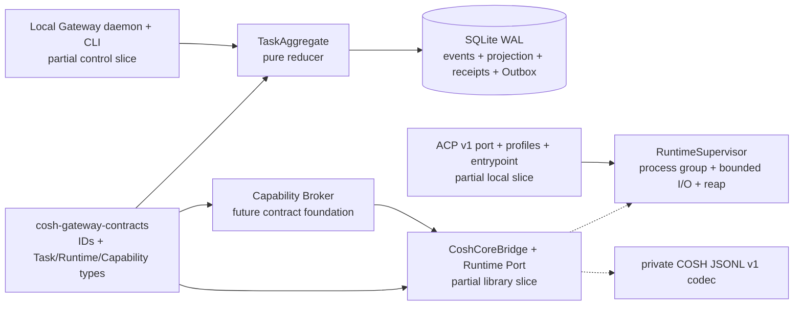
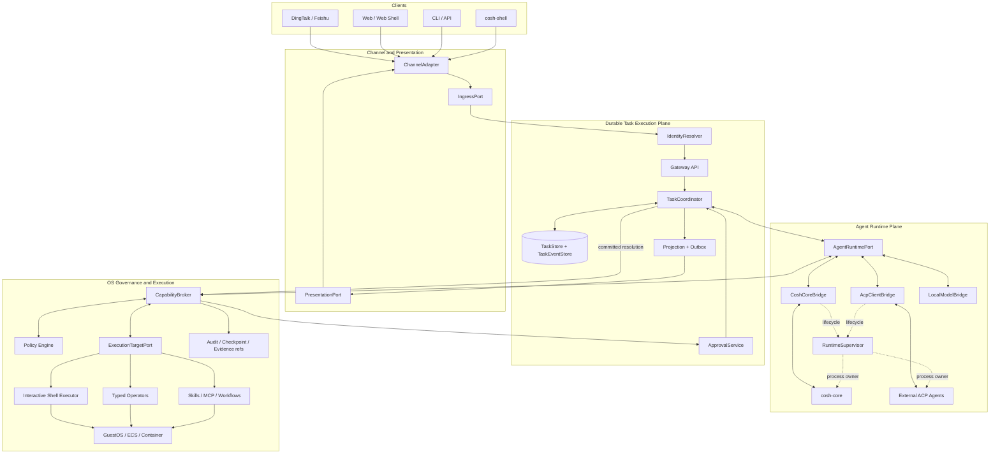
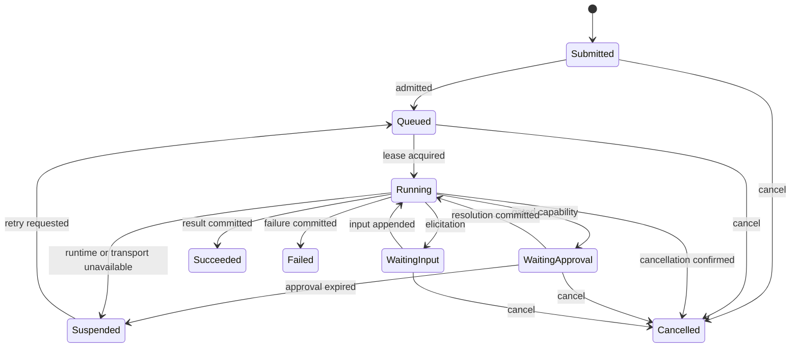
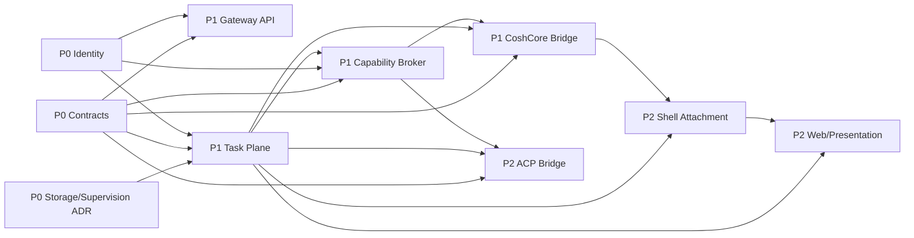

# ACP Task Platform Architecture

[中文版](architecture_zh.md)

## Decision summary

COSH becomes a local-first Agent OS gateway with four independent planes:

1. channel and presentation adapters;
2. a durable Task Execution Plane;
3. replaceable Agent Runtime adapters;
4. governed OS capability and execution targets.

The first deployment may place several modules in one process. Logical
ownership, typed ports, storage transactions, and security boundaries remain
separate even when process boundaries are collapsed.

## Baseline evidence and gaps

The baseline is a five-crate workspace. Its current architecture is documented
in the [developer guide](../../../../../docs/developer-guide/en/cosh-ng/architecture.md)
and [runtime contracts](../runtime-contracts.md).

| Current capability | Reuse | Gap that this plan addresses |
| --- | --- | --- |
| `cosh-shell` owns PTY, input routing, cards, approvals, evidence, and the cosh-core child | Interactive client and foreground executor | No durable Task, multi-client attachment, or channel-neutral API |
| `AgentAdapter`, `AgentRunHandle`, and `AgentEvent` model a provider lifecycle | Runtime event normalization experience | Shell types and in-memory ownership are unsuitable as Gateway wire contracts |
| cosh-core JSONL negotiates its exact internal control protocol and streams Agent events | First `CoshCoreBridge` transport | Not ACP and not a public Gateway protocol |
| `SessionStore` persists model-visible conversation by workspace | Provider-session continuity | No Task, approval, delivery, execution lease, or Outbox state |
| `cosh-cli` and `cosh-platform` expose typed package, service, checkpoint, and audit operations | Deterministic OS operators | No single broker in front of every side effect |
| Unified audit events correlate bounded runtime metadata | Security and operations timeline | Task events and delivery state remain separate contracts |

The baseline has no `cosh-gateway`, `TaskCoordinator`, `TaskStore`,
`CapabilityBroker`, ACP client, Web attachment, or channel adapter. Those items
must remain marked as planned until implementation evidence passes a module
acceptance report.

## Candidate-worktree foundation

The uncommitted candidate worktree based on the baseline adds two library
crates and several bounded implementation slices. Solid boxes below exist as
source; dashed edges remain integration work.



The contracts leaf freezes Gateway/Task schema v1 and Runtime schema v4 and validates bounded leaf strings/digests,
schema/envelope kinds, distinct IDs, Runtime bindings, Task events, and
Capability/Permit shapes. The reducer's 21-event by 9-state matrix
enforces identity, consecutive revisions, active Run, approval/execution, and
terminal transition rules, including exact pending input and fenced retry. The release raw writer
is crate-private. The store uses checked SQLite schema v9, WAL/FULL policy, durable installation
binding, private path checks, 256 KiB per-payload and 1 MiB per-commit bounds, and one transaction
for Task events, projection, command receipt, and Outbox intents. The supervisor validates a
direct launch, clears inherited environment, bounds JSONL/stderr, owns the
process group, escalates shutdown, reaps, and emits one process terminal.

This is now a runnable local Gateway slice. The Unix daemon authenticates peer
UID and supports durable Task submit/get/events/cancel/retry/append-input/
resolve-approval through the installed CLI. Its scheduler claims Outbox work
under renewable fenced Run leases, persists `RuntimeBound` before prompting,
drives the neutral Runtime port, and settles an unreconnectable Runtime as
`runtime_lost` after restart. Durable provider-native approval dispatch never
creates a COSH Permit and prevents a Delivered response from being sent twice.
The migration introduced in v5 marks queued Tasks that predate trusted Runtime
start intents and settles them administratively without launching a provider.
Production `serve` admits only the contained brokered Core task-only profile,
whose immutable inventory is `ask_user_question`; it has no production
`ExecutionTarget` and no checkpoint or ws-ckpt dependency. Shell attachment,
remote identity, Web/channel presentation, and universal brokered tool
execution remain outside this slice. Generic Capability/Permit/Execution
contracts and ledger rows remain future foundations, not evidence of a
production execution loop. The packaged systemd containment fixture passed in a
disposable Ubuntu 24.04 arm64 container with systemd 255, including Gateway
hard-`SIGKILL` and replacement readiness. A separate real-`SIGKILL` SQLite
kill-point proves local reopen/replay without partial rows. ACP `doctor` and
`run` are explicitly ungoverned. Exact-candidate real Codex/Claude, manual
Terminal, signed artifact, power-loss, and overall phase acceptance gates
remain unaccepted. Existing Shell PTY/core ownership is unchanged.

## Target logical system view

The following diagram is the target architecture, not the current process
topology:



## Port ownership

Every fan-in or fan-out point has one semantic owner. A box forwarding
unconstrained JSON is not an abstraction.

| Boundary | Port | Canonical input | Canonical output | Owner |
| --- | --- | --- | --- | --- |
| Channels to Gateway | `IngressPort` | `IngressEnvelope` | `IngressAck` with `TaskId` | Gateway API |
| Channel assertion to OS grants | `IdentityResolver` | Source assertion and installation binding | `ActorContext` | Identity module |
| Task to Agent implementation | `AgentRuntimePort` | `AgentRunSpec` and runtime command | `AgentRuntimeEvent` | Runtime module |
| Agent intent to side effect | `CapabilityBrokerPort` | `CapabilityRequest` | deny, approval, or scoped permit | Capability module |
| Broker to a machine or shell | `ExecutionTargetPort` | permit-bound execution request | typed execution events | Target module |
| Task state to UI/channel | `PresentationPort` | `DeliveryIntent` | `DeliveryReceipt` | Projection and delivery |
| Task mutation and replay | `TaskEventStore` | expected-revision event append | ordered cursor and snapshot | Task module |

Adapters preserve source metadata needed for reply routing, policy, audit, and
diagnosis, but downstream modules do not depend on a channel or Runtime's wire
types.

The candidate worktree now uses the side-effect-free
`cosh-gateway-contracts` leaf crate, separate from the existing OS-facing
`cosh-types`. Its Rust types are a partial G0 implementation; canonical JSON
schemas/fixtures, ownership ADR acceptance, compatibility manifests, and
cross-adapter compile/fixture evidence remain required. This does not silently
change the standalone `cosh-shell` boundary: the first Shell Gateway client is
still unimplemented, and a direct internal crate dependency requires its own
boundary ADR.

## Identity model

IDs identify different lifecycles and are never aliases.

| Identifier | Meaning | Authority |
| --- | --- | --- |
| `ChannelMessageId` | One inbound source message | Channel adapter |
| `ConversationRef` | Reply or thread location | Channel adapter |
| `ActorId` | Bound human, service, or installation identity | Identity resolver |
| `TaskId` | User-visible durable intent | Task Coordinator |
| `RunId` | One execution attempt for a Task | Task Coordinator |
| `AgentSessionId` | Runtime-specific conversation binding | Runtime bridge |
| `ShellSessionId` | One PTY ownership lifecycle | Shell host |
| `RequestId` | One correlated request/response exchange | Request initiator |
| `ToolUseId` | One Agent tool intent | Runtime bridge |
| `ExecutionId` | One governed side-effect attempt | Capability Broker |

Required invariants include:

- `TaskId != RunId != AgentSessionId != ShellSessionId`;
- an ACP `sessionId` maps only to `AgentSessionId`;
- every side-effect audit event carries `TaskId`, `RunId`, and `ExecutionId`;
- a channel retry reuses the ingress idempotency key and cannot create a
  second Task state effect;
- a permit is bound to actor, target, operation digest, policy revision,
  expiration, and `ExecutionId`.

## Durable Task model

`TaskCoordinator` is the sole writer of the Task aggregate. API handlers,
channel adapters, Agent bridges, runners, presenters, and approval callbacks
submit commands with an expected revision.



Task events are the durable control history and projection source. They do not
replace security audit events. Raw prompts, terminal output, model streams,
credentials, environment values, and raw input responses stay out of Task events. Raw input exists
only in a private typed dispatch row; Task history and receipts retain its digest. Bounded evidence
or projections may be referenced through opaque IDs.

Durability rules:

- ingress and delivery are at-least-once with stable idempotency keys;
- Task event append and Outbox append share one transaction;
- the runner uses renewable leases, but lease expiry never proves an OS side
  effect is safe to replay;
- each side effect has one `ExecutionId` and one broker permit;
- stream events carry source sequence or content identity for reconnect
  deduplication;
- the first legal terminal approval transition wins; conflicting callbacks
  return the already committed result.

## Runtime model and ACP placement

The Runtime Port hides provider process and wire differences:

```text
inspect_capabilities(runtime_ref)
start(AgentRunSpec) -> AgentBinding
resume(AgentBinding, AgentRunSpec)
send_input(AgentBinding, TaskInput)
resolve_permission(AgentBinding, PermissionResolution)
cancel(AgentBinding, RequestId)
close(AgentBinding)
subscribe(AgentBinding, after_cursor) -> AgentRuntimeEvent stream
```

`CoshCoreBridge` owns protocol translation and the runtime binding for the
existing internal JSONL control protocol. `AcpClientBridge` acts as an ACP
Client over stdio. Both delegate spawn, process-group cancellation, stderr
bounds, timeout, and reap behavior to the shared `RuntimeSupervisor`; neither
writes Task storage or executes an OS action directly.

ACP details:

- protocol negotiation uses integer wire version `1`;
- SDK release version and ACP wire version are tracked separately;
- omitted capabilities are unsupported;
- baseline session methods are mapped into Runtime commands and events;
- ACP permission requests become durable approval or broker decisions;
- ACP filesystem and terminal requests enter the Capability Broker;
- ACP cancellation controls Runtime lifecycle; Task cancellation remains the
  user-visible source of truth;
- remote clients use the COSH Gateway API because remote ACP transport is not
  a Phase 0-2 dependency.

The candidate worktree implements a bounded first slice of these ACP items:
official SDK 2.0.0 types, Rust 1.88, exact wire-v1 negotiation, supervised
stdio, one session, text prompt/update/stop, permission correlation, and
cancellation settlement, durable Runtime/Task mapping, and exact pending-input
dispatch. Production `serve` does not admit ACP profiles; the ACP path is
limited to ungoverned `doctor` and `run`. The task-only Core profile exposes
`ask_user_question` and does not wire a production `ExecutionTarget`. Checkpoint
and ws-ckpt callbacks are future optional capability work, not candidate
evidence. Private COSH JSONL control version `1` remains unrelated to ACP wire
version `1`.

## Capability and approval model

The Agent proposes intent; the Broker owns authorization. A request contains a
typed operation, resource/target, effect class, actor, Task and Run identity,
and a stable digest. The Broker produces one of:

1. a denial with a stable reason code;
2. an `ApprovalRequest` persisted through the Task Coordinator;
3. a short-lived target-bound permit;
4. a typed execution result correlated by `ExecutionId`.

Approval is durable Task state, not a card widget. A Shell or Web card is a
projection. Rendering a button, receiving a callback, or acknowledging a
message cannot authorize execution until the Task transition is committed.

The worktree has neutral Capability/Approval/Permit contracts, durable
approval/permit/execution ledger foundations, and exact provider-native
resolution dispatch. Provider-native approval never manufactures a COSH Permit.
The production task-only Core profile exposes only `ask_user_question`; no
production `ExecutionTarget` or checkpoint/ws-ckpt path is wired. The generic
contracts and ledgers are retained for a future optional capability profile and
cannot be cited as a passed execution loop. The candidate still does not prove
the product-wide invariant for every enabled OS side effect because existing
legacy CLI, direct Core, and Shell execution paths remain outside this
end-to-end governance claim.

## Target process topology by phase

| Phase | Required processes | Notes |
| --- | --- | --- |
| 0 | Existing binaries plus schema/fixture tooling | No production daemon is introduced |
| 1 | `cosh-gateway`, supervised `cosh-core`, local CLI client | A first implementation may keep Task, Broker, and projection modules in the gateway process |
| 2 | Phase 1 processes plus optional ACP Agent child and Web server endpoint | `cosh-shell` can attach to Gateway or retain direct local mode |

`RuntimeSupervisor` is the single lifecycle owner for each Agent child. It
creates process groups, captures bounded stderr, propagates cancel, enforces
shutdown timeouts, and reaps the child. The corresponding bridge owns protocol
negotiation and connection/session state. A PID or dropped connection alone is
never a durable Task result.

The candidate Core and ACP Runtime ports use `RuntimeSupervisor` for direct
child ownership and map a bounded subset of neutral events. The production
Gateway daemon schedules only the contained brokered Core task-only profile
with `ask_user_question`; it has no production `ExecutionTarget` and no
checkpoint/ws-ckpt dependency. ACP remains available through ungoverned
diagnostic/interoperability commands. The daemon does not govern the wider
Core/Shell/MCP/extension tool inventory,
and `cosh-shell` still owns the current interactive cosh-core compatibility
process.

## Dependency order



Phase numbers describe delivery gates, not permission to create circular
dependencies. Leaf schema types must remain side-effect free; adapters depend
on ports, while domain modules do not import adapter implementations.

## Failure ownership

| Failure | Durable owner | Required behavior |
| --- | --- | --- |
| Duplicate webhook or CLI retry | Gateway and Task Coordinator | Return the existing `TaskId`; do not repeat state effects |
| Gateway restart | Task Plane | Rebuild from snapshot/events and reclaim only expired leases |
| cosh-core or ACP child exits | Runtime bridge | Emit one terminal Runtime event; Task decides suspend, retry, or fail |
| Provider network loss | Runtime bridge and Task policy | Suspend with bounded diagnostic metadata; optional local fallback requires explicit policy |
| Approval callback races | Task Coordinator | Commit only the first valid terminal decision |
| Delivery API outage | Outbox worker | Retry without changing Task execution state |
| Shell detaches during command | Shell attachment and Broker | Keep PTY ownership explicit; never silently transfer executor lease |
| Permit expires before execution | Broker | Reject execution and require a fresh decision |
| Uncertain OS side effect | Broker and Task Plane | Record uncertainty; require operator-safe reconciliation before retry |

## Security and data boundaries

- Channel authentication proves control of a channel account, not root,
  workspace, target, or tool authority.
- The Gateway never trusts caller-supplied actor or target grants without an
  installation binding.
- Task and delivery stores contain bounded structured data, not secrets or
  raw model/terminal streams.
- Every OS side effect enters the Broker, including requests originating from
  ACP `terminal/*`, ACP filesystem methods, Skills, MCP, or a local model.
- The existing unified audit contract remains distinct from Task event and
  projection schemas.
- Endpoint and provider fallback policy is explicit; offline operation cannot
  silently weaken approval or target restrictions.

## Completion definition

This architecture is implemented only when every module report has runtime
evidence at its exit criteria and the [overall acceptance report](acceptance-report.md)
is updated against the candidate commit. Document completeness alone satisfies
only the planning deliverable.
