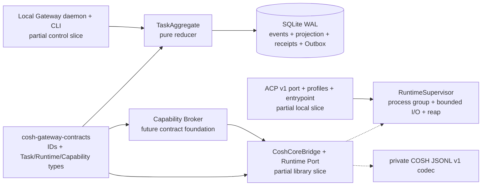
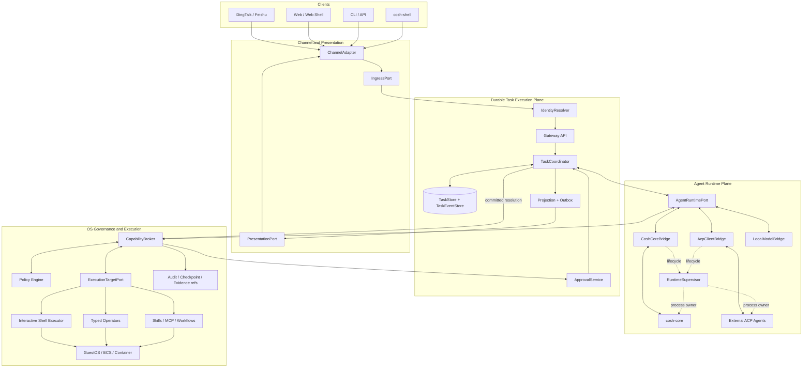
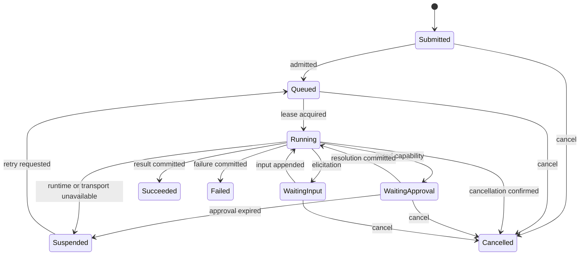
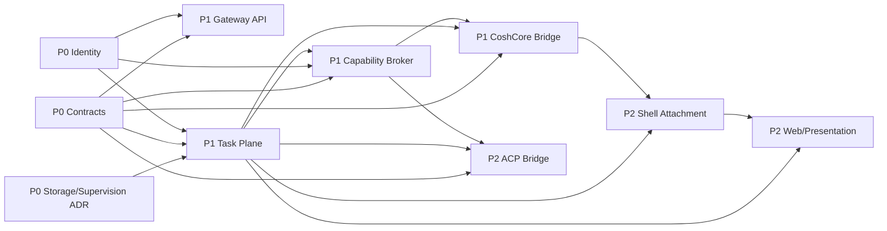

# ACP Task Platform 架构

[English](architecture.md)

## 决策摘要

COSH 将演进为本地优先 Agent OS Gateway，并形成四个相互独立的平面：

1. Channel 与 Presentation Adapter；
2. 持久 Task Execution Plane；
3. 可替换的 Agent Runtime Adapter；
4. 受治理的 OS Capability 与 Execution Target。

首个部署可以把多个模块放进同一个进程。即使合并进程，逻辑 ownership、typed
port、存储 transaction 与安全边界仍然必须分开。

## 基线证据与缺口

基线是五 crate workspace。当前架构记录在[开发者指南](../../../../../docs/developer-guide/zh/cosh-ng/architecture.md)
和 [Runtime Contracts](../runtime-contracts.md) 中。

| 当前能力 | 可复用部分 | 本规划处理的缺口 |
| --- | --- | --- |
| `cosh-shell` 拥有 PTY、输入路由、卡片、审批、证据和 cosh-core 子进程 | 交互客户端和前台 Executor | 没有持久 Task、多客户端 Attachment 或渠道无关 API |
| `AgentAdapter`、`AgentRunHandle` 和 `AgentEvent` 描述 provider 生命周期 | Runtime event 归一化经验 | Shell type 与内存 ownership 不适合作为 Gateway wire contract |
| cosh-core JSONL 协商内部 control protocol 并流式返回 Agent event | 首个 `CoshCoreBridge` transport | 不是 ACP，也不是公开 Gateway protocol |
| `SessionStore` 按 workspace 保存模型可见 conversation | Provider session 连续性 | 没有 Task、approval、delivery、execution lease 或 Outbox 状态 |
| `cosh-cli` 与 `cosh-platform` 提供类型化 package、service、checkpoint 和 audit 操作 | 确定性 OS operator | 所有副作用之前缺少统一 Broker |
| 统一 audit event 关联有界 Runtime metadata | 安全与运维时间线 | Task event 和 delivery state 仍需独立契约 |

基线上不存在 `cosh-gateway`、`TaskCoordinator`、`TaskStore`、
`CapabilityBroker`、ACP Client、Web Attachment 或 Channel Adapter。模块验收报告
没有取得实现证据前，这些能力都必须标记为规划中。

## 候选工作树基础

基于该基线的未提交候选工作树增加两个 library crate 和若干有界实现切片。下图实线框表示
已有源码，虚线表示仍待集成。



Contracts leaf 冻结 Gateway/Task schema v1 与独立 Runtime schema v4，校验有界 leaf、aggregate、
schema/envelope kind、不同 ID、Runtime binding、Task event 与 Capability/Permit shape。Reducer 的
21 个 event × 9 个 state matrix 执行 identity、连续 revision、active Run、准确 pending input、fenced
retry、approval/execution 与 terminal transition 规则。Release raw writer 为 crate-private。
Single-writer store 使用 SQLite storage schema v9、WAL/FULL policy、durable installation binding、
private path check、单 payload 256 KiB 与单 commit 1 MiB bound，并在一个 transaction 中提交 Task event、projection、command receipt 与 Outbox
intent。Supervisor 校验 direct launch、清除 inherited environment、限制 JSONL/stderr、独占 process
group、升级 shutdown、reap，并只生成一次 process terminal。

当前已形成可运行的 local Gateway slice。Unix daemon 认证 peer UID，并通过 installed CLI 提供
durable Task submit/get/events/cancel/retry/append-input/resolve-approval。Scheduler 在可续租且带
fence 的 Run lease 下领取 Outbox work，在发送 prompt 前持久化 `RuntimeBound`，驱动 neutral Runtime
port，并在重启后把无法重新连接的 Runtime 以 `runtime_lost` 收敛。Durable provider-native approval
dispatch 不会创建 COSH Permit，并保证 Delivered response 不会发送两次。v5 引入的 migration 会标记
早于 trusted Runtime start intent 的 queued Task，并在不启动 provider 的前提下做行政收敛。Production
`serve` 只接纳受约束的 brokered Core task-only profile，其 immutable inventory 只有
`ask_user_question`；没有 production `ExecutionTarget`，也不依赖 checkpoint 或 ws-ckpt。Shell
Attachment、remote identity、Web/channel presentation 与通用 brokered tool execution 仍不在这一
slice 内。通用 Capability/Permit/Execution contract 与 ledger row 作为后续可选 capability 的基础
保留，不能作为已通过的 execution loop 证据。Package systemd containment fixture 已在 disposable
Ubuntu 24.04 arm64、systemd 255 容器中通过，包括 Gateway hard-`SIGKILL` 与 replacement readiness。
真实 Codex/Claude 与人工 Terminal 路径仍未验收。独立的真实 `SIGKILL` SQLite kill-point 证明本地
reopen/replay 无 partial row。ACP `doctor` 与 `run` 明确 ungoverned。Exact-candidate、signed artifact、
power-loss 与总体阶段 Gate 仍未验收。现有 Shell PTY/core ownership 没有改变。

## 目标逻辑系统视图

下图是目标架构，不是当前 process topology：



## Port ownership

每个 fan-in 或 fan-out 位置只能有一个语义 owner。只转发任意 JSON 的组件不构成抽象。

| 边界 | Port | 统一输入 | 统一输出 | Owner |
| --- | --- | --- | --- | --- |
| Channel 到 Gateway | `IngressPort` | `IngressEnvelope` | 带 `TaskId` 的 `IngressAck` | Gateway API |
| Channel assertion 到 OS grant | `IdentityResolver` | 来源 assertion 和 installation binding | `ActorContext` | Identity module |
| Task 到 Agent 实现 | `AgentRuntimePort` | `AgentRunSpec` 和 Runtime command | `AgentRuntimeEvent` | Runtime module |
| Agent intent 到副作用 | `CapabilityBrokerPort` | `CapabilityRequest` | deny、approval 或 scoped permit | Capability module |
| Broker 到机器或 Shell | `ExecutionTargetPort` | 绑定 permit 的 execution request | typed execution event | Target module |
| Task state 到 UI/Channel | `PresentationPort` | `DeliveryIntent` | `DeliveryReceipt` | Projection 与 Delivery |
| Task mutation 与 replay | `TaskEventStore` | 带 expected revision 的 event append | 有序 cursor 与 snapshot | Task module |

Adapter 保留回复路由、策略、审计和诊断需要的来源 metadata，但下游模块不能依赖
Channel 或 Runtime 的 wire type。

候选工作树已经使用 side-effect-free leaf crate `cosh-gateway-contracts`，并与现有面向 OS 的
`cosh-types` 分开。其 Rust type 是 G0 的局部实现；canonical JSON schema/fixture、ownership ADR
验收、compatibility manifest 与跨 Adapter compile/fixture evidence 仍是必需项。这不会静默改变
`cosh-shell` standalone 边界。首个 Shell Gateway client 仍未实现；直接依赖内部 leaf crate 仍需单独
通过边界 ADR。

## Identity model

不同 ID 表达不同生命周期，不能互为别名。

| Identifier | 含义 | Authority |
| --- | --- | --- |
| `ChannelMessageId` | 一条来源消息 | Channel Adapter |
| `ConversationRef` | 回复或 thread 位置 | Channel Adapter |
| `ActorId` | 已绑定的人、服务或 installation 身份 | Identity Resolver |
| `TaskId` | 用户可见的持久 intent | Task Coordinator |
| `RunId` | Task 的一次执行尝试 | Task Coordinator |
| `AgentSessionId` | Runtime 专用 conversation binding | Runtime Bridge |
| `ShellSessionId` | 一次 PTY ownership 生命周期 | Shell Host |
| `RequestId` | 一次关联 request/response | Request 发起方 |
| `ToolUseId` | 一个 Agent tool intent | Runtime Bridge |
| `ExecutionId` | 一次受治理的副作用尝试 | Capability Broker |

必须保持以下 invariant：

- `TaskId != RunId != AgentSessionId != ShellSessionId`；
- ACP `sessionId` 只能映射为 `AgentSessionId`；
- 每个副作用 audit event 都携带 `TaskId`、`RunId` 和 `ExecutionId`；
- Channel retry 复用 ingress idempotency key，不能产生第二次 Task 状态效果；
- Permit 绑定 actor、target、operation digest、policy revision、过期时间和 `ExecutionId`。

## 持久 Task model

`TaskCoordinator` 是 Task aggregate 的唯一 writer。API handler、Channel
Adapter、Agent Bridge、Runner、Presenter 和 Approval callback 只能提交带 expected
revision 的 command。



Task event 是持久控制历史和 projection 来源，不替代安全 audit event。原始 prompt、
Terminal output、模型 stream、凭证、环境值与 raw input response 不能进入 Task event；raw input 只
存在 private typed dispatch row，Task history 与 receipt 只保留 digest。有界 evidence 或 projection
只能通过 opaque ID 引用。

持久性规则如下：

- Ingress 与 delivery 采用 at-least-once 和稳定 idempotency key；
- Task event append 与 Outbox append 共享一个 transaction；
- Runner 使用可续租 lease，但 lease 过期不能证明 OS 副作用可以安全重放；
- 每个副作用只有一个 `ExecutionId` 和一个 Broker permit；
- Stream event 携带 source sequence 或 content identity，用于 reconnect 去重；
- 第一个合法 terminal approval transition 生效，冲突 callback 返回已提交结果。

## Runtime model 与 ACP 位置

Runtime Port 隐藏 provider 进程和 wire 差异：

```text
inspect_capabilities(runtime_ref)
start(AgentRunSpec) -> AgentBinding
resume(AgentBinding, AgentRunSpec)
send_input(AgentBinding, TaskInput)
resolve_permission(AgentBinding, PermissionResolution)
cancel(AgentBinding, RequestId)
close(AgentBinding)
subscribe(AgentBinding, after_cursor) -> AgentRuntimeEvent stream
```

`CoshCoreBridge` 拥有现有内部 JSONL control protocol 的转换与 Runtime binding。
`AcpClientBridge` 通过 stdio 充当 ACP Client。两个 Bridge 都把 spawn、process-group
cancellation、stderr bound、timeout 与 reap 委托给共享 `RuntimeSupervisor`，并且都不能
直接写 Task storage 或执行 OS action。

ACP 约束如下：

- Protocol negotiation 使用整数 wire version `1`；
- SDK release version 与 ACP wire version 分开跟踪；
- 未声明的 capability 一律视为不支持；
- Baseline session method 映射为 Runtime command 与 event；
- ACP permission request 转成持久 approval 或 Broker decision；
- ACP filesystem 和 terminal request 进入 Capability Broker；
- ACP cancellation 控制 Runtime lifecycle，用户可见取消结果仍以 Task 为准；
- 远端 client 使用 COSH Gateway API，因为远端 ACP transport 不属于 Phase 0-2 依赖。

候选工作树已实现上述 ACP 能力的有界第一轮切片，包括官方 SDK 2.0.0 类型、Rust 1.88、
exact wire-v1 negotiation、supervised stdio、单 session、text prompt/update/stop、
permission correlation、cancellation settlement、持久 Runtime/Task mapping 与准确 pending-input
dispatch。Production `serve` 不接纳 ACP profile；ACP path 仅限 ungoverned `doctor` 与 `run`。
Task-only Core profile 只暴露 `ask_user_question`，不接入 production `ExecutionTarget`。Checkpoint
与 ws-ckpt callback 属于后续可选 capability，不是候选证据。Private COSH JSONL control version `1`
与 ACP wire version `1` 没有关联。

## Capability 与 Approval model

Agent 只提出 intent，Broker 拥有授权。Request 包含 typed operation、resource/target、
effect class、actor、Task/Run identity 和稳定 digest。Broker 只能产生以下结果：

1. 带稳定 reason code 的 denial；
2. 通过 Task Coordinator 持久化的 `ApprovalRequest`；
3. 短生命周期、绑定 target 的 permit；
4. 通过 `ExecutionId` 关联的 typed execution result。

Approval 是持久 Task 状态，不是 card widget。Shell 或 Web card 只是 projection。
在 Task transition 提交前，渲染按钮、收到 callback 或确认消息都不能授权执行。

工作树已有中立 Capability/Approval/Permit contract、durable
approval/permit/execution ledger foundation 与精确的 provider-native resolution dispatch。
Provider-native approval 不会制造 COSH Permit。Production task-only Core profile 只暴露
`ask_user_question`；没有 production `ExecutionTarget` 或 checkpoint/ws-ckpt path。通用 contract
与 ledger 为后续可选 capability 保留，不能作为已通过的 execution loop 证据。候选仍未证明每条已
启用 OS 副作用都满足该产品级 invariant，因为现有 legacy CLI、direct Core 与 Shell execution path
仍不属于新的端到端 governance 声明。

## 各阶段目标进程拓扑

| 阶段 | 必需进程 | 说明 |
| --- | --- | --- |
| 0 | 现有 binary 加 schema/fixture 工具 | 不引入生产 daemon |
| 1 | `cosh-gateway`、受监督的 `cosh-core`、本地 CLI client | 首版可以把 Task、Broker 与 projection 模块放在 Gateway 进程中 |
| 2 | Phase 1 进程，加可选 ACP Agent 子进程和 Web server endpoint | `cosh-shell` 可接入 Gateway，也保留 direct local mode |

`RuntimeSupervisor` 是每个 Agent 子进程唯一的 lifecycle owner。它创建 process group、
收集有界 stderr、传播 cancel、执行 shutdown timeout 并回收子进程；对应 Bridge 拥有
protocol negotiation 与 connection/session state。PID 或连接断开本身不能成为持久 Task result。

候选 Core 与 ACP Runtime port 使用 `RuntimeSupervisor` 独占直接启动的 child，并映射有界 neutral
event 子集。Production Gateway daemon 只调度受约束的 brokered Core task-only profile，inventory
只有 `ask_user_question`；没有 production `ExecutionTarget`，也不依赖 checkpoint/ws-ckpt。ACP
仍通过 ungoverned diagnostic/interoperability command 提供。Daemon 尚未治理更广的
Core/Shell/MCP/扩展工具 inventory，`cosh-shell` 当前 interactive
cosh-core compatibility process 也仍由 Shell 拥有。

## 依赖顺序



Phase 编号描述交付 Gate，不允许创建循环依赖。Leaf schema type 必须保持无副作用；
Adapter 依赖 Port，Domain module 不 import Adapter 实现。

## 故障 Ownership

| 故障 | 持久 Owner | 必需行为 |
| --- | --- | --- |
| 重复 webhook 或 CLI retry | Gateway 与 Task Coordinator | 返回现有 `TaskId`，不重复状态效果 |
| Gateway 重启 | Task Plane | 从 snapshot/event 恢复，只接管过期 lease |
| cosh-core 或 ACP 子进程退出 | Runtime Bridge | 只发一个 terminal Runtime event；由 Task 决定 suspend、retry 或 fail |
| Provider 网络中断 | Runtime Bridge 与 Task policy | 携带有界诊断 metadata 后 suspend；切换端侧模型必须有显式 policy |
| Approval callback 竞争 | Task Coordinator | 只提交第一个合法 terminal decision |
| Delivery API 不可用 | Outbox worker | 重试但不改变 Task execution state |
| Shell 在命令期间 detach | Shell Attachment 与 Broker | PTY ownership 保持显式；不能静默转移 executor lease |
| Permit 在执行前过期 | Broker | 拒绝执行并要求重新决策 |
| OS 副作用结果不确定 | Broker 与 Task Plane | 记录 uncertainty，完成安全 reconciliation 后才能 retry |

## 安全与数据边界

- Channel authentication 只能证明调用方控制某个 Channel account，不能证明其拥有
  root、workspace、target 或 tool 权限。
- Gateway 不接受未经 installation binding 验证的 caller actor 或 target grant。
- Task 与 delivery store 只保存有界结构化数据，不保存 secret、原始模型或 Terminal stream。
- 所有 OS 副作用都进入 Broker，包括来自 ACP `terminal/*`、ACP filesystem method、
  Skills、MCP 或端侧模型的请求。
- 现有统一 audit contract 与 Task event、projection schema 保持独立。
- Endpoint 与 provider fallback policy 必须显式；离线运行不能静默降低 approval 或 target 限制。

## 完成定义

只有每个模块报告都在候选 commit 上取得满足 exit criteria 的 Runtime 证据，并更新
[总体验收报告](acceptance-report_zh.md)，这套架构才能标记为已实现。文档完整只代表规划交付完成。
