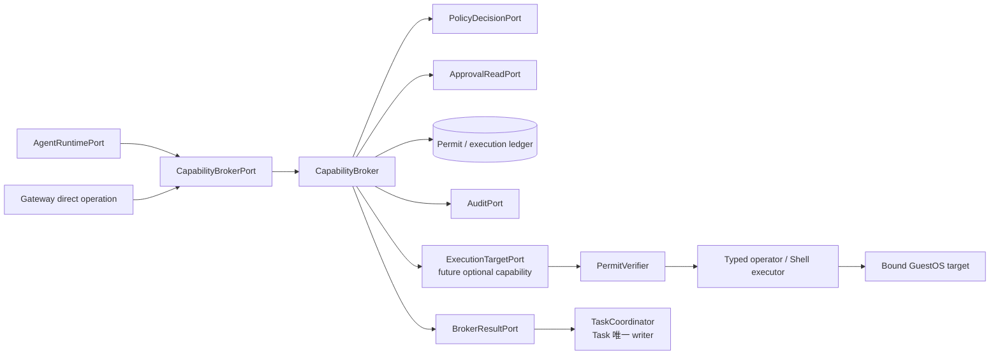

# Phase 1 Capability Broker 设计

[English](design.md) | [验收报告](acceptance_zh.md)

## 状态与决策

当前增量基于上游提交 `a43ab817`。通用 Broker 模型仍是目标架构，不是已验收的 Phase 1 声明。
已验收 production scope 更窄：`serve` 与 library daemon 只接纳 `core` / `gateway-brokered-v1`，其
immutable inventory 绑定固定 `task-only-v1` manifest，只有 `ask_user_question`。Gateway、durable
Runtime start intent 与 Core v3 negotiation 会在 launch 或 Task input 前校验 identity 与准确 inventory。
该 profile 禁用其他 side-effecting hook、Skill、MCP、
扩展、Shell、file、process 与 network path。ACP `doctor`/`run`、legacy CLI command 与 standalone Shell
是明确 ungoverned 的 interoperability/rollback path，不能作为 governed evidence。

Gateway 现在额外拥有可选的 `workspace-checkpoint-v1` capability profile，以及对所有 profile 都 **withhold**
checkpoint provider 的 sealed capability provider registry。**不存在 checkpoint execution target**：它被推迟到
ws-ckpt 协议提供 identity-only checkpoint 请求与不可复用的 workspace generation token 之后——没有这两者，
checkpoint-create permit 可能让 daemon 在其授予范围之外改动主机。`serve`、打包的 systemd unit 与 brokered
execution driver 同样未改动。已验收声明是“封闭 profile 与 sealed provider set 已存在且 fail closed，checkpoint
transport 的 effect 分类正确”，不是“存在 ws-ckpt target”，也不是“checkpoint 已端到端 governed”。

通用目标仍要求每个 enabled OS side effect 都把 `CapabilityBroker` 作为 mandatory policy
enforcement 与 permit authority。Execution target 只有收到绑定 target 和 operation 的有效 permit 才能
执行。

Policy 要求时 approval 是必要条件，但 approval 本身不是 executable authority。Committed approval
只能允许 Broker 签发范围更窄的 permit，不能扩大 actor、target、action、resource、lifetime 或执行次数。

## 已实现的通用基础（不是 production execution）

Gateway 现在包含 provider-neutral
[`PolicyPort`](../../../../../crates/cosh-gateway/src/capability/broker.rs)、
[`PermitStore`](../../../../../crates/cosh-gateway/src/capability/broker.rs) 与
`CapabilityBroker`。Authorization 在调用 policy 前校验 request expiry、准确的 Task/Run parent、
完整 authenticated `ActorRef` 与 `AuthoritativeRequestBinding`。该 binding pin exact target、完整
`OperationDescriptor`、完整 operation digest 与 requested scope。因此 Actor provenance 或 request
content substitution 不能影响 policy。Policy 可以 deny、require approval 或 allow。Revision 为零和
已经过期的 policy authority 会 fail closed。

Direct allowance 签发绑定 actor、Task、Run、Execution、exact `TargetRef`、完整 canonical
operation digest、policy revision、expiry 与一次使用的 `ExecutionPermit`。Operation digest
覆盖 namespace、name 与 normalized arguments；`arguments_digest` 只作为较窄的 policy detail。
Canonicalization 与 hashing 由 trusted ingress 负责，Broker 不使用 argument-only digest 签发
authority。Process-local
[`MemoryPermitStore`](../../../../../crates/cosh-gateway/src/capability/memory.rs) 在同一个 mutex 内校验
这些字段并标记 consumed，因此并发 caller 只有一个可以 claim。Binding check 失败不会 consume
authority。

`MemoryPermitStore` 仍是 process-local logic fixture，不承载 production authority。通用 durable
approval/permit/execution ledger contract 可以作为可复用基础保留。Task-only production profile 没有
side-effecting operation，只有 `ask_user_question`；不调用 checkpoint provider，也不依赖 ws-ckpt。

Phase 1 是 installation-scoped single-tenant。`InstallationId` 与 authenticated local peer credential
构成 v1 boundary。`TenantId`、remote peer 与 cross-tenant isolation 属未来 v2，本文不作相关声明。

## 可选 sealed provider set 与被推迟的 checkpoint target

Capability profile 固化 instance 可触达的准确有序 side-effect provider 集合。
[`GatewayCapabilityProfile::providers`](../../../../../crates/cosh-gateway-contracts/src/profile.rs)
对 `task-only-v1` 返回空集，对 `workspace-checkpoint-v1` 精确返回 `ws-ckpt`；`verify_providers` 拒绝
缺失、额外、重排或替换的 provider。因此“主机上恰好运行 ws-ckpt daemon”本身永远不是 authority。

[`SealedCapabilityProviderRegistry`](../../../../../crates/cosh-gateway/src/capability/provider.rs)
是 instance 获得副作用 authority 的唯一边界。请求 provider 的 task-only instance 会被拒绝而不是被扩权，
且 sealed set 在其他一切之前先完成校验。

该边界对**所有** profile 都 withhold checkpoint provider，因此 instance 唯一能达到的形态是空 provider 集合。
**本 crate 中不存在 checkpoint execution target。** 该 target 是被推迟，而不只是未接线：下文的约束是任何未来
实现都必须满足的前置条件，其中两条需要 ws-ckpt 协议变更，任何 Gateway 侧代码都无法替代。

让 `cosh-gateway` 不含 checkpoint adapter 也保持了它的依赖方向。在内部 crate 中它只依赖无副作用的
`cosh-gateway-contracts` 叶子；复用既有 `CkptClient` 的 Gateway 侧 target 会新增 `cosh-platform` 与
`cosh-types` 两条边，因此被推迟的 slice 必须先决定 checkpoint transport 应该放在哪里。

### 为什么 withhold checkpoint authority

一个 `workspace_checkpoint_create` permit 必须只授权在一个被准入的 workspace 上创建一个快照。ws-ckpt 的
checkpoint 请求无法被约束到这个范围。

Checkpoint dispatch 会在尝试快照之前无条件先跑 workspace auto-init。Auto-init 解析请求里的 workspace 字段，而
该解析在没有任何注册匹配时会继续把该值当作**相对路径**处理。Workspace 初始化是真实的主机变更：它会注册
workspace、可能收养已存在的 subvolume、把原目录改名移开、创建 symlink，并在报告 invalid path 之前删除损坏的
symlink。

用 daemon 拥有的 workspace identity 而不是路径名，可以消除常规触发条件——已注册的 identity 会直接解析成功、不进
auto-init。但它消除不了那个窗口：任何前置 identity 查询与 checkpoint 请求都是两次独立往返，因此期间发生的
`recover` 把 workspace unregister 之后，daemon 会把失效 identity 字符串当相对路径解析。它究竟会碰到什么，取决于
daemon 的工作目录——而这既不由 Gateway 控制，也未被 Gateway 校验。

Gateway 侧没有任何检查能关闭它。副作用后的比较只能把上报结果降级为不确定，无法阻止或撤销 daemon 已经完成的注册；
“把窗口缩小”也不是安全属性。

**前置条件**：ws-ckpt 提供严格解析 workspace identity、绝不 auto-init 的 checkpoint 请求。

### 为被推迟的 target 已确立的约束

以下结论来自 target 原型阶段，记录在此以免被推迟的 slice 重新踩一遍。每一条都是要求，而不是已交付行为的描述。

**Socket 可信性不能建立在路径元数据上。** daemon 故意发布可被任意进程连接的 socket，因此其 mode 不是证据。
可信性要求 socket owner 为 root 或 Gateway owner，且**每一级**上级目录直到根都由 root 或 Gateway owner 拥有、
并且除带 sticky bit 外不对其他 principal 可写——只检查直接父目录会让该父目录自身的目录项仍可被替换。即便如此，
路径检查也关不掉“检查到 `connect`”之间的窗口：必须在连接之后、写出任何请求字节之前用 kernel peer credentials
认证对端。Pin socket 的 device、inode 与 owner 仍可用于检出替换，但真正保护请求的是认证。

**一个 workspace 有两种并不相同的表示。** 初始化之后 daemon 会把原目录搬进 backend 并在 user-facing 路径留下
symlink，随后其 registry、`Status` 与 `List` 始终报告那个注册路径；而对同一路径做 descriptor-pinned open 会穿过
symlink 得到 backend 目录。要求二者相等会拒绝所有正常初始化过的 workspace，因此必须同时绑定：逐字用于 daemon
查询与证据比较的注册路径，以及作为本地 identity 的 pinned directory。

**device 与 inode 无法标识 btrfs subvolume。** 每个 subvolume 根的 inode 恒为 256，而 subvolume 的 anonymous
device number 在首次访问时分配、在 subvolume 被删除后可被复用。Rollback 会把 live subvolume 改名移开、在同一路径
创建新的 writable snapshot、再删除旧的，因此两个不同 subvolume 的 device 与 inode 可能完全相等。
`BTRFS_IOC_INO_LOOKUP` 给出的所属 subvolume ID 来自持久递增计数器且不被复用，但它只在单个文件系统内唯一，因此
必须用 `BTRFS_IOC_FS_INFO` 的文件系统标识为其定作用域。identity 因此是 `(filesystem ID, subvolume ID, inode)`，
且 scheme 标记也要参与绑定，使 workspace 无法静默退回 device/inode identity。

**Workspace identity 不是 generation fence。** daemon 由 workspace 路径派生其 workspace ID，因此同一路径在
unregister 之后再次注册会复用它；`rollback` 到当前 DAG head 会替换 live subvolume，同时保持 workspace ID、注册
路径与 `index.head` 不变。在请求前后比较 volume identity 能检出所有持续到某次比较之后的 rollback，但完全落在
create 窗口内的 rollback 不可见，也没有任何可观测协议取值能与创建原子校验。因此确定性 receipt 最多只能证明被注册
的 workspace、checkpoint identity 与被报告的快照，**绝不能**证明 workspace 内容的 generation。

**前置条件**：ws-ckpt 协议提供不可复用的 workspace generation token 并与 checkpoint 创建原子校验，然后 checkpoint
receipt 才可能绑定 workspace 内容。

### Effect 分类与 reconcile

这部分的 transport 原语实现在
[`CkptClient`](../../../../../crates/cosh-platform/src/checkpoint.rs)，也是本增量中唯一交付的 checkpoint 相关
代码——因为它自成一体，且其正确性不依赖 target。

Governed 原语 `create_classified` 与 `find_snapshot` 在结构上强制要求 peer 认证：caller 必须配置
`require_trusted_peer(owner_uid)`。缺少该配置时，两者都会在检查或访问 socket 之前拒绝请求。
`create_classified` 将这种拒绝报告为 `KnownNoEffect`，`find_snapshot` 则返回 permission error。该 fail-closed
要求只适用于这两个 governed 原语；legacy `CkptClient` operation 保留现有的 optional peer-auth 行为。

`create_classified` 报告失败请求是否可能已经改变 daemon 状态。只有在任何请求字节进入 kernel 之前发生的失败才是
可证明的 `KnownNoEffect`：缺少 trusted-peer 配置、socket 缺失、连接被拒绝、peer 不可信、零字节写入。其后的
一切都是 `PossiblyApplied`——部分写入、响应丢失或截断、payload 无法解码、意外响应 variant，**以及每一个
daemon 报告的错误码**。

任何响应码都不被当作 pre-effect 证据。Checkpoint dispatch 路径会先 auto-init workspace 再尝试快照，因此在产生
`WriteLockConflict`、`SnapshotAlreadyExists` 或 `InvalidPath` 之类错误码之前，注册、subvolume 收养或删除损坏的
workspace symlink 可能已经发生。这些错误码只证明没有创建快照，不证明 daemon 状态未变化。

`find_snapshot` 是只读 evidence 原语：它按一个 workspace 与一个准确 checkpoint identity 精确匹配，
报告 daemon 是否仍把该快照列为存在。未来 target 与 ledger-side reconciler 可在
`PossiblyApplied` 失败后使用该证据，而不是再创建一个快照；本增量不会把它转成
确定结果或 durable uncertain outcome。

## 目标

- 将全部 side-effect intent 规范化为一个 typed `CapabilityRequest`。
- 同时评估 actor、Task、Run、target、operation、resource scope、risk 和 policy revision。
- 返回稳定 denial、持久 approval specification 或短生命周期 target-bound permit。
- 将每个允许的 effect 绑定到一个 `ExecutionId` 和 replay-safe execution ledger。
- Opaque Shell command fail closed，并优先使用 deterministic typed operator。
- 将 Task control event 与现有 unified security audit contract 关联。
- 在不降低 target 或 approval 检查的前提下保留安全 local/offline policy path。

## 非目标

- 拥有 Task aggregate、channel approval UI、Agent lifecycle、PTY rendering 或 provider session。
- 把 `cosh audit check`、approval callback、model tool name 或 policy decision 当作 permit。
- 保证跨进程或机器 crash 的 exactly-once effect。
- 因 caller 在本机就授予宽泛 shell、root、filesystem 或 network access。
- 在 Phase 0 target identity 决策接受前支持 remote attestation。
- 将任意 natural language 解析成 OS authority。

## 当前源码证据

| `6c115aef` 的证据 | 可复用行为 | 安全缺口 |
| --- | --- | --- |
| [`cosh-types/audit/event.rs`](../../../../../crates/cosh-types/src/audit/event.rs) | Typed `Action`、policy `Decision`、audit identity、versioned event 与 redaction shape。 | 无 capability request、Execution ID、target identity 或 permit。 |
| [`cosh-platform/audit/evaluate.rs`](../../../../../crates/cosh-platform/src/audit/evaluate.rs) | Deterministic first-match PDP，输出 allow/deny/require-approval。 | Policy result 不是 execution authority。 |
| [`cosh-platform/audit/action.rs`](../../../../../crates/cosh-platform/src/audit/action.rs) | Shell action parsing 拒绝不支持的 compound/metacharacter shape。 | 只覆盖 command-policy classification，不提供完整 target binding。 |
| [`cosh-platform/audit.rs`](../../../../../crates/cosh-platform/src/audit.rs) | 已有 policy check 和 security-boundary audit segment write。 | 无 permit ledger 或 consume protocol。 |
| [`cosh-core/core.rs`](../../../../../crates/cosh-core/src/core.rs) | 集成 hook/policy decision、approval、audit event 与 tool execution。 | Allowed tool 在 core 内执行，approval 不经过公共 Broker。 |
| [`cosh-core/protocol.rs`](../../../../../crates/cosh-core/src/protocol.rs) | `can_use_tool` 携带 tool、input、tool-use ID、hook flag 与 audit reference。 | 缺少 Task/Run/target/Execution ID 和 permit。 |
| [`cosh-platform/pkg.rs`](../../../../../crates/cosh-platform/src/pkg.rs)、[`svc.rs`](../../../../../crates/cosh-platform/src/svc.rs) 与 [`checkpoint.rs`](../../../../../crates/cosh-platform/src/checkpoint.rs) | 已有 typed OS operation 与部分 dry-run path。 | Caller 无公共 permit verifier 即可调用。 |

基线上 `cosh-cli`、`cosh-core` 和 Shell execution path 都可能在没有 target-bound Broker permit 的情况下
触达副作用。现有 policy 与 audit module 是基础，不证明 Broker 已经存在。

## Ownership 与 ports



可复用 logic 实现同步 `PolicyPort::evaluate`、`PermitStore::issue`、`PermitStore::consume`，以及
`CapabilityBroker::authorize` 和 `CapabilityBroker::claim`。这些是通用 contract 与 logic foundation。
Production target loop、checkpoint driver、通用 `execute`、`reconcile` 和 multi-target port 仍是未来
边界；本 PR 不启用 checkpoint driver。Broker 不依赖 Task storage。

Broker 拥有 capability normalization、policy orchestration、permit issuance、permit consumption state 和
execution correlation。Execution adapter 拥有 last-mile operation，并在使用前立即验证 permit。
`TaskCoordinator` 拥有 approval state 和 Task event；Broker 只提交 result，不能写 Task storage。

概念 ports 如下：

```rust
trait CapabilityBrokerPort {
    async fn authorize(&self, request: CapabilityRequest)
        -> Result<CapabilityDecision, BrokerError>;
    async fn execute(&self, request: PermittedExecution)
        -> Result<ExecutionReceipt, BrokerError>;
    async fn reconcile(&self, execution_id: ExecutionId)
        -> Result<ExecutionStatus, BrokerError>;
}

trait PolicyDecisionPort {
    async fn evaluate(&self, action: PolicyAction, context: PolicyContext)
        -> Result<PolicyDecision, PolicyError>;
}

trait ApprovalReadPort {
    async fn verified_resolution(&self, approval_id: ApprovalId)
        -> Result<ApprovalResolution, ApprovalError>;
}

trait ExecutionTargetPort {
    async fn execute(&self, request: VerifiedExecution)
        -> Result<TypedExecutionResult, TargetError>;
    async fn reconcile(&self, execution_id: ExecutionId)
        -> Result<TargetExecutionStatus, TargetError>;
}
```

中立 ID 与 wire DTO 已位于 side-effect-free `cosh-gateway-contracts` leaf。Policy adapter 可以复用
`cosh-types` audit type，但不能把 Task/Gateway contract 移入 `cosh-types`。

## Capability request schema

已实现 leaf request 包含 request、Task、Run 与 Actor identity、`TargetRef`、由
namespace/name/arguments-digest 组成的 operation descriptor、独立的完整 canonical operation digest、
requested resource/access scope、input digest 与 expiry。Trusted ingress 必须在构造 request 和独立
`AuthoritativeRequestBinding` 前 canonicalize 并 hash 完整 operation。`RequestContext` 提供 current
time、parent binding 与 authoritative target/descriptor/digest/scope。Broker 在 policy 前逐项比较，
不从 presentation field 重建 authority。下面的扩展
target schema 仍是目标架构；runtime principal、lease fence、effect classification、typed operation
variant 与 prior approval correlation 尚未进入第一版切片。

```text
CapabilityRequest {
  request_id, task_id, run_id, tool_use_id?,
  actor_context, runtime_principal,
  target_ref, expected_target_kind,
  operation: CapabilityOperation,
  resource_scope, effect_class,
  canonical_input_digest,
  run_lease_fence, issued_at, deadline,
  prior_approval_id?
}
```

`CapabilityOperation` 是 supported operation 的 closed、versioned enum：

```text
FileRead, FileWrite, DirectoryList, ProcessInspect, ProcessSignal,
PackageQuery, PackageInstall, PackageRemove,
ServiceQuery, ServiceStart, ServiceStop, ServiceRestart,
CheckpointList, CheckpointCreate, CheckpointRestore,
NetworkConnect, ShellCommand, PtyAttach, SkillInvoke, McpToolInvoke
```

每个 variant 携带 typed field 与显式 limit。Unknown operation 返回 `unsupported_capability`，不能 fallback
为 `ShellCommand`。Raw string 可以作为有界 audit display data 保留，但只有经过专用 parser 规范化后才能
参与 policy matching。

Effect class 为 `Observe`、`WorkspaceWrite`、`HostMutation`、`PrivilegedMutation`、
`ExternalNetwork` 和 `InteractiveControl`。Classification 是风险下限；policy 可以提高风险，但不能把 typed
operation 降到 built-in minimum 以下。

## Target identity

`TargetRef` 只供用户选择，不能写入 permit。Policy evaluation 前，`TargetResolver` 将其 pin 为不可变
`TargetIdentity`：

```text
TargetIdentity {
  target_kind,
  installation_id,
  machine_or_instance_identity,
  boot_or_agent_epoch,
  execution_namespace,
  workspace_root_identity?,
  effective_uid,
  platform_fingerprint
}
```

Local target identity 由 daemon installation、pinned workspace/namespace、machine/boot identity 和 effective
credential 得出。Remote GuestOS target 必须由 Phase 0 定义 authenticated instance/agent epoch 与 replay
resistance。Hostname、IP、display label、workspace path string、channel installation 或 caller 提供的 instance
ID 都不充分。

Authorization 后 target 发生变化会使 decision 失效。相关场景下 symlink、mount namespace、container、
UID、boot、agent epoch 和 workspace-root 变化都属于 target revalidation。

通用 in-memory permit 绑定 exact `TargetRef`，但不提供通用 immutable identity 或 attestation。
Task-only profile 不启用 production target resolver。Canonical workspace identity、ws-ckpt endpoint
pinning、remote identity 与 multi-target attestation 属后续可选 capability，仍未实现。

## Decision 与 approval flow

可复用 logic 实现 deny、approval request 与 permit。Durable asynchronous resolution、approval-bound
re-authorization 与 target execution 仍待后续实现。下述完整流程是每个未来 enabled side-effecting
operation 的强制要求。

Broker 返回以下之一：

```text
Denied { reason_code, policy_revision }
ApprovalRequired { approval_spec, operation_digest, target_digest, expires_at }
Permitted { permit }
AlreadyExecuting { execution_id, status }
ReconciliationRequired { execution_id, reason_code }
```

流程如下：

1. 校验 schema、actor/runtime principal、Task/Run binding、lease fence、deadline 与 limit。
2. Resolve 并 pin `TargetIdentity`，canonicalize operation 和 resource scope。
3. 计算 operation/target digest，再评估 built-in risk floor 与 loaded policy。
4. 持久并 audit denial，或把 `ApprovalRequired` 返回给 `TaskCoordinator`。
5. Coordinator commit `ApprovalRequested`，presentation 异步投递。
6. Coordinator commit 第一个有效 resolution，并携带 `ApprovalId` 与 approval revision 重新提交同一
   capability request。
7. Broker 读取并验证 resolution，重新解析 target 和 policy，再签发不比 approved specification 更宽或
   更长的 permit。
8. Execution 通过 ledger consume permit，并调用 target adapter。

Approval 与 permit issuance 之间 policy 或 target 变化时必须重新评估。更严格结果会 deny 或请求新
approval；approval 不能跨 widened scope 沿用。

## Permit contract

已实现 `ExecutionPermit` 绑定 permit/request/execution ID、actor、Task、Run、exact target、
完整 operation digest、policy revision、optional approval ID、expiry 与 `single_use = true`。它尚未携带
immutable target identity、runtime/lease fence、durable issuance timestamp、revocation state 或
cross-process integrity proof。

```text
CapabilityPermit {
  permit_schema_version,
  permit_id, execution_id,
  task_id, run_id, actor_id, runtime_principal,
  target_identity_digest,
  operation_kind, operation_digest, resource_scope_digest,
  policy_revision, approval_id?, approval_revision?,
  run_lease_fence,
  issued_at, not_before, expires_at,
  use_limit = 1,
  broker_nonce, integrity_proof
}
```

Phase 1 local execution 应使用 opaque ledger-backed permit handle 加 integrity proof，避免 self-contained
宽泛 bearer token。`PermitVerifier` 校验全部字段、当前 target identity、expiry、fence 与 ledger state。
Permit serialization 有界，不包含 raw command、secret、output 或 credential value。

约束如下：

- 一个 permit 映射一个 `ExecutionId`、一个 exact operation digest 和一个 target digest；
- Permit 不能跨 actor、Task、Run、Runtime、target、workspace 或 boot 转移；
- Used、expired、revoked、stale-fence、malformed 或 unknown permit fail closed；
- 不支持 permit renewal；fresh request 和 current policy 生成新 permit；
- Approval 可以缩小 requested operation，但不能签发 wildcard permit；
- Target adapter 不接受无 permit 的 typed operation 或 raw shell fallback。

## Transaction、idempotency 与 execution ledger

Authorization 按 `(TaskId, RunId, RequestId, operation_digest, target_digest)` 去重。Retry 返回原 denial、
approval specification 或仍有效且未 consume 的 permit。同一 `RequestId` 用于另一 digest 时返回
`idempotency_conflict`。

Memory store 只为 logic test 原子记录 permit metadata。通用 ledger schema 预留 permit metadata、
`ExecutionId`、policy/approval reference、expiry 与 execution state；本 PR 没有 production target 消费
这些记录。未来 production authority 可用前必须持久化 security-boundary audit，audit failure 必须拒绝
签发。

Execution 使用 permit ID、fence 和 target executor claim 原子执行 `Ready -> Claimed`。副作用前记录
`Started` audit evidence。Target 返回 typed result 与 reconciliation evidence；ledger 转为 `Succeeded`、
`Failed` 或 `Uncertain`。重复 execute call 返回 stored terminal result 或 `execution_in_progress`，不能创建
另一个 effect。

在 `Claimed` 或 `Started` 后 crash 可能使 effect unknown。Recovery 调用
`ExecutionTargetPort.reconcile(ExecutionId)`，不能把 permit reset 为 `Ready`。Target 无法证明 terminal
result 时，status 变为 `Uncertain`，Task suspend，并要求 operator-safe reconciliation decision。

## Shell 与 typed operator 规则

优先使用 typed `cosh-platform` operation，因为 action 和 resource field 可以精确 binding。现有
`cosh-cli` 是 user-facing envelope；Broker 应调用 typed platform adapter 或窄 operator protocol，不能
解析任意 CLI output 推断 authority。

`ShellCommand` 是例外 operation：

- Classification 前 tokenize，并支持 tab/newline separator；
- 拒绝 shell metacharacter 和 compound/unspaced variant，除非 isolated、explicit high-risk executor
  contract 明确支持；
- 绑定 exact argv、executable identity、cwd/workspace identity、选中的 environment name、UID、timeout、
  output budget 和 target；
- 不允许 prefix、free-form continuation 或 inherited interactive shell permit；
- Interactive ownership 必须使用独立 `PtyAttach` permit；
- Parsing、executable resolution、target pinning 或 policy classification 不完整时 fail closed。

启用的 brokered cosh-core profile 只有 `ask_user_question`，它没有 OS side effect。Direct Shell、Skill、
MCP、扩展、hook、file、process、network 与 checkpoint execution 均禁用；不存在 generic allow response
或 Shell fallback。Shell attachment 与 owner migration 属 Phase 2。

## Security audit 与 Task correlation

Task event 与 security audit event 保持分离。Broker 为 request、policy result、approval correlation、permit
issuance/denial/revocation、execution start、terminal result 与 uncertainty 生成 audit event。Event 携带有界
`TaskId`、`RunId`、`RequestId`、`ToolUseId`、`ExecutionId`、policy revision、target digest、result code、
duration 与 redaction status。

Sensitive value 使用 digest 或 opaque evidence reference。Permit issuance 与 execution start 必须使用现有
audit store 的 security-boundary durability behavior。Best-effort audit mode 不能在 Broker path 授权
privileged mutation。

## Error model

稳定分类包括 `invalid_capability`、`unsupported_capability`、`forbidden`、`approval_required`、
`approval_invalid`、`approval_expired`、`target_unresolved`、`target_changed`、`policy_changed`、
`idempotency_conflict`、`permit_expired`、`permit_revoked`、`permit_consumed`、
`permit_scope_mismatch`、`stale_lease`、`audit_unavailable`、`execution_in_progress`、
`execution_uncertain`、`target_unavailable` 和 `internal`。

Error 区分 safe same-request retry、new authorization、new approval、target reconciliation 和 non-retryable
denial，不能回显 secret input 或无界 target output。Transport timeout 不能证明 effect 没有发生。

## 迁移与兼容

1. 固化 Phase 0 capability、target identity、permit、audit correlation 与 approval schema。
2. 引入 policy boundary 与 in-memory permit ledger。**Pure logic 已实现。**
3. 增加 persistent permit/execution ledger 和 required audit boundary。**只保留通用 foundation，
   production execution 仍未实现。**
4. Production `serve` 只接纳带 task-only inventory 的 `core` / `gateway-brokered-v1`；旧 CLI 与 ACP `doctor`/`run` 明确
   ungoverned。
5. 使用 private COSH brokered v3，绑定固定 `task-only-v1` manifest，只暴露
   `ask_user_question`。
6. 增加可选 `workspace-checkpoint-v1` profile、其 sealed provider set，以及 checkpoint transport 的 effect
   分类。**Provider 准入被 withheld；不存在 execution target。**
7. 先落地 ws-ckpt 协议前置条件，再实现 checkpoint execution target、把 Runtime checkpoint request 经
   durable approval 与 single-use permit 接入，并在 private Core wire 上镜像第二个 profile。**未实现。**
8. Shell/ACP/Skills/MCP/扩展保持禁用，等待后续 phase 提供完整 adapter。
9. Parity 与 recovery acceptance 通过后，删除或显式隔离 legacy bypass。

可选 profile 从不改变可移植 profile。`task-only-v1` canonical manifest 与原始版本逐字节一致，因此
private Core v3 mirror 继续校验同一个固定 digest，task-only instance 也继续在没有 ws-ckpt package、
socket、service 与 provider 的情况下启动。ws-ckpt daemon 不可用只能使 checkpoint-enabled instance 拒绝
准入，绝不能阻塞 task-only instance。

Rollback 保留 standalone Shell 与 legacy binary。Production `serve` 继续 fail closed，不能 fallback 到
ACP 或 legacy mutation backend。Release 只能宣传 task-only `ask_user_question` profile，不能宣传“all
side effects governed”。

## 依赖

- Phase 0 identity、target、capability、schema compatibility、storage、secret 与 threat-model 决策。
- [Task Execution Plane](../task-execution-plane/design_zh.md)：Task/Run state、durable approval 与 result
  recording。
- [Gateway API](../gateway-api/design_zh.md)：actor 与 direct-operation ingress。
- [Cosh Core Bridge](../cosh-core-bridge/design_zh.md)：JSONL tool-intent translation 与 brokered runtime
  profile。
- `cosh-platform` typed operation 和 audit policy/storage 继续作为 implementation foundation。

## 实现任务分解

1. 定义 capability、target、approval reference、permit 与 execution result schema。
2. 实现 target resolution/pinning 与 canonical operation/resource digest。
3. 使用 built-in minimum effect classification 适配当前 audit policy evaluation。
   **未来 side-effecting capability 的 policy wiring 仍开放。**
4. 实现 decision flow 与 durable approval correlation，但不能写 Task。
   **Branching 为通用实现；production side-effect resolution 仍开放。**
5. 实现 permit issuance、verification、revocation、consume 与 execution ledger。
   **通用 contract foundation 已有；没有 production ExecutionTarget。**
6. 保持 checkpoint/ws-ckpt 与严格 Shell/Pty adapter 禁用，直到后续可选 capability 提供完整 policy、
   audit 与 recovery evidence。
7. 在未来 target execution 前补齐 required pre-effect audit 与 Task correlation。
8. 集成 Gateway 与 brokered COSH v2；ACP hosting 与 presentation 扩展属于后续 phase。
9. 对每个未来 capability inventory 分别冻结并测试，不声称通用 bypass coverage。

## 测试策略

当前八个 unit test 覆盖 request expiry 与 parent substitution、deny 与 approval branch、policy failure 与
invalid authority、完整 permit binding、binding mismatch 不消费、expiry/replay，以及八路 concurrent
claim。仍需更广的 security suite：

- Stable digest 和 ID type separation 的 schema golden/property test。
- Built-in risk floor、每个 policy decision 与 approval transition 的 table test。
- Adversarial Shell corpus 覆盖 tab、newline、unspaced metacharacter、path substitution、symlink/mount
  change、environment injection 与 executable replacement。
- 覆盖 workspace、UID、boot/agent epoch、container 与 remote instance 的 target substitution test。
- Permit expiry、replay、tamper、stale fence、cross-actor/Task/target use 与 revoke 测试。
- Concurrent consume test 证明一个 permit 最多产生一个 claimed Execution ID。
- 在 claim、audit start、OS invocation、result capture 和 Task callback 前后执行 kill-point test。
- Typed success、typed failure、in-progress 与 unknown effect 的 reconciliation test。
- Bypass test 证明打包的 production service 仍是 task-only 且不依赖 ws-ckpt；每个未来
  Gateway/Core/Shell/ACP/Skill/MCP mutation path 都必须先补相应测试才能启用。

可选 profile 与被 withhold 的 provider 补充确定性覆盖，不涉及真实 ws-ckpt daemon、btrfs 文件系统、ECS 实例或
人工终端：

- Profile test 固定第二个 canonical manifest 与 digest，并拒绝缺失、额外、重排或改名的 tool 以及任何
  provider set 漂移，包含此前已被拒绝的 `ws-ckpt-v1` 名称。
- Registry test 证明 task-only instance 在没有任何 ws-ckpt 配置时接纳空 provider set 并拒绝被请求的 provider、
  checkpoint-enabled instance 在缺少 provider 时拒绝准入，以及固化该 provider 的 profile 同样被 withhold。
- 穷举 (profile × requested provider) 全部组合的 test 证明没有任何准入结果会产生 checkpoint 副作用 authority。
- Transport test 把每个请求阶段分类为可证明无副作用或可能已应用，覆盖全部十三个 daemon 错误码，并覆盖 peer
  认证与准确的只读 reconcile 查询。

## 开放问题

| 问题 | Owner | Phase 1 默认值 |
| --- | --- | --- |
| Canonical local/remote target identity 是什么？ | Phase 0 identity/security | 只支持 local pinned identity；remote blocked。 |
| 跨进程 permit 使用 opaque 还是 signed？ | Broker/security | Local 使用 opaque ledger-backed handle；进程边界使用 integrity proof。 |
| 哪种 audit mode 可以授权 mutation？ | Security/audit | Permit issuance 与 execution start 必须 Required。 |
| 是否允许 opaque compound shell？ | Security/executor | Initial profile deny；优先 typed operator。 |
| Post-crash effect 如何 reconcile？ | Target owner | 每种 operation 使用 typed probe；unknown 则 suspend Task。 |
| 何时删除 legacy direct CLI？ | Product/release | Parity、recovery 和 bypass inventory 验收后。 |
