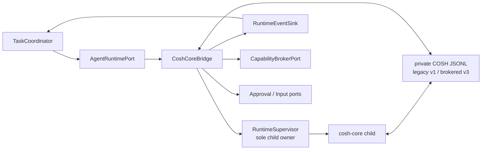

# Phase 1 Cosh Core Bridge Design

[中文版](design_zh.md) | [Acceptance baseline](acceptance.md)

## Status and decision

The current capability-admission increment is based on upstream commit
`a6592234341a095b2b9446601642caa87314e2c5`. `CoshCoreBridge` adapts the private cosh-core
newline-delimited JSONL control protocol to neutral `AgentRuntimePort`. Private COSH legacy v1
remains the Shell/Core compatibility protocol; Gateway's closed brokered profile negotiates
private COSH v3 and `gateway_brokered_v1`. Neither version is ACP. ACP v1 remains a separate
interoperability protocol used by ungoverned `doctor`/`run`, not production `serve`.

`RuntimeSupervisor` is the only owner of cosh-core and future ACP/provider child processes. The
Bridge owns protocol translation and per-runtime correlation; it never writes Task storage,
decides policy, renders approval UI, or executes an OS action directly.

## Goals

- Reuse cosh-core's implemented provider, session, streaming, tool, question, auth, cancellation,
  and recovery behavior behind a channel-neutral Runtime Port.
- Negotiate the private control protocol before admitting a Task Run.
- Preserve distinct Task, Run, runtime instance, Agent session, provider session, request, tool,
  and execution identities.
- Normalize JSONL output into bounded, ordered `AgentRuntimeEvent` values.
- Route side-effecting tool intent through `CapabilityBroker`; never answer it with an ungoverned
  generic approval.
- Supervise process groups, stderr, deadlines, cancellation, shutdown, and terminal result exactly
  once per runtime attempt.
- Keep the current direct Shell/core path available during opt-in migration.

## Non-goals

- Implementing or exposing ACP, JSON-RPC, HTTP, a Gateway API, or a channel protocol.
- Making `ProviderSessionId` a `TaskId`, `RunId`, or `AgentSessionId`.
- Moving Task durability into cosh-core `SessionStore`.
- Sharing `cosh-shell` UI/runtime state with the daemon through a Rust dependency.
- Allowing cosh-core to execute side-effecting tools internally in the brokered production profile.
- Supporting concurrent turns on one cosh-core process in Phase 1.
- Persisting raw stdout/stderr, secrets, prompt bodies, or terminal buffers in Task events.

## Current-source evidence

| Evidence at `6c115aef` | Reusable behavior | Bridge gap |
| --- | --- | --- |
| [`cosh-core/protocol.rs`](../../../../../crates/cosh-core/src/protocol.rs) | Private JSONL `InputMessage`/`OutputMessage`, exact `CONTROL_PROTOCOL_VERSION = 1`, capabilities, approvals, questions, auth, evidence, and results. | No `AgentRuntimePort`, Task/Run identity, or Broker contract. |
| [`cosh-core/headless.rs`](../../../../../crates/cosh-core/src/headless.rs) | Headless loop, strict version mismatch exit, provider session setup, turn persistence, and terminal results. | Lifecycle is tied to stdin/stdout and caller process ownership. |
| [`cosh-core/session.rs`](../../../../../crates/cosh-core/src/session.rs) | Workspace-scoped `ProviderSessionId` and versioned conversation persistence. | Provider session is not durable Task state. |
| [`cosh-shell/adapter/cosh_core_service.rs`](../../../../../crates/cosh-shell/src/adapter/cosh_core_service.rs) | Long-lived child, one active request, interrupt/graceful kill, registry reuse, bounded cancellation artifacts, and reset. | Owned by standalone Shell and not reusable by Gateway. |
| [`cosh-shell/adapter/control_protocol.rs`](../../../../../crates/cosh-shell/src/adapter/control_protocol.rs) | Shell-side parser/serializer and capability negotiation mirror. | Types are Shell-owned and include presentation/shell assumptions. |
| [`cosh-shell/adapter/cosh_core.rs`](../../../../../crates/cosh-shell/src/adapter/cosh_core.rs) | Workspace, resume, approval mode, prompt, and AgentEvent adaptation. | `AgentRequest` includes Shell command context and state is in memory. |
| [`runtime-contracts.md`](../../../runtime-contracts.md) | Documents current implemented shell/core runtime contract and explicitly separates ACP/Task designs. | No Gateway-owned bridge exists. |

The baseline has no `cosh-gateway`, `RuntimeSupervisor`, neutral `AgentRuntimePort`,
`CoshCoreBridge`, durable runtime binding, or brokered core launch profile.

## Implemented bridge and profile

The candidate contains the runtime-local foundation under
[`cosh-gateway/src/runtime.rs`](../../../../../crates/cosh-gateway/src/runtime.rs) and the
installed brokered Core Runtime factory used by production `serve`:

- [`RuntimeSupervisor`](../../../../../crates/cosh-gateway/src/runtime/supervisor.rs) validates an
  absolute direct executable and pinned workspace, clears inherited environment, owns piped
  stdin/stdout/stderr, creates a dedicated process group, escalates TERM to KILL, reaps the child,
  and delivers one process terminal observation. Its state machine currently covers `Idle`,
  `Starting`, `Initializing`, `Ready`, `Stopping`, and `Exited`.
- [`bounded_io.rs`](../../../../../crates/cosh-gateway/src/runtime/bounded_io.rs) bounds stdout
  JSONL frames before full-line allocation and continuously drains a fixed-capacity stderr tail
  with an explicit discarded-byte count.
- [`cosh_core_jsonl.rs`](../../../../../crates/cosh-gateway/src/runtime/cosh_core_jsonl.rs) is a
  pure dual-profile codec. Legacy uses **private COSH v1**; the Gateway brokered profile requires
  **private COSH v3**, exact `gateway_brokered_v1`, capability-profile identity, exact Runtime
  tool inventory, correlation, and capabilities. It permits only
  bounded auth bootstrap before readiness,
  decodes current system/stream/assistant/tool/control/registry/result shapes into runtime-local
  observations, and synthesizes EOF-without-result once.
- Public Task, Run, Runtime, and Agent IDs/events remain owned by `cosh-gateway-contracts`. The
  codec intentionally does not copy those types or label private COSH JSONL as ACP. A subsequent
  bridge increment must attach contract headers, binding fences, sequence, correlation, and
  backpressure while converting observations to `AgentRuntimeEvent`.

The daemon persists Runtime binding before prompt dispatch and connects the task-only
`ask_user_question` path to durable question/input dispatch. It does not wire a production
`ExecutionTarget` or checkpoint/ws-ckpt dependency. Provider-session resume,
complete event/backpressure coverage, accepted real-provider evidence, and manual Terminal
validation remain incomplete. Shell attachment and process-owner migration are Phase 2; the
standalone Shell compatibility path remains the Phase 1 rollback.

## Ownership and dependencies



`RuntimeSupervisor` owns executable resolution, child creation, process group, stdin/stdout/stderr,
resource limits, health, kill/reap, and restart policy. `CoshCoreBridge` owns JSONL codecs,
negotiated capabilities, correlation maps, runtime binding, and event normalization. The Task
Coordinator decides Run state and is the only Task writer. The Broker owns side-effect authority.

Planned dependency direction:

```text
cosh-gateway -> cosh-gateway-contracts
cosh-gateway -> cosh-platform -> cosh-types
cosh-core    -> cosh-platform -> cosh-types
cosh-shell remains standalone
```

There is no Rust dependency from `cosh-gateway` to the cosh-core implementation crate, from
`cosh-core` back to Gateway, or between Gateway and `cosh-shell`. The bridge launches the binary
and speaks the private JSONL contract. Core owns a narrow private v3 profile mirror while Gateway
owns the canonical admitted profile; neither imports the other's domain crate. Canonical JSON
fixtures are mirrored across Core, Shell, and Gateway tests to detect drift. Neutral Runtime
IDs/events follow the Phase 0 G0 schema-first decision and planned side-effect-free
`cosh-gateway-contracts` leaf.

## Agent Runtime Port

Conceptual commands are:

```text
InspectCapabilities { runtime_profile }
Start { task_id, run_id, run_lease_fence, workspace, target_ref,
        runtime_profile, input_ref, idempotency_key }
Resume { task_id, run_id, run_lease_fence, agent_session_id, input_ref }
SendInput { task_id, run_id, request_id, input_ref }
ResolvePermission { task_id, run_id, request_id, resolution_ref }
Cancel { task_id, run_id, request_id, reason }
Close { agent_session_id, reason }
Subscribe { runtime_binding, after_cursor }
```

The Bridge returns an `AgentRuntimeBinding` with Gateway-created `RuntimeInstanceId` and
`AgentSessionId`, plus an opaque provider binding that may contain `ProviderSessionId`. Callers
never receive a provider ID as a Task or Run identity.

Representative events are:

```text
RuntimeStarting, RuntimeReady, AgentSessionBound,
AgentStatusChanged, AgentMessageChunk, AgentMessageCompleted,
ToolUseDeclared, CapabilityRequested, ApprovalOwnershipConfirmed,
UserInputRequested, AuthInputRequested, ShellEvidenceRequested,
ToolResultRecorded, EnvironmentDeltaProposed,
RuntimeTurnSucceeded, RuntimeTurnFailed, RuntimeCancelled,
RuntimeProcessExited, RuntimeProtocolFailed
```

Every command/event carries Task ID, Run ID, runtime instance ID, Run lease fence, bridge sequence,
and causation/correlation IDs where applicable.

## Private JSONL profile

### Initialization

Before a user message, legacy Shell/Core sends private v1. Gateway production sends a correlated
`control_request.initialize` with `protocol_version: 3`, `execution_profile:
gateway_brokered_v1`, the pinned `task-only-v1` manifest identity, and
`fire_session_start: false`. It requires the matching v3 response, identical profile identity,
exact `ask_user_question` Runtime inventory, and safe capability snapshot before input. Missing version remains compatible only
for legacy v1 and is rejected by the brokered profile. Current headless startup may request authentication
before it consumes initialization, so one bounded `auth_required` bootstrap exchange is allowed
through the secret-safe credential port. No Task user turn is admitted during that exchange.
Mismatch, malformed response, any other output before negotiation, or deadline expiry terminates
the runtime attempt before input admission.

`CONTROL_PROTOCOL_VERSION = 1` and `BROKERED_CONTROL_PROTOCOL_VERSION = 3` are private COSH
constants. They are unrelated to ACP SDK or wire versions. One shared golden corpus is consumed by
Core serializers/parsers and the Gateway codec for v1/v3 initialize, task/question request,
acknowledgement, result, and negative version/profile/capability cases. Shell need not support v3.

### Input mapping

| Runtime command | Private JSONL message |
| --- | --- |
| Start/Resume prompt | `type: user` with content, provider session binding, and bounded Shell context when enabled |
| Cancel | correlated `control_request.interrupt`, then supervisor escalation |
| Close | `control_request.shutdown`, bounded grace, then kill/reap |
| Runtime config update | typed `config_override`, `switch_model`, or `reload_config` only when profile allows |
| Permission result | `control_response` correlated to original core `request_id` |
| Durable approval ownership | `approval_receipt` only when capability is advertised |
| Registry management | `registry_request`; never interleave with an active turn in Phase 1 |

The Bridge does not accept caller-created raw JSONL. It constructs messages from typed Runtime
commands and validates all bounded fields.

### Output mapping

| Private output | Normalized handling |
| --- | --- |
| `system/init` | Validate/bind provider session, model, tool inventory, and resumability. |
| `system/status` and hook notifications | Bounded status/governance events. |
| `stream_event` | Ordered text/thinking/tool-input deltas with per-process sequence. |
| `assistant` / `user` | Completed content/tool-result events; deduplicate by scoped IDs. |
| `control_request.can_use_tool` | Normalize and submit to `CapabilityBrokerPort`. |
| `control_request.ask_user` | Ask Task Coordinator to enter `WaitingInput`. |
| `control_request.auth_required` | Request a credential reference through a dedicated secret-safe port or suspend. |
| `control_request.shell_evidence` | Use a bounded evidence-read capability; never read arbitrary host data in Bridge. |
| `result` | Emit exactly one terminal Runtime event, then persist provider binding metadata. |
| `registry_response` | Complete only the correlated management request. |

Unknown top-level types, invalid field types, oversized lines/nesting, unmatched responses, reused
request IDs, terminal output followed by new turn data, or capability violations fail the runtime
attempt. Unknown optional payload fields may be retained only as bounded diagnostics.

## Brokered execution profile

Current cosh-core can execute an `Outcome::Allow` tool internally and can execute an approved tool
after receiving a generic allow response. That behavior is incompatible with the production
Gateway invariant for side effects. Phase 1 therefore adds a distinct brokered launch profile,
while keeping direct legacy mode unchanged.

The task-only Phase 1 brokered profile:

1. expose only an audited allowlist of tools;
2. exposes only `ask_user_question`, which has no OS side effect;
3. does not construct extension, Skill, MCP, hook, Shell, file, process, or network execution
   surfaces or a production `ExecutionTarget`;
4. does not accept a generic allow for any side-effecting operation; and
5. keeps checkpoint/ws-ckpt as a future optional capability requiring a separate inventory,
   permit, audit, and recovery review.

This is a task-only profile, not a universal Broker or governed Shell claim.
Additional hosted tools require explicit inventory review, typed result contracts, a new private
protocol version when the wire changes, and new shared fixtures.

## Approval, receipt, question, auth, and evidence semantics

For `can_use_tool`, the Bridge constructs a `CapabilityRequest` carrying Task, Run, actor, target,
tool-use ID, core request ID, canonical input, and lease fence. Broker denial produces a correlated
deny response. `ApprovalRequired` is first committed by `TaskCoordinator`; only after that commit
may the Bridge send `approval_receipt`, proving durable ownership rather than merely UI rendering.

After the first valid approval resolution, the Broker re-evaluates and may issue a permit. The
Bridge executes through the target and sends the exact correlated result. Timeout, cancellation,
stale fence, expired approval, audit failure, or unknown execution fails closed. Late callbacks do
not send a second response.

`ask_user` becomes durable `WaitingInput`; a presenter answer returns through the coordinator and
is correlated once. `auth_required` never stores secret values in Task events or Bridge logs. A
credential port returns an opaque reference or the Run suspends for configured authentication.
`shell_evidence` uses a scoped, bounded read contract and returns evidence references/text under
the negotiated capability; the Bridge cannot access a live Shell buffer directly.

## Process supervision and lifecycle

`RuntimeSupervisor` applies one lifecycle policy to cosh-core, ACP, and other provider children:

- resolve an approved executable and arguments without invoking a shell;
- start a dedicated process group with pinned workspace and bounded environment allowlist;
- own stdin, bounded line decoder, bounded stderr tail, and child wait handle;
- allow one active turn per cosh-core runtime instance in Phase 1;
- negotiate before admission and reject output before readiness except the explicit bounded auth
  bootstrap required by current headless startup;
- enforce startup, idle/progress, approval, turn, cancellation, and shutdown deadlines separately;
- on cancel, send `interrupt`, wait a bounded grace, terminate the process group, and reap every
  child before declaring the runtime settled;
- emit one terminal process event even when stdout EOF, wait status, and cancellation race;
- use restart backoff/budget and create a new `RuntimeInstanceId` after restart.

A child PID, EOF, broken pipe, or dropped subscription is not a Task terminal state. Supervisor
events go to the coordinator, which decides suspend, retry, fail, or confirm cancellation.

## Session and identity semantics

The provider session remains owned by cosh-core `SessionStore` and scoped to a canonical
workspace. The Bridge maps it into opaque binding metadata under one `AgentSessionId`. It may
start core with `--resume <provider-session-id>` only after validation and exact workspace match.

Required invariants:

- `TaskId != RunId != RuntimeInstanceId != AgentSessionId != ProviderSessionId`;
- one active Run owns one runtime turn and Run lease fence;
- a provider session commit after a stale/cancelled Run cannot rebind the Task;
- retry creates a new Run and runtime attempt unless an explicit, validated resume policy applies;
- restart never silently resends a prompt whose OS effect may be uncertain;
- `env_delta` is a proposed normalized event, not permission to mutate Gateway or target process
  environment.

## Ordering, idempotency, replay, and backpressure

The Bridge assigns `(RuntimeInstanceId, bridge_sequence)` as each valid line/update is accepted.
Core request IDs and tool-use IDs provide scoped deduplication for control/tool flows. Stream
chunks without source IDs are append-once within one live decoder; after process loss the Run
suspends rather than fabricating exact replay.

Task event commit acknowledgment provides backpressure. The Bridge uses bounded queues and pauses
stdout consumption within safe OS pipe limits; if durable consumers remain unavailable, it
cancels/terminates the runtime rather than dropping control, permission, tool result, or terminal
events. Presentation detach does not affect the runtime subscription owned by the Task Plane.

A duplicate Task command with the same Runtime idempotency key returns the existing binding or
status. A conflicting payload fails. Repeated cancel/close is idempotent. Exactly one correlated
response is sent for each pending core request; resolved IDs enter a bounded tombstone set to
reject late duplicates.

## Error model

Stable categories include `runtime_not_found`, `spawn_failed`, `protocol_mismatch`,
`protocol_malformed`, `capability_missing`, `unexpected_message`, `message_too_large`,
`correlation_unknown`, `correlation_duplicate`, `runtime_busy`, `provider_session_invalid`,
`workspace_mismatch`, `broker_denied`, `approval_expired`, `execution_uncertain`,
`credential_unavailable`, `event_sink_backpressure`, `cancel_timeout`, `process_exited`, and
`shutdown_timeout`.

Errors include bounded stderr classification, exit status, runtime instance, and protocol phase,
but never raw secrets, prompts, full provider payloads, or terminal output. Recoverability is a
Task policy decision informed by the error class. A bridge timeout or transport loss never claims
that an OS effect did not occur.

## Migration and compatibility

1. Freeze private JSONL fixtures and neutral Runtime contracts in Phase 0.
2. Implement `RuntimeSupervisor` and fake line-protocol child under `cosh-gateway`.
3. Implement `CoshCoreBridge` codecs, negotiation, event normalization, correlation, and session
   binding without Broker execution.
4. Add brokered launch profile with only non-effecting/delegated tools and integrate the Broker.
5. Connect Task Run leases, cancellation, durable approval/input, replay cursor, and projections.
6. Keep the direct Shell/Core adapter as the Phase 1 legacy rollback. Shell attachment and owner
   migration occur only in Phase 2 through a Gateway wire client/mirror, without a crate dependency.
7. Add Phase 2 ACP bridge as a sibling Runtime adapter, never as a mode inside CoshCoreBridge.

Rollback disables Gateway runtime mode and leaves current cosh-core/Shell behavior and provider
session files intact. A private protocol extension requires explicit versioning and coordinated
core/Shell/Gateway fixture changes; version 1 is not silently reinterpreted.

## Dependencies

- Phase 0 G0 schema/contracts, process supervision, provider trust, secret, and storage decisions.
- [Task Execution Plane](../task-execution-plane/design.md): Run lease, runtime binding, durable
  event, input, approval, cancellation, and terminal state.
- [Capability Broker](../capability-broker/design.md): every side-effect tool decision and target
  execution.
- [Gateway API](../gateway-api/design.md): user-facing commands only through Task Coordinator.
- Existing cosh-core protocol/session code and cosh-shell fixtures as implementation evidence, not
  shared domain ownership.

## Implementation work breakdown

1. Inventory/freeze all private JSONL inputs, outputs, limits, and canonical fixtures.
2. Define neutral Runtime commands/events/bindings in schema-first contracts.
3. Implement reusable `RuntimeSupervisor` process-group, I/O, deadline, kill/reap, and restart
   lifecycle.
4. Implement strict bounded JSONL codec, v1 negotiation, correlation table, and tombstones.
5. Map system/stream/assistant/tool/question/auth/evidence/result messages to Runtime events.
6. Implement provider session binding/resume validation without Task-store writes.
7. Implement brokered core profile and `CapabilityBrokerPort`/target result flow.
8. Integrate Task lease/cancel/backpressure and add migration-compatible Shell mirror fixtures.
9. Add protocol drift, crash, malformed stream, race, and security bypass tests.

Current progress includes the shared dual-version corpus, neutral contracts, supervisor, strict
codec, bridge mapping, durable Runtime binding, and task/question dispatch. Production side-effect
execution and checkpoint/ws-ckpt integration remain future optional capability work. Complete
message mapping, provider-session recovery, backpressure, real-provider, and Phase 2 Shell
migration work remains.

## Test strategy

- Canonical cross-implementation fixtures for every JSONL type and capability combination.
- Strict negotiation tests for explicit v1, legacy missing version rejection in production,
  mismatch, wrong request ID, duplicate initialize, permitted auth bootstrap, and all other
  output-before-ready.
- Parser fuzzing for oversized lines, nesting, invalid UTF-8, partial JSON, unknown tags, and EOF.
- Mapping golden tests for status, chunks, tool calls/results, approval, question, auth, evidence,
  environment delta, and every terminal result/error.
- Process tests for spawn failure, process-group descendants, stderr bound, broken pipe, cancel/
  result/EOF races, shutdown escalation, reap, and restart budget.
- Session tests for workspace mismatch, stale Run commit, validated resume, corrupt provider
  session, and retry without prompt replay.
- Broker bypass tests proving no side-effecting exposed tool receives generic allow or core-local
  execution in brokered mode.
- Backpressure/crash tests proving control and terminal events are never silently dropped.

## Open questions

| Question | Owner | Phase 1 default |
| --- | --- | --- |
| Is one persistent core reused across Tasks? | Runtime owner | One active turn; reuse only after clean settlement and profile/workspace validation. |
| Which core tools are exposed in brokered profile? | Core/Broker owners | Only audited non-effecting or host-delegated tools. |
| Does brokered profile require private protocol v3? | Core/Bridge owners | Yes. The task-only profile identity and exact Runtime inventory are frozen in private COSH v3; checkpoint remains future. |
| How are credentials supplied? | Secret/security owner | Opaque credential reference; no Task/event secret values. |
| What is the maximum durable event lag? | Runtime/Task owners | Benchmark bounded queue; cancel safely before control-event loss. |
| Can a failed turn resume the provider session? | Runtime/product owners | Only with validated session and explicit no-uncertain-effect policy. |
