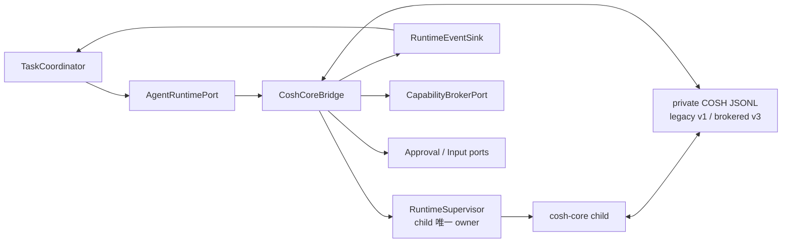

# Phase 1 Cosh Core Bridge 设计

[English](design.md) | [验收基线](acceptance_zh.md)

## 状态与决策

当前 capability admission 增量基于上游提交 `a6592234341a095b2b9446601642caa87314e2c5`。
`CoshCoreBridge` 将 private cosh-core newline-delimited JSONL control protocol 适配到 neutral
`AgentRuntimePort`。Private COSH legacy v1 继续用于 Shell/Core compatibility；Gateway 的封闭 brokered
profile negotiation private COSH v3 与 `gateway_brokered_v1`。两个版本都不是 ACP。ACP v1 只用于
ungoverned `doctor`/`run` interoperability，不用于 production `serve`。

`RuntimeSupervisor` 是 cosh-core 与未来 ACP/provider child process 的唯一 owner。Bridge 拥有 protocol
translation 和 per-runtime correlation；不能写 Task storage、决定 policy、渲染 approval UI 或直接执行
OS action。

## 目标

- 在 channel-neutral Runtime Port 后复用 cosh-core 已实现的 provider、session、streaming、tool、
  question、auth、cancellation 和 recovery 行为。
- 接受 Task Run 前完成 private control protocol negotiation。
- 保持 Task、Run、runtime instance、Agent session、provider session、request、tool 与 execution identity
  相互独立。
- 将 JSONL output 规范化成有界、有序的 `AgentRuntimeEvent`。
- 将 side-effecting tool intent 送入 `CapabilityBroker`，不能用 ungoverned generic approval 回答。
- 每个 runtime attempt 只由一处监督 process group、stderr、deadline、cancel、shutdown 与 terminal result。
- Opt-in migration 期间保留当前 direct Shell/Core path。

## 非目标

- 实现或暴露 ACP、JSON-RPC、HTTP、Gateway API 或 channel protocol。
- 将 `ProviderSessionId` 用作 `TaskId`、`RunId` 或 `AgentSessionId`。
- 将 Task durability 移入 cosh-core `SessionStore`。
- 通过 Rust dependency 与 daemon 共享 `cosh-shell` UI/runtime state。
- 允许 cosh-core 在 brokered production profile 内部执行 side-effecting tool。
- Phase 1 在单个 cosh-core process 上运行 concurrent turn。
- 在 Task event 中持久化 raw stdout/stderr、secret、prompt body 或 terminal buffer。

## 当前源码证据

| `6c115aef` 的证据 | 可复用行为 | Bridge 缺口 |
| --- | --- | --- |
| [`cosh-core/protocol.rs`](../../../../../crates/cosh-core/src/protocol.rs) | Private JSONL `InputMessage`/`OutputMessage`、exact `CONTROL_PROTOCOL_VERSION = 1`、capability、approval、question、auth、evidence 与 result。 | 无 `AgentRuntimePort`、Task/Run identity 或 Broker contract。 |
| [`cosh-core/headless.rs`](../../../../../crates/cosh-core/src/headless.rs) | Headless loop、严格 version mismatch exit、provider session setup、turn persistence 与 terminal result。 | Lifecycle 依赖 stdin/stdout 和 caller process ownership。 |
| [`cosh-core/session.rs`](../../../../../crates/cosh-core/src/session.rs) | Workspace-scoped `ProviderSessionId` 与 versioned conversation persistence。 | Provider session 不是 durable Task state。 |
| [`cosh-shell/adapter/cosh_core_service.rs`](../../../../../crates/cosh-shell/src/adapter/cosh_core_service.rs) | Long-lived child、单 active request、interrupt/graceful kill、registry reuse、有界 cancellation artifact 与 reset。 | 由 standalone Shell 拥有，Gateway 无法复用。 |
| [`cosh-shell/adapter/control_protocol.rs`](../../../../../crates/cosh-shell/src/adapter/control_protocol.rs) | Shell-side parser/serializer 与 capability negotiation mirror。 | Type 由 Shell 拥有并包含 presentation/shell assumption。 |
| [`cosh-shell/adapter/cosh_core.rs`](../../../../../crates/cosh-shell/src/adapter/cosh_core.rs) | Workspace、resume、approval mode、prompt 与 AgentEvent adaptation。 | `AgentRequest` 包含 Shell command context，state 在内存。 |
| [`runtime-contracts.md`](../../../runtime-contracts.md) | 记录当前 implemented Shell/Core runtime contract，并明确 ACP/Task design 分离。 | 不存在 Gateway-owned bridge。 |

基线上不存在 `cosh-gateway`、`RuntimeSupervisor`、neutral `AgentRuntimePort`、`CoshCoreBridge`、durable
runtime binding 或 brokered core launch profile。

## 已实现 Bridge 与 profile

当前候选实现在
[`cosh-gateway/src/runtime.rs`](../../../../../crates/cosh-gateway/src/runtime.rs) 下包含 runtime-local
基础，以及 production `serve` 使用的 installed brokered Core Runtime factory：

- [`RuntimeSupervisor`](../../../../../crates/cosh-gateway/src/runtime/supervisor.rs) 验证 absolute
  direct executable 与 pinned workspace，清除 inherited environment，独占 piped
  stdin/stdout/stderr，创建 dedicated process group，将 TERM 升级为 KILL，reap child，并且只交付一次
  process terminal observation。当前状态机覆盖 `Idle`、`Starting`、`Initializing`、`Ready`、
  `Stopping` 与 `Exited`。
- [`bounded_io.rs`](../../../../../crates/cosh-gateway/src/runtime/bounded_io.rs) 在整行分配前限制 stdout
  JSONL frame，并持续 drain 固定容量的 stderr tail，同时明确记录 discarded byte 数量。
- [`cosh_core_jsonl.rs`](../../../../../crates/cosh-gateway/src/runtime/cosh_core_jsonl.rs) 是 dual-profile
  纯 codec。Legacy 使用 **private COSH v1**；Gateway brokered profile 要求 **private COSH v3**、
  exact `gateway_brokered_v1`、capability-profile identity、准确 Runtime tool inventory、correlation 与
  capability，readiness 前只允许有界 auth bootstrap，将当前
  system/stream/assistant/tool/control/registry/result shape 解码为 runtime-local observation，并且只生成
  一次 EOF-without-result。
- Public Task、Run、Runtime 与 Agent ID/event 继续由 `cosh-gateway-contracts` 拥有。Codec 不复制这些
  type，也不会把 private COSH JSONL 称为 ACP。后续 Bridge 增量必须在 observation 转换为
  `AgentRuntimeEvent` 时附加 contract header、binding fence、sequence、correlation 与 backpressure。

Daemon 在 prompt dispatch 前持久化 Runtime binding，并把 task-only 的 `ask_user_question` 接入 durable
question/input dispatch。本 PR 不接入 production `ExecutionTarget`，也不依赖 checkpoint/ws-ckpt。
Provider-session resume、完整 event/backpressure、已验收 real-provider evidence 与人工 Terminal 验证仍不完整。Shell attachment 与 process-owner migration
属于 Phase 2；standalone Shell compatibility path 是 Phase 1 rollback。

## Ownership 与 dependencies



`RuntimeSupervisor` 拥有 executable resolution、child creation、process group、stdin/stdout/stderr、
resource limit、health、kill/reap 与 restart policy。`CoshCoreBridge` 拥有 JSONL codec、negotiated
capability、correlation map、runtime binding 与 event normalization。Task Coordinator 决定 Run state，
并是 Task 唯一 writer。Broker 拥有 side-effect authority。

计划的依赖方向：

```text
cosh-gateway -> cosh-gateway-contracts
cosh-gateway -> cosh-platform -> cosh-types
cosh-core    -> cosh-platform -> cosh-types
cosh-shell remains standalone
```

不存在 `cosh-gateway` 到 cosh-core implementation crate 的 Rust dependency，也不存在 `cosh-core`
反向依赖 Gateway，或 Gateway 与 `cosh-shell` 之间的 crate dependency。Bridge 启动 binary 并使用 private
JSONL contract。Core 只持有 private v3 profile mirror，Gateway 持有 canonical admitted profile，
双方都不导入对方的 domain crate。Core、Shell 与 Gateway test 通过 canonical JSON fixture mirror
检测 drift。Neutral Runtime ID/event 遵循 Phase 0 G0 schema-first 决策和计划中的
side-effect-free `cosh-gateway-contracts` leaf。

## Agent Runtime Port

概念命令为：

```text
InspectCapabilities { runtime_profile }
Start { task_id, run_id, run_lease_fence, workspace, target_ref,
        runtime_profile, input_ref, idempotency_key }
Resume { task_id, run_id, run_lease_fence, agent_session_id, input_ref }
SendInput { task_id, run_id, request_id, input_ref }
ResolvePermission { task_id, run_id, request_id, resolution_ref }
Cancel { task_id, run_id, request_id, reason }
Close { agent_session_id, reason }
Subscribe { runtime_binding, after_cursor }
```

Bridge 返回 `AgentRuntimeBinding`，其中包含 Gateway 创建的 `RuntimeInstanceId` 和 `AgentSessionId`，以及
可能含 `ProviderSessionId` 的 opaque provider binding。Caller 不能把 provider ID 当作 Task 或 Run identity。

代表性 event 为：

```text
RuntimeStarting, RuntimeReady, AgentSessionBound,
AgentStatusChanged, AgentMessageChunk, AgentMessageCompleted,
ToolUseDeclared, CapabilityRequested, ApprovalOwnershipConfirmed,
UserInputRequested, AuthInputRequested, ShellEvidenceRequested,
ToolResultRecorded, EnvironmentDeltaProposed,
RuntimeTurnSucceeded, RuntimeTurnFailed, RuntimeCancelled,
RuntimeProcessExited, RuntimeProtocolFailed
```

每个 command/event 携带 Task ID、Run ID、runtime instance ID、Run lease fence、bridge sequence，以及适用
的 causation/correlation ID。

## Private JSONL profile

### Initialization

发送 user message 前，legacy Shell/Core 使用 private v1。Gateway production 发送相关联的
`control_request.initialize`，携带 `protocol_version: 3`、`execution_profile:
gateway_brokered_v1`、固定 `task-only-v1` manifest identity 与 `fire_session_start: false`。Bridge 在
input 前要求 matching v3 response、相同 profile identity、准确的 `ask_user_question` Runtime inventory
与 safe capability snapshot。Missing version 只对 legacy v1 compatibility 有效，brokered profile 会拒绝。
当前 headless startup 可能
在消费 initialization 前请求 authentication，因此允许通过 secret-safe credential port 完成一次有界
`auth_required` bootstrap exchange，期间不能接收 Task user turn。Mismatch、malformed response、其他
negotiation 前 output 或 deadline expiry 都会在 input admission 前结束 runtime attempt。

`CONTROL_PROTOCOL_VERSION = 1` 与 `BROKERED_CONTROL_PROTOCOL_VERSION = 3` 都是 private COSH
constant，与 ACP SDK 或 wire version 无关。Core serializer/parser 与 Gateway codec 共同消费一份 golden
corpus，覆盖 v1/v3 initialize、task/question request、ack、result，以及 version/profile/capability 负例。
Shell 无需支持 v3。

### Input mapping

| Runtime command | Private JSONL message |
| --- | --- |
| Start/Resume prompt | `type: user`，携带 content、provider session binding 与启用时的有界 Shell context |
| Cancel | 相关联的 `control_request.interrupt`，随后 supervisor escalation |
| Close | `control_request.shutdown`、有界 grace、然后 kill/reap |
| Runtime config update | 只有 profile 允许时使用 typed `config_override`、`switch_model` 或 `reload_config` |
| Permission result | 与原 core `request_id` 相关联的 `control_response` |
| Durable approval ownership | 只有 capability advertised 时发送 `approval_receipt` |
| Registry management | `registry_request`；Phase 1 不与 active turn interleave |

Bridge 不接受 caller 构造的 raw JSONL，只根据 typed Runtime command 构造 message，并校验全部有界 field。

### Output mapping

| Private output | 规范化处理 |
| --- | --- |
| `system/init` | 校验并绑定 provider session、model、tool inventory 与 resumability。 |
| `system/status` 和 hook notification | 有界 status/governance event。 |
| `stream_event` | 使用 per-process sequence 的 ordered text/thinking/tool-input delta。 |
| `assistant` / `user` | Completed content/tool-result event；按 scoped ID 去重。 |
| `control_request.can_use_tool` | 规范化后提交 `CapabilityBrokerPort`。 |
| `control_request.ask_user` | 请求 Task Coordinator 进入 `WaitingInput`。 |
| `control_request.auth_required` | 通过 secret-safe dedicated port 请求 credential reference，或 suspend。 |
| `control_request.shell_evidence` | 使用有界 evidence-read capability；Bridge 不能读取任意 host data。 |
| `result` | 只发一个 terminal Runtime event，再保存 provider binding metadata。 |
| `registry_response` | 只完成 correlated management request。 |

Unknown top-level type、非法 field type、超大 line/nesting、unmatched response、request ID reuse、terminal
output 后的新 turn data 或 capability violation 都使 runtime attempt fail。Unknown optional payload field 只能
作为有界 diagnostic 保留。

## Task-only brokered execution profile

当前 cosh-core 可以在内部执行 `Outcome::Allow` tool，也可以在收到 generic allow response 后执行 approved
tool。这与生产 Gateway 的 side-effect 约束不兼容。因此 Phase 1 增加独立 brokered launch profile，同时
保持 direct legacy mode 不变。

已验收 Phase 1 brokered profile：

1. 只暴露经过 audit 的 tool allowlist；
2. 只暴露没有 OS side effect 的 `ask_user_question`；
3. 不构造 extension、Skill、MCP、hook、Shell、file、process、network execution surface 或 production
   `ExecutionTarget`；
4. 不对任何 side-effecting operation 接受 generic allow；
5. checkpoint/ws-ckpt 保留为后续可选 capability，需单独完成 inventory、permit、audit 与 recovery review。

这是 task-only profile，不是 universal Broker 或 governed Shell 声明。新增 hosted tool
必须完成显式 inventory review、typed result contract；wire 变化时使用新 private protocol version 与新
shared fixture。

## Approval、receipt、question、auth 与 evidence 语义

Bridge 为 `can_use_tool` 构造携带 Task、Run、actor、target、tool-use ID、core request ID、canonical input
和 lease fence 的 `CapabilityRequest`。Broker denial 产生 correlated deny response。`ApprovalRequired` 首先由
`TaskCoordinator` commit；commit 后 Bridge 才能发送 `approval_receipt`，证明 durable ownership，而不是
UI 已渲染。

第一个有效 approval resolution 后，Broker 重新评估并可能签发 permit。Bridge 通过 target 执行并发送 exact
correlated result。Timeout、cancel、stale fence、expired approval、audit failure 或 unknown execution 均 fail
closed。Late callback 不能发送第二个 response。

`ask_user` 成为 durable `WaitingInput`；presenter answer 通过 coordinator 返回且只 correlation 一次。
`auth_required` 不能在 Task event 或 Bridge log 存 secret value。Credential port 返回 opaque reference，
否则 Run 因 authentication 配置 suspend。`shell_evidence` 使用 scoped、有界 read contract，在 negotiated
capability 下返回 evidence reference/text；Bridge 不能直接访问 live Shell buffer。

## Process supervision 与 lifecycle

`RuntimeSupervisor` 对 cosh-core、ACP 和其他 provider child 使用一套 lifecycle policy：

- 不调用 shell，解析 approved executable 与 argument；
- 使用 pinned workspace 和有界 environment allowlist 启动 dedicated process group；
- 拥有 stdin、bounded line decoder、bounded stderr tail 和 child wait handle；
- Phase 1 每个 cosh-core runtime instance 只允许一个 active turn；
- Admission 前 negotiate；除当前 headless startup 明确需要的有界 auth bootstrap 外，readiness 前 output
  直接拒绝；
- 分别强制 startup、idle/progress、approval、turn、cancellation 和 shutdown deadline；
- Cancel 时发送 `interrupt`，等待有界 grace，terminate process group 并 reap 所有 child，之后才认为
  runtime settled；
- Stdout EOF、wait status 与 cancel race 时仍只发一个 terminal process event；
- 使用 restart backoff/budget，restart 后创建新 `RuntimeInstanceId`。

Child PID、EOF、broken pipe 或 dropped subscription 都不是 Task terminal state。Supervisor event 发送给
coordinator，由 coordinator 决定 suspend、retry、fail 或 confirm cancellation。

## Session 与 identity 语义

Provider session 继续由 cosh-core `SessionStore` 拥有，并按 canonical workspace 隔离。Bridge 将其映射
为一个 `AgentSessionId` 下的 opaque binding metadata。只有 validation 通过且 workspace exact match 时，
才可以用 `--resume <provider-session-id>` 启动 core。

必要约束：

- `TaskId != RunId != RuntimeInstanceId != AgentSessionId != ProviderSessionId`；
- 一个 active Run 拥有一个 runtime turn 和 Run lease fence；
- Stale/cancelled Run 后的 provider session commit 不能 rebind Task；
- Retry 创建新 Run 和 runtime attempt，除非 explicit、validated resume policy 允许；
- Restart 不能静默重发可能具有 uncertain OS effect 的 prompt；
- `env_delta` 是 proposed normalized event，不是修改 Gateway 或 target process environment 的权限。

## Ordering、idempotency、replay 与 backpressure

Bridge 在接受每个合法 line/update 时分配 `(RuntimeInstanceId, bridge_sequence)`。Core request ID 与 tool-use
ID 为 control/tool flow 提供 scoped deduplication。没有 source ID 的 stream chunk 只在一个 live decoder 内
append-once；process 丢失后 Run suspend，不能伪造 exact replay。

Task event commit acknowledgment 提供 backpressure。Bridge 使用 bounded queue，并在安全 OS pipe limit 内
暂停读取 stdout；如果 durable consumer 持续不可用，则 cancel/terminate runtime，不能丢弃 control、
permission、tool result 或 terminal event。Presentation detach 不影响 Task Plane 拥有的 runtime subscription。

相同 Runtime idempotency key 的 duplicate Task command 返回 existing binding/status；payload conflict 则失败。
Repeated cancel/close 幂等。每个 pending core request 只发送一个 correlated response；resolved ID 进入有界
tombstone set，从而拒绝 late duplicate。

## Error model

稳定分类包括 `runtime_not_found`、`spawn_failed`、`protocol_mismatch`、`protocol_malformed`、
`capability_missing`、`unexpected_message`、`message_too_large`、`correlation_unknown`、
`correlation_duplicate`、`runtime_busy`、`provider_session_invalid`、`workspace_mismatch`、
`broker_denied`、`approval_expired`、`execution_uncertain`、`credential_unavailable`、
`event_sink_backpressure`、`cancel_timeout`、`process_exited` 和 `shutdown_timeout`。

Error 包含有界 stderr classification、exit status、runtime instance 和 protocol phase，但不能包含 raw secret、
prompt、完整 provider payload 或 terminal output。Recoverability 是 Task policy 根据 error class 作出的决定。
Bridge timeout 或 transport loss 不能宣称 OS effect 未发生。

## 迁移与兼容

1. 在 Phase 0 固化 private JSONL fixture 与 neutral Runtime contract。
2. 在 `cosh-gateway` 下实现 `RuntimeSupervisor` 和 fake line-protocol child。
3. 实现 `CoshCoreBridge` codec、negotiation、event normalization、correlation 与 session binding，但先不执行
   Broker operation。
4. 增加只含 non-effecting/delegated tool 的 brokered launch profile，并集成 Broker。
5. 连接 Task Run lease、cancel、durable approval/input、replay cursor 与 projection。
6. 保留 direct Shell/Core adapter 作为 Phase 1 legacy rollback。Shell attachment 与 owner migration 只在
   Phase 2 通过 Gateway wire client/mirror 完成，不能增加 crate dependency。
7. 将 Phase 2 ACP bridge 作为 sibling Runtime adapter，不能作为 CoshCoreBridge 内部 mode。

Rollback 禁用 Gateway runtime mode，并保留当前 cosh-core/Shell 行为与 provider session file。Private protocol
extension 需要显式 versioning 和协调 core/Shell/Gateway fixture change；不能静默重新解释 version 1。

## 依赖

- Phase 0 G0 schema/contracts、process supervision、provider trust、secret 与 storage 决策。
- [Task Execution Plane](../task-execution-plane/design_zh.md)：Run lease、runtime binding、durable event、
  input、approval、cancel 与 terminal state。
- [Capability Broker](../capability-broker/design_zh.md)：所有 side-effect tool decision 与 target execution。
- [Gateway API](../gateway-api/design_zh.md)：user-facing command 只能经 Task Coordinator。
- 现有 cosh-core protocol/session code 与 cosh-shell fixture 只是 implementation evidence，不共享 domain
  ownership。

## 实现任务分解

1. Inventory/freeze 所有 private JSONL input、output、limit 与 canonical fixture。
2. 在 schema-first contracts 中定义 neutral Runtime command/event/binding。
3. 实现可复用 `RuntimeSupervisor` process-group、I/O、deadline、kill/reap 和 restart lifecycle。
4. 实现严格 bounded JSONL codec、v1 negotiation、correlation table 与 tombstone。
5. 将 system/stream/assistant/tool/question/auth/evidence/result message 映射为 Runtime event。
6. 实现 provider session binding/resume validation，但不能写 Task store。
7. 实现 brokered core profile 和 `CapabilityBrokerPort`/target result flow。
8. 集成 Task lease/cancel/backpressure 并增加 migration-compatible Shell mirror fixture。
9. 增加 protocol drift、crash、malformed stream、race 与 security bypass test。

当前进度包括 shared dual-version corpus、neutral contract、supervisor、strict codec、Bridge mapping、
durable Runtime binding 与 task/question dispatch。Production side-effect execution 与 checkpoint/ws-ckpt
integration 属后续可选 capability。完整 message mapping、provider-session recovery、
backpressure、real-provider 与 Phase 2 Shell migration 仍待完成。

## 测试策略

- 每个 JSONL type 与 capability 组合的 canonical cross-implementation fixture。
- 严格 negotiation test 覆盖 explicit v1、production 拒绝 legacy missing version、mismatch、错误 request ID、
  duplicate initialize、允许的 auth bootstrap 与其他 output-before-ready。
- Parser fuzz 覆盖 oversized line、nesting、invalid UTF-8、partial JSON、unknown tag 与 EOF。
- Mapping golden test 覆盖 status、chunk、tool call/result、approval、question、auth、evidence、environment
  delta 和每个 terminal result/error。
- Process test 覆盖 spawn failure、process-group descendant、stderr bound、broken pipe、cancel/result/EOF race、
  shutdown escalation、reap 与 restart budget。
- Session test 覆盖 workspace mismatch、stale Run commit、validated resume、corrupt provider session 与 retry
  without prompt replay。
- Broker bypass test 证明 brokered mode 没有 side-effecting exposed tool 能收到 generic allow 或 core-local
  execution。
- Backpressure/crash test 证明 control 与 terminal event 不会静默丢失。

## 开放问题

| 问题 | Owner | Phase 1 默认值 |
| --- | --- | --- |
| 是否跨 Task 复用一个 persistent core？ | Runtime owner | 单 active turn；clean settlement 且 profile/workspace validation 后才复用。 |
| Brokered profile 暴露哪些 core tool？ | Core/Broker owner | 只暴露 audited non-effecting 或 host-delegated tool。 |
| Brokered profile 是否要求 private protocol v3？ | Core/Bridge owner | 是。Task-only profile identity 与准确 Runtime inventory 已固化在 private COSH v3；checkpoint 属后续。 |
| 如何提供 credential？ | Secret/security owner | Opaque credential reference；Task/event 不存 secret value。 |
| 最大 durable event lag 是多少？ | Runtime/Task owner | Benchmark bounded queue；在 control-event loss 前安全 cancel。 |
| Failed turn 能否 resume provider session？ | Runtime/product owner | 只有 validated session 且明确无 uncertain effect 时允许。 |
