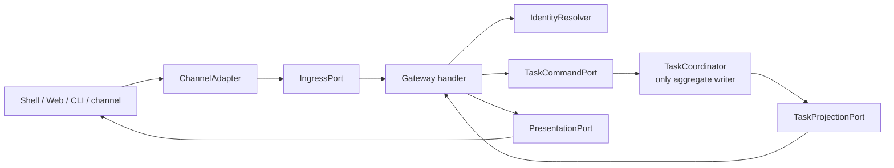

# Phase 1 Gateway API Design

[中文版](design_zh.md) | [Acceptance baseline](acceptance.md)

## Status and scope

This Phase 1 contract is paired with a local implementation based on upstream commit
`e90d9d9402c7fa1c8122267eb4e075c0adda51f5`. The Gateway API is the installation-scoped local
control-plane ingress. A handler receives an actor already resolved from Unix peer credentials,
checks admission, calls only `TaskCommandPort` or `TaskProjectionPort`, and returns a Task
projection. It never imports storage, a Runtime bridge, a scheduler, a process API, a PTY, or an
execution target.

Production `serve` admits only `core/gateway-brokered-v1`. It schedules durable
Runs and exposes a contained task-only inventory with `ask_user_question` as its
only production tool. No production `ExecutionTarget` or checkpoint/ws-ckpt
dependency is wired in this PR. The separate `doctor` and `run` commands retain
explicitly ungoverned ACP interoperability and are not production daemon
admission paths. Phase 1 has no remote listener or accepted real-provider/manual
Terminal evidence.

## Goals

- Define one versioned, transport-neutral ingress contract for every client surface.
- Preserve installation, actor, conversation, request, target, and trace identity across adapters.
- Make retries safe through durable idempotency and cursor-based event delivery.
- Keep request handlers stateless and keep `TaskCoordinator` as the only Task aggregate writer.
- Expose approval decisions without allowing a channel adapter to bypass policy.
- Support a Unix-domain transport first while leaving HTTP/WebSocket adapters possible later.

## Non-goals

- Public Internet exposure, DingTalk/Feishu implementation, or cross-device authentication.
- Agent protocol translation; that belongs to `CoshCoreBridge` in Phase 1 and `AcpClientBridge` in
  Phase 2.
- OS execution, policy evaluation, permit issuance, task scheduling, or event storage.
- Reusing a channel message ID as a Task, Run, Agent session, or Shell session ID.
- Claiming exactly-once delivery across a client and the daemon.

## Current-source evidence

| Evidence at `6c115aef` | Reusable fact | Gap owned by this module |
| --- | --- | --- |
| [`cosh-cli/main.rs`](../../../../../crates/cosh-cli/src/main.rs) | CLI commands use typed subcommands and a JSON `CoshResponse<T>` envelope. | There is no task-oriented daemon API or ingress identity. |
| [`cosh-types/output.rs`](../../../../../crates/cosh-types/src/output.rs) | Success and error responses are structurally separated and include metadata. | The envelope has no API version, request ID, Task ID, or event cursor. |
| [`cosh-core/protocol.rs`](../../../../../crates/cosh-core/src/protocol.rs) | The shell/core JSONL stream has correlated control requests. | It is an internal runtime protocol and must not become the Gateway API. |
| [`cosh-core/session_control.rs`](../../../../../crates/cosh-core/src/session_control.rs) | A bounded, provider-free one-request JSON management path exists. | It manages provider sessions only, not durable Tasks or approvals. |
| [`cosh-shell`](../../../../../crates/cosh-shell/src) | Shell owns rich interaction and approval rendering. | Shell is standalone and no reusable multi-channel ingress port exists. |

The upstream baseline contains no `GatewayApi`, `IngressPort`, channel adapter, Task endpoint, or
durable request-deduplication store. The candidate adds a narrow local daemon/client adapter; the
target ports and remote/channel surfaces below remain design contracts.

## Boundary and ownership



The planned `cosh-gateway` process owns the local Gateway API, identity resolution facade, and
transport adapters. `TaskCommandPort` and `TaskProjectionPort` are its only paths into Task state.
Handlers cannot hold a `TaskStore`, `ExecutionTargetPort`, `CapabilityBroker`, or process-spawn
handle. This is enforced by module visibility and constructor dependencies, not a convention.

Initial crate direction remains:

```text
cosh-gateway -> cosh-platform -> cosh-types
cosh-gateway -> cosh-gateway-contracts
cosh-core  -> cosh-platform -> cosh-types
cosh-cli   -> cosh-platform -> cosh-types
cosh-shell remains standalone
```

`cosh-gateway` delegates provider child ownership to `RuntimeSupervisor`; it must not add a Rust
dependency from `cosh-core` back to the daemon. Neutral IDs and wire DTOs belong in the planned
side-effect-free leaf `cosh-gateway-contracts`, subject to the Phase 0 G0 schema-first ADR and final
crate naming. They do not enter the existing `cosh-types` by default. Transport and orchestration
types remain in `cosh-gateway` unless another crate needs them.

## Ports

```rust
trait IngressPort {
    async fn submit(&self, envelope: IngressEnvelope) -> Result<ApiResponse, GatewayError>;
}

trait IdentityResolver {
    async fn resolve(&self, subject: ChannelSubject) -> Result<ActorContext, IdentityError>;
}

trait TaskCommandPort {
    fn submit(...);
    fn cancel(...);
    fn resolve_approval(...);
}

trait TaskProjectionPort {
    fn get(...);
    fn events(...);
}

trait PresentationPort {
    async fn publish(&self, delivery: Delivery) -> Result<(), DeliveryError>;
}
```

These are design signatures. Naming and async-trait mechanics are implementation decisions.

## Typed schema

Every request carries these independent values:

```text
ApiVersion         = "cosh.gateway.v1"
RequestId          = caller-generated idempotency key within ActorScope
ChannelMessageId   = provider delivery identity, optional
ConversationRef    = provider thread/chat identity, optional
ActorId            = authenticated COSH principal
InstallationId     = durable local installation namespace
TaskId             = durable user intent
RunId              = one execution attempt
TargetRef          = requested execution target, resolved later to TargetIdentity
TraceId            = observability correlation only
```

The normalized envelope is:

```json
{
  "api_version": "cosh.gateway.v1",
  "request_id": "req_...",
  "trace_id": "tr_...",
  "source": {
    "channel": "shell",
    "channel_message_id": "msg_...",
    "conversation_ref": "conv_..."
  },
  "actor": {"actor_id": "act_...", "assurance": "local_os"},
  "command": {
    "type": "task.create",
    "prompt": "inspect the failed service",
    "target_ref": "local"
  }
}
```

Gateway wire v1 carries no caller-supplied actor. The daemon derives an `ActorRef` from its durable
`InstallationId` and the authenticated local peer UID before calling the handler. This is a
single-installation, single-user authorization boundary, not a `TenantId` or cross-tenant claim.
Multi-tenant identity and remote channel resolution require a future Gateway API v2 decision.

### Command surface

| Command | Required fields | Semantics |
| --- | --- | --- |
| `task.create` | prompt, target reference | Creates a Task and its first queued Run. |
| `task.message.append` | Task ID, request ID, typed response | Resolves the exact pending input for the active Run once; stale, duplicate, wrong-Run, terminal, or conflicting requests fail closed. Raw response storage remains private. |
| `task.cancel` | Task ID, reason | Requests cancellation; does not kill a process in the handler. |
| `approval.resolve` | Task ID, approval ID, decision | Records an actor decision through `TaskCoordinator`. |
| `task.retry` | Task ID, failed or suspended Run ID | Requests a new fenced Run after the previous Run is quiescent; never reopens an old Run. |
| `task.get` | Task ID | Reads a projection only. |
| `task.events.read` | Task ID, cursor, limit | Reads a bounded, ordered event page. |

For a Unix-domain JSON transport, a command maps to one length-bounded request and response. A
future HTTP adapter may map create/append/cancel/approval to `POST`, reads to `GET`, and events to
SSE or WebSocket. The domain envelope and error codes do not depend on that mapping.

## Handler pipeline

1. Enforce byte, field-count, string, attachment-metadata, and deadline limits before parsing
   unbounded content. A serial local connection receives at most a 250 ms read/write admission
   quantum so an idle or partial-frame peer cannot starve scheduler ticks.
2. Validate `api_version` and reject unknown required fields for mutating commands.
3. Authenticate the channel transport and resolve immutable `ActorContext`.
4. Normalize channel-specific text, references, locale, and reply routing into the typed envelope.
5. Authorize the actor to address the tenant, Task, conversation binding, and target reference.
6. Dispatch one `TaskCommand` with `RequestId`, deadline, and expected Task version when supplied.
7. Return the durable command receipt and latest projection. Never wait for Agent or OS completion.
8. Publish asynchronous projections only through transactional outbox consumption.

## State, transaction, idempotency, lease, and outbox semantics

The Gateway owns no Task transaction. For mutating commands it supplies `RequestId` and waits for
the coordinator to atomically store the idempotency result with the Task event. A retry with the
same `(InstallationId, ActorId, IdempotencyKey)` and the same canonical command digest returns the original
receipt. A different digest returns `idempotency_conflict`.

Gateway handlers have no worker lease. A daemon shutdown may lose an in-flight socket response,
but the client can retry the same request. Task Run leases and fencing tokens are issued and
checked by the Task Execution Plane.

Outbound channel delivery reads outbox rows written in the same transaction as Task events. A
delivery worker may send more than once, so `DeliveryId` is stable and adapters deduplicate where
the channel supports it. An outbox row advances only after acknowledgment; exponential retry,
dead-letter status, and cursor replay never mutate the Task aggregate directly.

Event cursors are monotonic within an installation/actor-authorized Task stream. Clients must tolerate
replayed events and must resync the projection after `cursor_expired`.

## Security and approval rules

- The local Unix socket uses restrictive ownership and peer credentials; bearer tokens are not a
  substitute for filesystem permissions.
- Remote transports are disabled in Phase 1. Enabling one requires a separate threat model, TLS,
  credential rotation, replay protection, and rate limits.
- Actor identity, target selection, and conversation binding are authorized independently.
- `approval.resolve` accepts only a live approval addressed to the actor or delegated role. It
  cannot manufacture or widen a permit.
- Prompt and result text are untrusted content. They never select a module, executable, path, or
  policy rule by string interpolation.
- Secrets, raw provider credentials, command output, and approval payloads are redacted before
  logs or channel delivery.
- A Gateway handler never calls `cosh-platform`, `cosh-cli`, `Command::new`, a PTY, or an Agent
  bridge. A dependency/lint test should fail if those symbols enter the handler module.

## Error contract

```json
{
  "ok": false,
  "error": {
    "code": "task_version_conflict",
    "message": "task changed before this command was committed",
    "recoverable": true,
    "retry_after_ms": 50,
    "details": {"task_id": "tsk_..."}
  },
  "meta": {
    "api_version": "cosh.gateway.v1",
    "request_id": "req_...",
    "trace_id": "tr_..."
  }
}
```

Stable categories are `invalid_request`, `unsupported_version`, `unauthenticated`, `forbidden`,
`not_found`, `idempotency_conflict`, `task_version_conflict`, `rate_limited`, `deadline_exceeded`,
`store_unavailable`, and `internal`. Messages remain bounded and contain no secret detail.
Transport errors do not imply that a mutating command failed to commit.

## Migration and compatibility

1. Add pure Gateway IDs, envelopes, and stable errors under the schema-first contracts decision
   without changing `CoshResponse<T>`.
2. Add `cosh-gateway` with a local Unix socket and an in-process adapter for tests.
3. Let a development `cosh-cli task ...` adapter use the same `IngressPort`; existing pkg/svc/
   checkpoint/audit commands remain unchanged.
4. Keep Shell standalone throughout Phase 1. Shell attachment and child-owner migration are Phase
   2 work and must preserve the process/socket dependency boundary.
5. Add Web and enterprise channels in Phase 2 or later. Old clients negotiate an API version;
   no runtime JSONL message is silently treated as a Gateway request.

Rollback disables the daemon and adapters; existing `cosh-cli`, `cosh-core`, and `cosh-shell`
entry points keep their current behavior. Database migration rollback is defined by the Task
Execution Plane, not a Gateway handler.

## Implemented local control slice

The installed route is:

```text
cosh agent serve
cosh agent task submit|get|events|cancel|resolve-approval
```

`serve` generates and persists a durable installation ID on first start, or verifies an explicitly
provisioned ID, and requires private absolute socket/database paths. Client mutations require an
explicit caller-stable idempotency key; Task and Run IDs are parsed as their own strong types.
Event reads use an optional revision cursor and a 64-event hard page limit. The daemon accepts
only local Unix peers and rejects a peer UID that does not match the daemon owner; the client
independently verifies the server UID after connecting.

The implemented transport uses bounded JSON frames prefixed by a four-byte unsigned big-endian
length over a local Unix socket. A frozen Gateway wire v1 corpus covers all enabled commands. Its
wire must not be confused with ACP JSON-RPC or either private COSH JSONL version.

The daemon consumes the Outbox, persists Runtime binding before prompt dispatch, resolves durable
approvals, and converges restart/cancellation through the scheduler. Its production Runtime
selector is fixed to `core/gateway-brokered-v1`; the task-only inventory exposes `ask_user_question`
and no production `ExecutionTarget`. An explicit ACP selector may be constructed by a client but
daemon admission rejects it before socket or database mutation. No checkpoint/ws-ckpt dependency,
HTTP, WebSocket,
DingTalk, Feishu, bearer-token, cross-device, or cross-tenant listener is enabled.

## Dependencies

- [Task Execution Plane](../task-execution-plane/design.md): commands, projections, idempotency,
  event cursors, and outbox.
- [Capability Broker](../capability-broker/design.md): approval meaning and target authorization.
- [Cosh Core Bridge](../cosh-core-bridge/design.md): Agent runtime events, never called directly
  by a handler.
- Phase 0 identity, schema, threat-model, and ACP fixture decisions where applicable.

## Implementation work breakdown

1. Define ID newtypes, bounded DTOs, version negotiation, and stable error codes.
2. Define `IngressPort`, `IdentityResolver`, `TaskCommandPort`, `TaskProjectionPort`, and contract
   fakes.
3. Implement the Unix-domain adapter with peer-credential authentication and resource budgets.
4. Implement command normalization and authorization without OS/runtime dependencies.
5. Implement task query/event endpoints and opaque cursor validation.
6. Implement outbox presentation worker and adapter delivery deduplication.
7. Add compatibility adapters for a task CLI, then Shell; defer external channels.
8. Add dependency-boundary, fuzz, replay, and crash-recovery tests.

## Test strategy

- Schema golden tests for every command, response, unknown version, unknown field, and limit.
- Property tests proving independent IDs never deserialize into another ID type.
- Contract tests proving same request/same digest replays and same request/different digest fails.
- Authorization tests for foreign-installation Task IDs, target substitution, stale approvals,
  and forged actor bodies. Cross-tenant tests begin only with the future v2 identity model.
- Dependency-boundary test proving handlers cannot import execution or process APIs.
- Crash test between coordinator commit and socket response, followed by idempotent retry.
- Outbox tests for duplicate delivery, reordered acknowledgment, cursor replay, and dead-lettering.
- Fuzzing for JSON framing, cursor parsing, Unicode bounds, and oversized nested values.

No test may mutate the host. Any future pkg/svc fixture uses `--dry-run` or an isolated target.

## Open questions

| Question | Owner | Phase 1 default |
| --- | --- | --- |
| Which local transport framing is canonical? | Gateway owner | Bounded length-prefix over Unix socket; validate in spike. |
| Is the first persistence implementation single-user only? | Product/security | Yes for Phase 1: `InstallationId` plus local peer identity is authoritative; `TenantId` and multi-tenant semantics require v2. |
| Who is the source of channel-to-actor mappings? | Identity owner | Local config facade; external IdP deferred. |
| How long are event cursors retained? | Task storage owner | Policy-driven; return `cursor_expired` plus projection resync. |
| Are attachments accepted in Phase 1? | Gateway owner | Metadata references only; no arbitrary upload body. |
