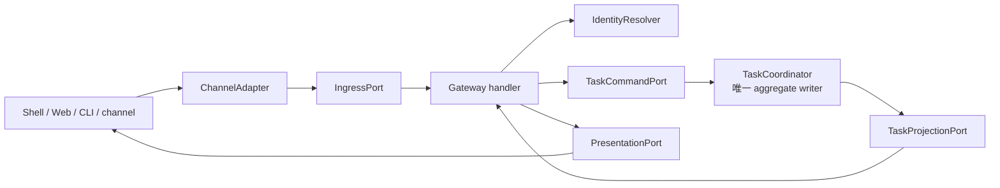

# Phase 1 Gateway API 设计

[English](design.md) | [验收基线](acceptance_zh.md)

## 状态与范围

本文的 Phase 1 契约已配套一份基于上游提交
`e90d9d9402c7fa1c8122267eb4e075c0adda51f5` 的本地实现。Gateway API 是 installation-scoped 本地控制面
入口。Handler 接收已从 Unix peer credential 解析的 actor，检查 admission，只调用
`TaskCommandPort` 或 `TaskProjectionPort`，然后返回 Task projection。它不 import storage、Runtime
bridge、scheduler、process API、PTY 或 execution target。

Production `serve` 只接收 `core/gateway-brokered-v1`，调度 durable Run，并且只开放受约束的
task-only inventory，production tool 只有 `ask_user_question`。本 PR 不接入 production
`ExecutionTarget`，也不依赖 checkpoint/ws-ckpt。独立的 `doctor` 与 `run` 保留明确不受治理的 ACP
interoperability，不属于 production daemon admission path。Phase 1 不开放 remote listener，也没有
已验收的 real-provider 或人工 Terminal evidence。

## 目标

- 为所有客户端入口定义一个带版本、与传输无关的 ingress 契约。
- 跨 adapter 保留 installation、actor、conversation、request、target 和 trace 身份。
- 通过持久幂等和基于 cursor 的事件投递，使重试安全。
- 保持 handler 无状态，并使 `TaskCoordinator` 成为 Task aggregate 的唯一 writer。
- 暴露审批决定入口，同时禁止渠道 adapter 绕过 policy。
- 首先支持 Unix domain transport，并保留未来 HTTP/WebSocket adapter 的可能性。

## 非目标

- 公网暴露、钉钉/飞书实现或跨设备认证。
- Agent 协议转换；Phase 1 由 `CoshCoreBridge` 负责，Phase 2 由 `AcpClientBridge` 负责。
- OS 执行、policy 评估、permit 签发、Task 调度或事件存储。
- 将 channel message ID 当作 Task、Run、Agent session 或 Shell session ID。
- 声称客户端和 daemon 之间存在 exactly-once delivery。

## 当前源码证据

| `6c115aef` 的证据 | 可复用事实 | 本模块负责的缺口 |
| --- | --- | --- |
| [`cosh-cli/main.rs`](../../../../../crates/cosh-cli/src/main.rs) | CLI 使用 typed subcommand 和 JSON `CoshResponse<T>` envelope。 | 没有面向 Task 的 daemon API 或 ingress identity。 |
| [`cosh-types/output.rs`](../../../../../crates/cosh-types/src/output.rs) | 成功和失败响应结构分离，并带 metadata。 | Envelope 没有 API version、request ID、Task ID 或 event cursor。 |
| [`cosh-core/protocol.rs`](../../../../../crates/cosh-core/src/protocol.rs) | Shell/Core JSONL stream 支持相关联的 control request。 | 它是内部 runtime protocol，不能成为 Gateway API。 |
| [`cosh-core/session_control.rs`](../../../../../crates/cosh-core/src/session_control.rs) | 已有带边界、无 provider 的单请求 JSON 管理路径。 | 只管理 provider session，不管理持久 Task 或审批。 |
| [`cosh-shell`](../../../../../crates/cosh-shell/src) | Shell 已拥有富交互和审批渲染。 | Shell 仍是 standalone，没有多渠道共享的 ingress port。 |

上游基线不存在 `GatewayApi`、`IngressPort`、channel adapter、Task endpoint 或持久请求去重存储。
候选实现增加 narrow local daemon/client adapter；下述 target port 与 remote/channel surface 仍是设计契约。

## 边界与 ownership



规划中的 `cosh-gateway` 进程拥有本地 Gateway API、identity resolution facade 和 transport
adapter。`TaskCommandPort` 与 `TaskProjectionPort` 是访问 Task state 的唯一通道。Handler
不能持有 `TaskStore`、`ExecutionTargetPort`、`CapabilityBroker` 或进程 spawn handle。该约束通过
module visibility 和 constructor dependency 强制执行，而不是依赖约定。

初始 crate 依赖方向保持如下：

```text
cosh-gateway -> cosh-platform -> cosh-types
cosh-gateway -> cosh-gateway-contracts
cosh-core  -> cosh-platform -> cosh-types
cosh-cli   -> cosh-platform -> cosh-types
cosh-shell remains standalone
```

`cosh-gateway` 将 provider child ownership 交给 `RuntimeSupervisor`，但不能增加 `cosh-core` 反向依赖
daemon 的 Rust dependency。中立 ID 与 wire DTO 归计划中的 side-effect-free leaf
`cosh-gateway-contracts` 所有，最终 crate 名称和 schema-first 落地受 Phase 0 G0 ADR 约束，默认不能
直接并入现有 `cosh-types`。Transport 和 orchestration type 默认留在 `cosh-gateway`，除非另一个 crate
确实需要共享。

## Ports

```rust
trait IngressPort {
    async fn submit(&self, envelope: IngressEnvelope) -> Result<ApiResponse, GatewayError>;
}

trait IdentityResolver {
    async fn resolve(&self, subject: ChannelSubject) -> Result<ActorContext, IdentityError>;
}

trait TaskCommandPort {
    fn submit(...);
    fn cancel(...);
    fn resolve_approval(...);
}

trait TaskProjectionPort {
    fn get(...);
    fn events(...);
}

trait PresentationPort {
    async fn publish(&self, delivery: Delivery) -> Result<(), DeliveryError>;
}
```

以上仅为设计签名，命名和 async-trait 机制由实现阶段决定。

## Typed schema

每个请求携带以下相互独立的值：

```text
ApiVersion         = "cosh.gateway.v1"
RequestId          = caller 在 ActorScope 内生成的幂等键
ChannelMessageId   = provider delivery identity，可选
ConversationRef    = provider thread/chat identity，可选
ActorId            = 已认证的 COSH principal
InstallationId     = durable local installation namespace
TaskId             = 持久用户意图
RunId              = 一次执行尝试
TargetRef          = 请求的执行目标，稍后解析为 TargetIdentity
TraceId            = 只用于 observability correlation
```

规范化 envelope 如下：

```json
{
  "api_version": "cosh.gateway.v1",
  "request_id": "req_...",
  "trace_id": "tr_...",
  "source": {
    "channel": "shell",
    "channel_message_id": "msg_...",
    "conversation_ref": "conv_..."
  },
  "actor": {"actor_id": "act_...", "assurance": "local_os"},
  "command": {
    "type": "task.create",
    "prompt": "inspect the failed service",
    "target_ref": "local"
  }
}
```

Gateway wire v1 不携带 caller 提供的 actor。Daemon 在调用 handler 前，根据 durable
`InstallationId` 与经过认证的 local peer UID 派生 `ActorRef`。这是单 installation、单用户授权边界，
不构成 `TenantId` 或 cross-tenant 声明。Multi-tenant identity 与 remote channel resolution 需要未来
Gateway API v2 决策。

### 命令面

| 命令 | 必需字段 | 语义 |
| --- | --- | --- |
| `task.create` | prompt、target reference | 创建 Task 及其第一个 queued Run。 |
| `task.message.append` | Task ID、request ID、typed response | 单次 resolve active Run 的准确 pending input；stale、duplicate、wrong-Run、terminal 或 conflict request 均 fail closed。Raw response storage 保持 private。 |
| `task.cancel` | Task ID、reason | 请求取消；handler 不直接 kill process。 |
| `approval.resolve` | Task ID、approval ID、decision | 通过 `TaskCoordinator` 记录 actor 决定。 |
| `task.retry` | Task ID、失败或 suspended Run ID | 旧 Run 已静止后请求新的 fenced Run，不重新打开旧 Run。 |
| `task.get` | Task ID | 只读取 projection。 |
| `task.events.read` | Task ID、cursor、limit | 读取有界、有序事件页。 |

Unix-domain JSON transport 中，一个命令映射为一个有长度上限的请求和响应。未来 HTTP adapter
可以把 create/append/cancel/approval 映射为 `POST`，read 映射为 `GET`，event 映射为 SSE 或
WebSocket。Domain envelope 和错误码不依赖该映射。

## Handler pipeline

1. 在解析无界内容前强制 byte、field count、string、attachment metadata 和 deadline 上限。串行本地
   连接最多占用 250 ms read/write admission quantum，idle 或 partial-frame peer 不能阻塞 scheduler tick。
2. 校验 `api_version`，mutating command 遇到未知 required field 时拒绝。
3. 认证 channel transport 并解析不可变 `ActorContext`。
4. 将渠道专属 text、reference、locale 和 reply routing 规范化成 typed envelope。
5. 分别授权 actor 访问 tenant、Task、conversation binding 和 target reference。
6. Dispatch 一个携带 `RequestId`、deadline 和可选 expected Task version 的 `TaskCommand`。
7. 返回持久 command receipt 与最新 projection，不等待 Agent 或 OS 执行完成。
8. 只通过 transactional outbox consumer 发布异步 projection。

## State、transaction、idempotency、lease 与 outbox 语义

Gateway 不拥有 Task transaction。Mutating command 携带 `RequestId`，由 coordinator 将幂等结果
与 Task event 原子存储。同一个 `(InstallationId, ActorId, IdempotencyKey)` 携带相同 canonical command
digest 重试时返回原 receipt；digest 不同则返回 `idempotency_conflict`。

Gateway handler 不持有 worker lease。Daemon shutdown 可能丢失正在返回的 socket response，但
client 可以用相同 request 重试。Task Run lease 和 fencing token 由 Task Execution Plane 签发和校验。

Outbound channel delivery 读取与 Task event 在同一个 transaction 写入的 outbox row。Delivery worker
可能重复发送，因此 `DeliveryId` 保持稳定；channel 支持时由 adapter 去重。只有收到确认后才推进
outbox row；指数退避、dead-letter 状态和 cursor replay 都不能直接修改 Task aggregate。

Event cursor 在经过 installation/actor authorization 的单个 Task stream 内单调。Client 必须容忍 event replay，并在
`cursor_expired` 后重新同步 projection。

## 安全与审批规则

- 本地 Unix socket 使用严格 owner 权限和 peer credential；bearer token 不能代替文件系统权限。
- Phase 1 禁用 remote transport。启用前必须单独完成 threat model、TLS、凭据轮转、防 replay 与
  rate limit。
- Actor identity、target selection 和 conversation binding 分别授权。
- `approval.resolve` 只接受仍有效且分配给该 actor 或 delegated role 的审批，不能制造或扩大 permit。
- Prompt 和 result text 均为不可信内容，不能通过字符串插值选择 module、executable、path 或 policy rule。
- Secret、原始 provider credential、command output 与审批 payload 在日志和渠道投递前完成脱敏。
- Gateway handler 不调用 `cosh-platform`、`cosh-cli`、`Command::new`、PTY 或 Agent bridge。应通过
  dependency/lint test 阻止这些 symbol 进入 handler module。

## 错误契约

```json
{
  "ok": false,
  "error": {
    "code": "task_version_conflict",
    "message": "task changed before this command was committed",
    "recoverable": true,
    "retry_after_ms": 50,
    "details": {"task_id": "tsk_..."}
  },
  "meta": {
    "api_version": "cosh.gateway.v1",
    "request_id": "req_...",
    "trace_id": "tr_..."
  }
}
```

稳定分类为 `invalid_request`、`unsupported_version`、`unauthenticated`、`forbidden`、
`not_found`、`idempotency_conflict`、`task_version_conflict`、`rate_limited`、
`deadline_exceeded`、`store_unavailable` 和 `internal`。Message 有长度上限且不包含 secret 细节。
Transport error 不代表 mutating command 一定未提交。

## 迁移与兼容

1. 按 schema-first contracts 决策增加纯 Gateway ID、envelope 与稳定 error，不改变
   `CoshResponse<T>`。
2. 增加带本地 Unix socket 和测试用 in-process adapter 的 `cosh-gateway`。
3. 让开发期 `cosh-cli task ...` adapter 使用同一个 `IngressPort`；现有 pkg/svc/checkpoint/audit
   命令保持不变。
4. Phase 1 全程保持 Shell standalone。Shell attachment 与 child-owner migration 属于 Phase 2，且必须
   保持 process/socket dependency boundary。
5. Phase 2 或以后增加 Web 与企业渠道。旧 client 协商 API version；不能把 runtime JSONL message
   静默当作 Gateway request。

Rollback 时禁用 daemon 和 adapter；现有 `cosh-cli`、`cosh-core` 与 `cosh-shell` 入口保持当前行为。
Database migration rollback 由 Task Execution Plane 定义，不由 Gateway handler 定义。

## 已实现的本地控制切片

安装后的命令入口为：

```text
cosh agent serve
cosh agent task submit|get|events|cancel|resolve-approval
```

`serve` 首次启动时生成并持久化 durable installation ID，或者验证显式预置的 ID，同时要求 private
absolute socket/database path。Client mutation 要求显式传入 caller-stable idempotency key；Task
与 Run ID 按各自 strong type 解析。Event read 使用 optional revision cursor 与 64-event hard page
limit。Daemon 只接受 local Unix peer，并拒绝 UID 与 daemon owner 不一致的 peer；client 连接后也会
独立校验 server UID。

当前 transport 使用 local Unix socket 上带四字节无符号大端长度前缀的 bounded JSON frame。Frozen
Gateway wire v1 corpus 覆盖全部 enabled command。该 wire 不能与 ACP JSON-RPC 或任一 private COSH
JSONL version 混淆。

Daemon 会消费 Outbox，在 prompt dispatch 前持久化 Runtime binding，通过 scheduler 解析 durable
approval，并完成 restart/cancellation convergence。Production Runtime selector 固定为
`core/gateway-brokered-v1`；client 可以构造显式 ACP selector，但 daemon admission 会在 socket 或
database mutation 前拒绝。当前没有启用 HTTP、WebSocket、钉钉、飞书、bearer token、cross-device 或
cross-tenant listener。

## 依赖

- [Task Execution Plane](../task-execution-plane/design_zh.md)：命令、projection、幂等、event cursor
  与 outbox。
- [Capability Broker](../capability-broker/design_zh.md)：审批含义与 target authorization。
- [Cosh Core Bridge](../cosh-core-bridge/design_zh.md)：Agent runtime event，handler 不直接调用。
- Phase 0 的 identity、schema、threat-model 和适用的 ACP fixture 决策。

## 实现任务分解

1. 定义 ID newtype、有界 DTO、version negotiation 和稳定 error code。
2. 定义 `IngressPort`、`IdentityResolver`、`TaskCommandPort`、`TaskProjectionPort` 和 contract fake。
3. 实现带 peer-credential authentication 和 resource budget 的 Unix-domain adapter。
4. 实现不依赖 OS/runtime 的 command normalization 与 authorization。
5. 实现 Task query/event endpoint 和 opaque cursor 校验。
6. 实现 outbox presentation worker 与 adapter delivery 去重。
7. 先增加 task CLI compatibility adapter，再增加 Shell；external channel 延后。
8. 增加 dependency-boundary、fuzz、replay 和 crash-recovery 测试。

## 测试策略

- 为每个命令、响应、未知版本、未知字段和上限建立 schema golden test。
- Property test 证明相互独立的 ID 不能反序列化为另一种 ID type。
- Contract test 证明同 request/同 digest 重放成功，同 request/不同 digest 失败。
- 覆盖 foreign-installation Task ID、target substitution、stale approval 和 forged actor body 的授权测试。
  Cross-tenant test 只随未来 v2 identity model 引入。
- Dependency-boundary test 证明 handler 不能 import execution 或 process API。
- 在 coordinator commit 与 socket response 之间 crash，随后执行幂等 retry。
- 覆盖 duplicate delivery、ack 乱序、cursor replay 和 dead-letter 的 outbox test。
- 对 JSON framing、cursor parsing、Unicode bound 和超大嵌套 value 进行 fuzz。

测试不能修改 host。未来 pkg/svc fixture 必须使用 `--dry-run` 或 isolated target。

## 开放问题

| 问题 | Owner | Phase 1 默认值 |
| --- | --- | --- |
| 哪种 local transport framing 为 canonical？ | Gateway owner | Unix socket 上的有界 length-prefix；由 spike 验证。 |
| 首个 persistence implementation 是否只支持单用户？ | Product/security | 是。Phase 1 以 `InstallationId` 和 local peer identity 为 authority；`TenantId` 与 multi-tenant semantic 留给 v2。 |
| 谁提供 channel-to-actor mapping？ | Identity owner | Local config facade；external IdP 延后。 |
| Event cursor 保留多久？ | Task storage owner | 由 policy 决定；过期返回 `cursor_expired` 并重同步 projection。 |
| Phase 1 是否接收 attachment？ | Gateway owner | 只接 metadata reference，不接任意 upload body。 |
