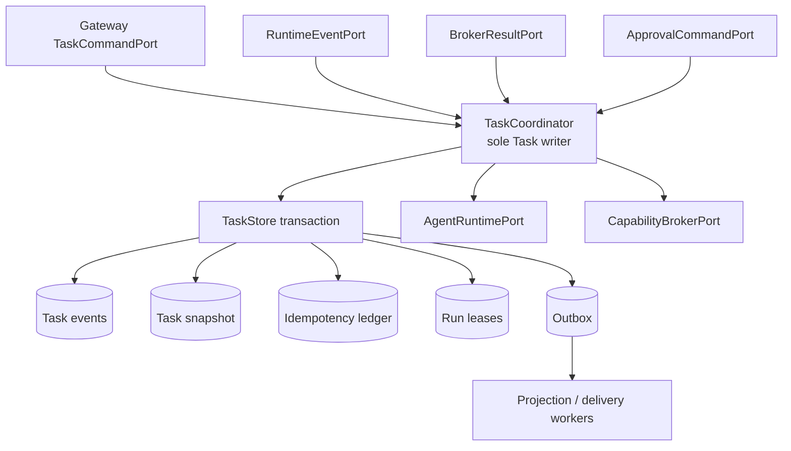
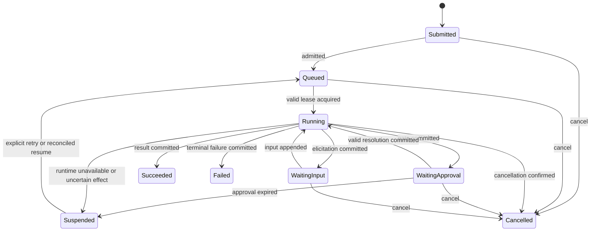

# Phase 1 Task Execution Plane Design

[中文版](design_zh.md) | [Acceptance baseline](acceptance.md)

## Status and decision

This document plans Phase 1 against upstream commit
`6c115aefe04ace0d169a24fa7cd55ad7c1befa52`. The current working-tree candidate now contains the
durable Task reducer and storage schema v9 slice; it is not the complete Phase 1 service. The Task
Execution Plane makes user intent durable independently of a channel connection, Agent process,
provider session, PTY, or OS execution attempt. The planned `TaskCoordinator` remains the sole
writer of the Task aggregate. The raw store writer is crate-private in release builds. Every other
module submits a typed command and observes committed
events or projections.

The first deployment may host the coordinator, runner, projection worker, and stores in the
`cosh-gateway` process. Their ownership and port boundaries remain separate.

### Implemented first slice

- `task/aggregate.rs` is a deterministic, non-mutating-on-error reducer over the shared
  `TaskEventEnvelope` contract. Its exhaustive 21-event by 9-state matrix enforces consecutive
  revisions, exact pending input, fenced retry, Task/correlation identity, explicit
  `WaitingApproval`, terminal Task closure, and a terminal Run fact before Task closure.
- `storage/task_store.rs` owns the only exposed mutable SQLite connection through
  `&mut SqliteTaskStore`. `BEGIN IMMEDIATE` atomically appends events, updates the snapshot,
  records the actor-scoped idempotency receipt, and inserts stable Outbox rows. Every Task or
  Outbox payload is limited to 256 KiB and a whole commit to 1 MiB before the transaction starts.
- Exact replay returns the stored receipt before evaluating a now-stale revision. Reusing the
  same actor/key with another digest fails, as does an optimistic-revision mismatch.
- Recovery decodes all versioned events, reruns the reducer, and fails closed when the rebuilt
  projection differs from the stored snapshot.
- Run leases, `TaskCoordinator`, Outbox workers, approval authorization, execution reconciliation,
  retry, and exact pending-input dispatch are implemented. Universal Broker and remote/Shell
  Phase 2 integration remain later slices.

## Goals

- Persist Tasks, Runs, inputs, approvals, runtime bindings, execution references, and terminal
  outcomes with explicit versions.
- Resume safely after daemon, Agent, presentation, or weak-network interruption.
- Serialize every Task transition through one writer and reject stale commands.
- Atomically append Task events, update snapshots, store idempotency results, and enqueue outbox
  delivery.
- Use renewable Run leases and fencing tokens without treating lease expiry as proof that an OS
  side effect is safe to repeat.
- Keep Task events bounded and separate from security audit records and raw stream storage.

## Non-goals

- Replacing provider conversation persistence in `SessionStore`.
- Authorizing OS operations or issuing permits; those belong to `CapabilityBroker`.
- Owning a child process or translating cosh-core/ACP messages; runtime bridges do that.
- Storing raw model streams, terminal output, credentials, environment snapshots, or file bodies.
- Providing exactly-once OS side effects. Uncertain effects require reconciliation.
- Selecting the final embedded database before the Phase 0 storage ADR is accepted.

## Current-source evidence

| Evidence at `6c115aef` | Reusable behavior | Task-plane gap |
| --- | --- | --- |
| [`cosh-core/session.rs`](../../../../../crates/cosh-core/src/session.rs) | Workspace-scoped `ProviderSessionId`, schema version, generation, and typed health/errors. | A provider transcript is not a Task or Run. |
| [`cosh-core/session/store.rs`](../../../../../crates/cosh-core/src/session/store.rs) | Locking, optimistic generation, bounded files, atomic replacement, and scope validation. | File envelopes cannot atomically own Task event, idempotency, lease, and outbox rows. |
| [`cosh-core/session_control.rs`](../../../../../crates/cosh-core/src/session_control.rs) | Bounded list/inspect/validate/clear management protocol. | No Task command or durable execution lifecycle. |
| [`cosh-shell/runtime/state.rs`](../../../../../crates/cosh-shell/src/runtime/state.rs) | In-memory inline runtime state for one interactive Shell. | State is process-local and presentation-owned. |
| [`cosh-shell/adapter/mod.rs`](../../../../../crates/cosh-shell/src/adapter/mod.rs) | Agent run handle and event callback pattern. | Lifecycle is Shell-owned and not durable. |
| [`cosh-types/audit/event.rs`](../../../../../crates/cosh-types/src/audit/event.rs) | Audit identity already has bounded correlation fields such as run/request/tool use. | Audit events are evidence, not aggregate state or delivery queues. |

No `Task`, `TaskId`, durable `RunId`, `TaskCoordinator`, `TaskEventStore`, lease table,
idempotency ledger, Task projection, or outbox exists at the baseline.

## Aggregate ownership and ports



`TaskCoordinator` owns aggregate validation and event decisions. It does not own channel
transport, Agent wire parsing, policy evaluation, OS execution, or UI rendering. A per-Task actor
mailbox serializes commands within one process. The store also enforces `expected_revision` so a
second process or stale lease cannot bypass the invariant.

Conceptual ports are:

```rust
trait TaskCommandPort {
    async fn execute(&self, command: TaskCommand) -> Result<CommandReceipt, TaskError>;
}

trait TaskEventStore {
    async fn load(&self, task_id: TaskId) -> Result<TaskHistory, StoreError>;
    async fn commit(&self, batch: TaskCommit) -> Result<CommittedBatch, StoreError>;
}

trait TaskLeasePort {
    async fn acquire(&self, run_id: RunId, owner: WorkerId) -> Result<RunLease, LeaseError>;
    async fn renew(&self, lease: RunLease) -> Result<RunLease, LeaseError>;
}

trait TaskProjectionPort {
    async fn get(&self, task_id: TaskId) -> Result<TaskProjection, ProjectionError>;
    async fn events(&self, query: EventQuery) -> Result<EventPage, ProjectionError>;
}
```

These signatures define responsibilities, not final Rust syntax.

Neutral Task/Run IDs and cross-process command/event DTOs follow the Phase 0 G0 schema-first
decision and belong in the planned side-effect-free `cosh-gateway-contracts` leaf once its name and
crate boundary are accepted. Aggregate reducer, storage records, leases, and coordinator internals
remain private to `cosh-gateway`; they are not wire contracts and do not enter existing
`cosh-types`.

## Identity and aggregate schema

IDs are typed newtypes with canonical textual encodings. They cannot be assigned across types.

| ID | Authority | Lifetime |
| --- | --- | --- |
| `TaskId` | Task Coordinator | Durable user intent. |
| `RunId` | Task Coordinator | One attempt under a Task. |
| Task event `MessageId` | Contract producer | One immutable aggregate event. |
| `AgentSessionId` | Runtime bridge | Runtime conversation binding, never Task identity. |
| `ApprovalId` | Task Coordinator | One durable gate. |
| `ExecutionId` | Capability Broker | One side-effect attempt. |
| `IdempotencyKey` | Command initiator | Command replay namespace in actor scope. |
| `DeliveryId` | Task transaction | One outbox intent. |

The aggregate snapshot contains bounded control data:

```text
Task {
  task_id, tenant_id, actor_id, target_ref,
  state, revision, created_at, updated_at,
  active_run_id?, latest_input_ref?, pending_input?,
  pending_approval_ids[], runtime_binding_ref?,
  result_summary?, failure?
}

Run {
  run_id, attempt, state, runtime_profile,
  started_at?, finished_at?, lease_fence,
  agent_session_id?, last_runtime_cursor?,
  execution_ids[], terminal_reason?
}
```

`latest_input_ref` references bounded/redacted content storage. `pending_input` retains only the
bounded request identity and presentation metadata needed for an exact match. Raw responses exist
only in a private typed dispatch row; Task events and receipts retain their digest. Events contain
hashes, sizes, and opaque evidence references, not raw prompt, model thought, terminal buffer, or
credentials.

## State machine



Terminal states are `Succeeded`, `Failed`, and `Cancelled`. They never reopen. `retry` creates a
new `RunId` while preserving `TaskId`. `Suspended` records a recoverable stop and the required
operator or policy action. A cancellation request while a runtime or execution is active records
`CancellationRequested`; `Cancelled` is committed only after the owning bridge/target confirms
settlement or a reviewed reconciliation policy declares it terminal.

## Command and event schema

Every command includes `tenant_id`, `actor_context`, `request_id`, `expected_revision` when known,
`issued_at`, and `deadline`. Core commands include:

```text
CreateTask, AdmitTask, AcquireRun, RenewRunLease,
AppendInput, RequestApproval, ResolveApproval,
RecordRuntimeBinding, RecordRuntimeEvent,
RecordExecutionPlanned, RecordExecutionResult,
RequestCancellation, ConfirmCancellation,
SuspendRun, RetryRun, CompleteRun, FailRun
```

Only coordinator-internal principals may issue lease/runtime/execution commands. Gateway actors
may create, append, cancel, retry, and resolve an assigned approval.

Representative immutable events are:

```text
TaskSubmitted, TaskQueued, RunStarted, RunLeaseRenewed,
RuntimeBound, RuntimeEventRecorded, InputRequested, InputSubmitted,
ApprovalRequested, ApprovalResolved, ApprovalExpired,
ExecutionPlanned, ExecutionResultRecorded, ExecutionUncertain,
CancellationRequested, RunCancelled, RunSuspended,
RunSucceeded, RunFailed, RunRetryQueued, TaskSucceeded, TaskFailed, TaskCancelled
```

Each event has `schema`, `schema_version`, `task_id`, `event_id`, `sequence`, `task_revision`,
`occurred_at`, `causation_id`, `correlation_id`, actor/runtime principal, and a bounded typed
payload. Unknown optional fields are ignored within a schema generation; unknown required event
types stop replay and mark the Task incompatible.

## Transaction and optimistic concurrency

One accepted mutation performs this transaction:

1. Read the Task row and latest revision under the store's write serialization.
2. Resolve `(tenant, principal, request_id)` from the idempotency ledger.
3. Reject a reused request with a different canonical command digest.
4. Validate `expected_revision`, state transition, lease fence, approval state, and referenced IDs.
5. Append one or more immutable events with consecutive sequence numbers.
6. Replace the projection/snapshot with `revision + 1` or the event batch's final revision.
7. Insert the command receipt in the idempotency ledger.
8. Insert all projection/delivery intents into the outbox.
9. Commit atomically, then publish in-memory notifications.

If the transaction outcome is unknown to the caller, retrying the same `IdempotencyKey` returns the
stored receipt. A store conflict triggers reload and command re-evaluation; it never performs a
blind event append.

The storage slice provides atomic uniqueness and transactions with SQLite WAL,
`synchronous=FULL`, foreign keys, strict tables, one owned write connection, no-clobber online
backup/restore, and read-only redacted inspection. The Phase 0 ADR still requires checkpoint/disk
health, corruption quarantine, operational runbooks, and a full kill/power-loss matrix before
final exit. Public contracts do not expose SQLite types.

## Idempotency semantics

- Scope is `(ActorId, IdempotencyKey)`; tenant/workspace authorization stays at ingress.
- The canonical digest includes command type, Task/Run references, normalized payload, and target
  reference; it excludes trace IDs and deadlines.
- Successful and domain-error receipts are retained long enough to cover channel retry policy.
- An in-progress ledger row cannot be left without a transaction owner; no two-phase placeholder
  exists outside the commit.
- Runtime events deduplicate by `(RuntimeInstanceId, source_sequence)` or a bridge-issued stable
  event identity.
- Approval resolution is first-valid-terminal-wins. Later duplicates return the stored decision;
  conflicting decisions return `approval_already_resolved`.
- Execution results deduplicate by `ExecutionId` and result revision.

## Run lease and fencing semantics

A `RunLease` contains `run_id`, `owner_id`, `fence`, `acquired_at`, `expires_at`, and renewal
deadline. `fence` increases on every acquisition. Every runtime command and coordinator callback
includes the fence; stale owners are rejected even if their process is still alive.

Lease expiry allows another worker to reconcile and acquire orchestration ownership. It does not
authorize replay of an `ExecutionId`, resend of a prompt, or reuse of a permit. Before retry, the
new worker asks the runtime bridge and Broker for their durable/observable status. Unknown side
effects produce `ExecutionUncertain` and `Suspended`, not automatic retry.

Renewal uses bounded jitter and stops before expiry. A worker that cannot renew stops admitting
new work and requests cancellation of owned runtime operations; it cannot write after its fence
is stale.

## Outbox and projection semantics

The Task transaction writes `DeliveryIntent` rows containing `delivery_id`, `task_id`, event range,
presentation kind, destination binding reference, redaction profile, attempt count, and next
attempt time. It never stores a channel credential or unbounded rendered body.

Projection workers build channel-neutral views from events and bounded evidence. Delivery is
at-least-once. A stable `DeliveryId` and destination idempotency token suppress duplicates where
supported. A failed or dead-lettered delivery changes delivery projection only; it cannot fail or
rewind the Task. Event consumers store `(consumer_id, task_id, sequence)` checkpoints and tolerate
replay.

## Approval, security, and audit

- `ApprovalRequest` and its resolution are Task state; a card or callback is only presentation.
- Only the coordinator can commit an approval resolution. It validates actor/delegation, Task and
  Run state, expiry, operation digest, target binding, and current policy revision.
- A committed approval is an input to the Broker. It is not itself an executable permit.
- Every side-effect event references `ExecutionId`; the corresponding security audit event carries
  Task/Run/Execution correlation without becoming the Task source of truth.
- Task storage permissions are private to the daemon account. Tenant and workspace scope are
  checked before opening or querying records.
- Stored text and failure details are bounded and redacted. Secret-bearing data uses an external
  secret reference and never enters events or outbox.
- Corrupt, unsupported, or scope-mismatched histories fail closed and remain inspectable.

## Error model

Stable categories include `invalid_command`, `not_found`, `forbidden`, `version_conflict`,
`idempotency_conflict`, `invalid_transition`, `stale_lease`, `approval_expired`,
`approval_already_resolved`, `runtime_unavailable`, `execution_uncertain`, `store_busy`,
`store_corrupt`, `incompatible_schema`, and `internal`.

Errors state whether the client may retry the same request, retry with a refreshed revision,
request reconciliation, or must stop. A timeout never reports that a command did not commit.
Store and serialization errors include bounded developer context but no prompt, terminal output,
credentials, or filesystem contents.

## Migration and recovery

1. Freeze Phase 0 ID/event/storage ADRs and add pure schema types.
2. Create an empty versioned Task store without importing provider `SessionStore` records.
3. Add coordinator replay, snapshots, command ledger, leases, and outbox behind in-memory fakes.
4. Add local persistent adapter and crash fixtures.
5. Connect Gateway commands, then `CoshCoreBridge`, then Broker callbacks.
6. Keep direct `cosh-shell` and existing CLI flows during opt-in migration.

Provider sessions may be linked by `AgentSessionId` and opaque binding metadata; they are never
converted into Tasks automatically. Rollback disables Task ingress and preserves existing
provider session files. Store schema migration must use forward backups and an offline validator;
never silently downgrade a newer event generation.

On startup the daemon validates schema and store integrity, replays events after the last valid
snapshot, republishes pending outbox rows, and reclaims only expired leases. Tasks with corrupt
history are quarantined read-only and surfaced as `store_corrupt`.

## Dependencies

- Phase 0 contracts: ID encodings, event compatibility, storage/supervision ADR, retention, and
  threat model.
- [Gateway API](../gateway-api/design.md): actor commands and projections.
- [Capability Broker](../capability-broker/design.md): Execution IDs, permits, approvals, and
  reconciliation.
- [Cosh Core Bridge](../cosh-core-bridge/design.md): runtime binding and normalized events.
- Phase 2 ACP bridge and presentation modules consume the same ports without becoming writers.

## Implementation work breakdown

1. Define Task/Run/approval/event/projection newtypes and bounded codecs under the G0
   schema-first contracts decision.
2. Implement aggregate transition reducer and exhaustive transition tests.
3. Implement coordinator command serialization and optimistic revision checks.
4. Implement transactional event/snapshot/idempotency/outbox storage adapter.
5. Implement Run lease acquire/renew/reclaim and fencing checks.
6. Implement replay, snapshot validation, corruption quarantine, and migration tooling.
7. Implement projection/event cursor and outbox worker.
8. Connect Gateway, bridge, and Broker ports with deterministic fakes first.
9. Add kill-point crash matrix and uncertain-side-effect reconciliation fixtures.

## Test strategy

- Table-driven tests for every legal and illegal state transition.
- Model/property tests comparing command replay with event reduction.
- Concurrent writer tests proving only one expected revision and one lease fence wins.
- Idempotency tests for same/different digest and post-commit response loss.
- Kill-point tests before event append, between event/snapshot/outbox writes, after commit, during
  lease renewal, and before delivery acknowledgment.
- Corruption tests for truncated events, bad checksums, unknown required schema, and scope mismatch.
- Reconciliation tests proving expired lease never automatically repeats an unknown execution.
- Projection tests for replay, cursor expiry, duplicate delivery, and redaction.
- Migration fixtures for every committed store schema generation.

## Open questions

| Question | Owner | Default pending decision |
| --- | --- | --- |
| Which embedded store is accepted? | Phase 0 storage ADR owner | SQLite WAL candidate; port-first design. |
| What is the event/snapshot compaction threshold? | Task storage owner | Retain immutable security-relevant control events; benchmark snapshots. |
| How long are idempotency receipts retained? | Gateway/task owners | Longer than maximum channel retry and offline window. |
| Can a Task have concurrent Runs? | Runtime/product owners | No in Phase 1; one active Run per Task. |
| When may uncertain execution be retried? | Broker/security owner | Only after typed reconciliation or explicit operator decision. |
| Which approval roles may act across channels? | Identity/security owner | Exact actor only until delegation is specified. |
