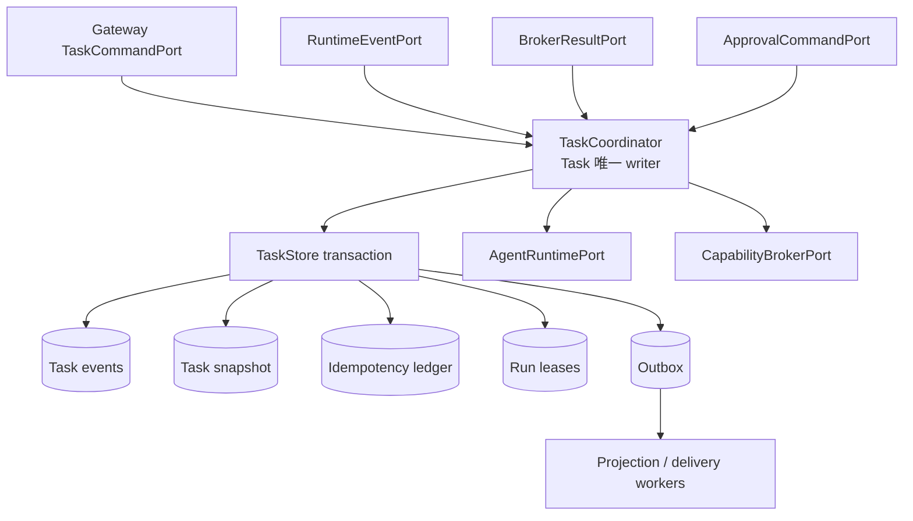
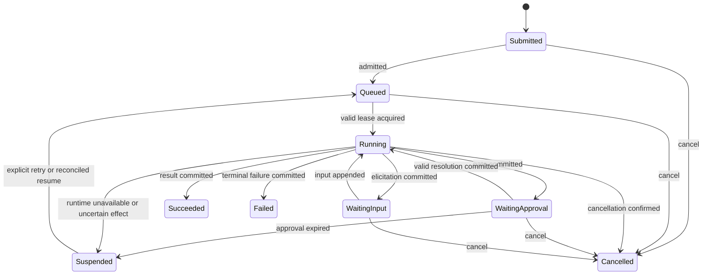

# Phase 1 Task Execution Plane 设计

[English](design.md) | [验收基线](acceptance_zh.md)

## 状态与决策

本文基于上游提交 `6c115aefe04ace0d169a24fa7cd55ad7c1befa52` 规划 Phase 1。当前工作树候选已包含
durable Task reducer 与 storage schema v9 切片，但还不是完整 Phase 1 服务。Task Execution Plane 使用户
意图独立于 channel connection、Agent process、provider session、PTY 或 OS execution attempt 持久
存在。`TaskCoordinator` 是 Task aggregate 的唯一 writer，release build 中 raw store writer 为
crate-private。其他模块只能提交 typed command，
并观察已经 commit 的 event 或 projection。

首个 deployment 可以把 coordinator、runner、projection worker 和 store 放在 `cosh-gateway` 进程中，
但仍保持各自 ownership 与 port boundary。

### 首个已实现切片

- `task/aggregate.rs` 基于共享 `TaskEventEnvelope` contract 提供确定性 reducer，错误时不修改原
  aggregate。其 21 个 event × 9 个 state exhaustive matrix 强制 revision 连续、准确 pending input、
  fenced retry、Task/correlation identity、显式 `WaitingApproval`、Task terminal closure，以及先记录
  Run terminal fact 再关闭 Task。
- `storage/task_store.rs` 通过 `&mut SqliteTaskStore` 独占可变 SQLite connection。`BEGIN IMMEDIATE`
  原子 append event、更新 snapshot、记录 actor-scoped idempotency receipt 并插入稳定 Outbox row。
  每个 Task 或 Outbox payload 限制为 256 KiB，完整 commit 在 transaction 前限制为 1 MiB。
- 完全相同的 retry 在检查已经过期的 revision 之前返回 stored receipt。同一 actor/key 使用不同 digest
  会失败，optimistic revision 不匹配也会失败。
- Recovery 解码全部 versioned event，重新执行 reducer，并在重建 projection 与 snapshot 不一致时
  fail closed。
- Run lease、`TaskCoordinator`、Outbox worker、approval authorization、execution reconciliation、retry
  与准确 pending-input dispatch 已实现。通用 Broker 与 remote/Shell Phase 2 integration 留给后续切片。

## 目标

- 用显式版本持久保存 Task、Run、input、approval、runtime binding、execution reference 和 terminal
  outcome。
- 在 daemon、Agent、presentation 或弱网中断后安全恢复。
- 所有 Task transition 经过单一 writer 串行化，并拒绝 stale command。
- 原子 append Task event、更新 snapshot、存储 idempotency result 并写入 outbox delivery。
- 使用可续租 Run lease 和 fencing token，但不把 lease expiry 当成 OS 副作用可安全重放的证明。
- Task event 保持有界，并与 security audit record 和 raw stream storage 分离。

## 非目标

- 替换 `SessionStore` 中的 provider conversation persistence。
- 授权 OS operation 或签发 permit；这属于 `CapabilityBroker`。
- 拥有 child process 或转换 cosh-core/ACP message；这属于 runtime bridge。
- 存储原始 model stream、terminal output、credential、environment snapshot 或 file body。
- 提供 exactly-once OS side effect。无法确定的副作用必须 reconciliation。
- 在 Phase 0 storage ADR 接受前确定最终 embedded database。

## 当前源码证据

| `6c115aef` 的证据 | 可复用行为 | Task Plane 缺口 |
| --- | --- | --- |
| [`cosh-core/session.rs`](../../../../../crates/cosh-core/src/session.rs) | 按 workspace 隔离的 `ProviderSessionId`、schema version、generation 和 typed health/error。 | Provider transcript 不是 Task 或 Run。 |
| [`cosh-core/session/store.rs`](../../../../../crates/cosh-core/src/session/store.rs) | Lock、optimistic generation、有界文件、atomic replace 和 scope validation。 | 文件 envelope 无法原子承载 Task event、idempotency、lease 与 outbox row。 |
| [`cosh-core/session_control.rs`](../../../../../crates/cosh-core/src/session_control.rs) | 有界 list/inspect/validate/clear management protocol。 | 无 Task command 或持久 execution lifecycle。 |
| [`cosh-shell/runtime/state.rs`](../../../../../crates/cosh-shell/src/runtime/state.rs) | 单个交互 Shell 的 in-memory inline runtime state。 | State 属于进程内和 presentation。 |
| [`cosh-shell/adapter/mod.rs`](../../../../../crates/cosh-shell/src/adapter/mod.rs) | Agent run handle 和 event callback pattern。 | Lifecycle 由 Shell 拥有且不持久。 |
| [`cosh-types/audit/event.rs`](../../../../../crates/cosh-types/src/audit/event.rs) | Audit identity 已有 run/request/tool use 等有界 correlation field。 | Audit event 是证据，不是 aggregate state 或 delivery queue。 |

基线上不存在 `Task`、`TaskId`、持久 `RunId`、`TaskCoordinator`、`TaskEventStore`、lease table、
idempotency ledger、Task projection 或 outbox。

## Aggregate ownership 与 ports



`TaskCoordinator` 拥有 aggregate validation 和 event decision，不拥有 channel transport、Agent wire
parsing、policy evaluation、OS execution 或 UI rendering。进程内使用 per-Task actor mailbox 串行 command。
Store 仍强制 `expected_revision`，因此第二个进程或 stale lease 不能绕过约束。

概念 ports 如下：

```rust
trait TaskCommandPort {
    async fn execute(&self, command: TaskCommand) -> Result<CommandReceipt, TaskError>;
}

trait TaskEventStore {
    async fn load(&self, task_id: TaskId) -> Result<TaskHistory, StoreError>;
    async fn commit(&self, batch: TaskCommit) -> Result<CommittedBatch, StoreError>;
}

trait TaskLeasePort {
    async fn acquire(&self, run_id: RunId, owner: WorkerId) -> Result<RunLease, LeaseError>;
    async fn renew(&self, lease: RunLease) -> Result<RunLease, LeaseError>;
}

trait TaskProjectionPort {
    async fn get(&self, task_id: TaskId) -> Result<TaskProjection, ProjectionError>;
    async fn events(&self, query: EventQuery) -> Result<EventPage, ProjectionError>;
}
```

这些签名定义职责，不代表最终 Rust syntax。

Neutral Task/Run ID 与 cross-process command/event DTO 遵循 Phase 0 G0 schema-first 决策；最终名称和
crate boundary 接受后归计划中的 side-effect-free `cosh-gateway-contracts` leaf 所有。Aggregate reducer、
storage record、lease 与 coordinator internal 留在 `cosh-gateway` 私有范围，它们不是 wire contract，也不
进入现有 `cosh-types`。

## Identity 与 aggregate schema

ID 使用具有 canonical text encoding 的 typed newtype，不同 ID type 之间不能赋值。

| ID | Authority | 生命周期 |
| --- | --- | --- |
| `TaskId` | Task Coordinator | 持久用户意图。 |
| `RunId` | Task Coordinator | Task 下的一次尝试。 |
| Task event `MessageId` | Contract producer | 一个 immutable aggregate event。 |
| `AgentSessionId` | Runtime bridge | Runtime conversation binding，不是 Task identity。 |
| `ApprovalId` | Task Coordinator | 一个持久 gate。 |
| `ExecutionId` | Capability Broker | 一次 side-effect attempt。 |
| `IdempotencyKey` | Command initiator | Actor scope 内的 command replay namespace。 |
| `DeliveryId` | Task transaction | 一个 outbox intent。 |

Aggregate snapshot 只包含有界 control data：

```text
Task {
  task_id, tenant_id, actor_id, target_ref,
  state, revision, created_at, updated_at,
  active_run_id?, latest_input_ref?, pending_input?,
  pending_approval_ids[], runtime_binding_ref?,
  result_summary?, failure?
}

Run {
  run_id, attempt, state, runtime_profile,
  started_at?, finished_at?, lease_fence,
  agent_session_id?, last_runtime_cursor?,
  execution_ids[], terminal_reason?
}
```

`latest_input_ref` 指向有界且脱敏的 content storage。`pending_input` 只保留准确匹配所需的有界 request
identity 与 presentation metadata。Raw response 只存在 private typed dispatch row，Task event 与 receipt
只保留 digest。Event 只包含 hash、size 和 opaque evidence reference，不包含 raw prompt、model thought、
terminal buffer 或 credential。

## 状态机



Terminal state 为 `Succeeded`、`Failed` 和 `Cancelled`，进入后不能 reopen。`retry` 保留 `TaskId`
并创建新 `RunId`。`Suspended` 记录可恢复停止以及需要的 operator 或 policy action。Runtime 或 execution
活跃时收到 cancel，先记录 `CancellationRequested`；只有 owning bridge/target 确认 settle，或经过 review
的 reconciliation policy 宣告 terminal，才 commit `Cancelled`。

## Command 与 event schema

每个 command 包含 `tenant_id`、`actor_context`、`request_id`、已知时的 `expected_revision`、
`issued_at` 与 `deadline`。核心命令包括：

```text
CreateTask, AdmitTask, AcquireRun, RenewRunLease,
AppendInput, RequestApproval, ResolveApproval,
RecordRuntimeBinding, RecordRuntimeEvent,
RecordExecutionPlanned, RecordExecutionResult,
RequestCancellation, ConfirmCancellation,
SuspendRun, RetryRun, CompleteRun, FailRun
```

只有 coordinator internal principal 可以发 lease/runtime/execution command。Gateway actor 可以 create、
append、cancel、retry 和 resolve 分配给自己的 approval。

代表性的 immutable event 为：

```text
TaskSubmitted, TaskQueued, RunStarted, RunLeaseRenewed,
RuntimeBound, RuntimeEventRecorded, InputRequested, InputSubmitted,
ApprovalRequested, ApprovalResolved, ApprovalExpired,
ExecutionPlanned, ExecutionResultRecorded, ExecutionUncertain,
CancellationRequested, RunCancelled, RunSuspended,
RunSucceeded, RunFailed, RunRetryQueued, TaskSucceeded, TaskFailed, TaskCancelled
```

每个 event 包含 `schema`、`schema_version`、`task_id`、`event_id`、`sequence`、`task_revision`、
`occurred_at`、`causation_id`、`correlation_id`、actor/runtime principal 和有界 typed payload。同一
schema generation 内忽略未知 optional field；遇到未知 required event type 时停止 replay，并将 Task 标记
为 incompatible。

## Transaction 与 optimistic concurrency

一个 accepted mutation 执行以下 transaction：

1. 在 store write serialization 下读取 Task row 和 latest revision。
2. 从 idempotency ledger 解析 `(tenant, principal, request_id)`。
3. 同一 request 携带不同 canonical command digest 时拒绝。
4. 校验 `expected_revision`、state transition、lease fence、approval state 和 referenced ID。
5. Append sequence 连续的一个或多个 immutable event。
6. 以 `revision + 1` 或 event batch 最终 revision 替换 projection/snapshot。
7. 在 idempotency ledger 插入 command receipt。
8. 在 outbox 插入全部 projection/delivery intent。
9. 原子 commit 后再发布 in-memory notification。

Caller 无法确定 transaction outcome 时，用相同 `IdempotencyKey` retry 即可返回 stored receipt。Store conflict
触发 reload 与 command re-evaluation，不能 blind append event。

Storage 切片已经用 SQLite WAL、`synchronous=FULL`、foreign key、strict table、单一 owned write
connection、no-clobber online backup/restore 与只读脱敏 inspect 提供 atomic uniqueness 和
transaction。Phase 0 ADR 在最终 exit 前仍需补齐 checkpoint/disk health、corruption quarantine、
operational runbook 与完整 kill/power-loss matrix。Public contract 不暴露 SQLite type。

## Idempotency 语义

- Scope 为 `(ActorId, IdempotencyKey)`；tenant/workspace authorization 保留在 ingress。
- Canonical digest 包含 command type、Task/Run reference、normalized payload 和 target reference，排除
  trace ID 与 deadline。
- Successful receipt 与 domain-error receipt 的保留时间覆盖 channel retry policy。
- In-progress ledger row 不能脱离 transaction owner；不存在 transaction 外的 two-phase placeholder。
- Runtime event 使用 `(RuntimeInstanceId, source_sequence)` 或 bridge 签发的稳定 event identity 去重。
- Approval resolution 采用 first-valid-terminal-wins。后续 duplicate 返回 stored decision；冲突决定返回
  `approval_already_resolved`。
- Execution result 按 `ExecutionId` 与 result revision 去重。

## Run lease 与 fencing 语义

`RunLease` 包含 `run_id`、`owner_id`、`fence`、`acquired_at`、`expires_at` 和 renewal deadline。每次
acquire 都递增 `fence`。所有 runtime command 和 coordinator callback 都携带 fence；即使 stale owner
process 仍存活也会被拒绝。

Lease expiry 只允许另一个 worker reconciliation 并取得 orchestration ownership，不能授权重放
`ExecutionId`、重发 prompt 或重用 permit。Retry 前新 worker 必须向 runtime bridge 和 Broker 查询其
durable/observable status。未知 side effect 产生 `ExecutionUncertain` 与 `Suspended`，不能自动 retry。

Renewal 使用有界 jitter 并在 expiry 前停止。无法 renew 的 worker 停止接收新工作并请求 cancel 自己拥有
的 runtime operation；fence stale 后不能继续写入。

## Outbox 与 projection 语义

Task transaction 写入 `DeliveryIntent` row，包括 `delivery_id`、`task_id`、event range、presentation
kind、destination binding reference、redaction profile、attempt count 与 next attempt time。不能存储
channel credential 或无界 rendered body。

Projection worker 从 event 和有界 evidence 生成 channel-neutral view。Delivery 采用 at-least-once。
支持时使用稳定 `DeliveryId` 与 destination idempotency token 抑制 duplicate。Failed 或 dead-lettered
delivery 只改变 delivery projection，不能 fail 或 rewind Task。Event consumer 存储
`(consumer_id, task_id, sequence)` checkpoint 并容忍 replay。

## Approval、安全与 audit

- `ApprovalRequest` 及其 resolution 属于 Task state；card 或 callback 只是 presentation。
- 只有 coordinator 能 commit approval resolution，并校验 actor/delegation、Task 和 Run state、expiry、
  operation digest、target binding 与 current policy revision。
- Committed approval 是 Broker 输入，不是可执行 permit。
- 每个 side-effect event 引用 `ExecutionId`；对应 security audit event 携带 Task/Run/Execution correlation，
  但不成为 Task source of truth。
- Task storage 权限仅开放给 daemon account。Open 或 query record 前校验 tenant 与 workspace scope。
- 存储的 text 和 failure detail 有界且脱敏。Secret-bearing data 只使用 external secret reference，不能进入
  event 或 outbox。
- Corrupt、unsupported 或 scope-mismatched history fail closed，但仍可以 inspect。

## Error model

稳定分类包括 `invalid_command`、`not_found`、`forbidden`、`version_conflict`、
`idempotency_conflict`、`invalid_transition`、`stale_lease`、`approval_expired`、
`approval_already_resolved`、`runtime_unavailable`、`execution_uncertain`、`store_busy`、
`store_corrupt`、`incompatible_schema` 和 `internal`。

Error 指明 client 应使用同 request retry、刷新 revision 后 retry、请求 reconciliation 或停止。Timeout
不能宣称 command 未 commit。Store 与 serialization error 包含有界 developer context，但不能包含 prompt、
terminal output、credential 或 filesystem content。

## 迁移与恢复

1. 固化 Phase 0 ID/event/storage ADR，并增加纯 schema type。
2. 创建空的 versioned Task store，不导入 provider `SessionStore` record。
3. 在 in-memory fake 后增加 coordinator replay、snapshot、command ledger、lease 和 outbox。
4. 增加 local persistent adapter 与 crash fixture。
5. 依次连接 Gateway command、`CoshCoreBridge` 和 Broker callback。
6. Opt-in migration 期间保留 direct `cosh-shell` 和现有 CLI flow。

Provider session 可以通过 `AgentSessionId` 和 opaque binding metadata 关联，但不能自动转换为 Task。
Rollback 时禁用 Task ingress 并保留现有 provider session file。Store schema migration 必须使用 forward
backup 和 offline validator，不能静默 downgrade 新 event generation。

Daemon 启动时校验 schema 与 store integrity，重放最后一个有效 snapshot 后的 event，重新发布 pending
outbox row，并且只 reclaim expired lease。History corrupt 的 Task 进入 read-only quarantine 并显示
`store_corrupt`。

## 依赖

- Phase 0 contract：ID encoding、event compatibility、storage/supervision ADR、retention 与 threat model。
- [Gateway API](../gateway-api/design_zh.md)：actor command 与 projection。
- [Capability Broker](../capability-broker/design_zh.md)：Execution ID、permit、approval 与 reconciliation。
- [Cosh Core Bridge](../cosh-core-bridge/design_zh.md)：runtime binding 与 normalized event。
- Phase 2 ACP bridge 与 presentation module 使用相同 port，但不能成为 writer。

## 实现任务分解

1. 按 G0 schema-first contracts 决策定义 Task/Run/approval/event/projection newtype 与有界 codec。
2. 实现 aggregate transition reducer 和 exhaustive transition test。
3. 实现 coordinator command serialization 与 optimistic revision check。
4. 实现 transactional event/snapshot/idempotency/outbox storage adapter。
5. 实现 Run lease acquire/renew/reclaim 与 fencing check。
6. 实现 replay、snapshot validation、corruption quarantine 与 migration tooling。
7. 实现 projection/event cursor 与 outbox worker。
8. 首先使用 deterministic fake 连接 Gateway、bridge 与 Broker port。
9. 增加 kill-point crash matrix 和 uncertain-side-effect reconciliation fixture。

## 测试策略

- 为每个合法和非法 state transition 建立 table-driven test。
- Model/property test 比较 command replay 与 event reduction。
- Concurrent writer test 证明只有一个 expected revision 与一个 lease fence 获胜。
- 覆盖同/不同 digest 与 post-commit response loss 的 idempotency test。
- 在 event append 前、event/snapshot/outbox write 之间、commit 后、lease renewal 中和 delivery ack 前进行
  kill-point test。
- 覆盖 truncated event、bad checksum、unknown required schema 和 scope mismatch 的 corruption test。
- Reconciliation test 证明 expired lease 不会自动重复 unknown execution。
- Projection test 覆盖 replay、cursor expiry、duplicate delivery 和 redaction。
- 为每个已 commit store schema generation 保留 migration fixture。

## 开放问题

| 问题 | Owner | 待决默认值 |
| --- | --- | --- |
| 接受哪种 embedded store？ | Phase 0 storage ADR owner | SQLite WAL candidate；port-first design。 |
| Event/snapshot compaction threshold 是什么？ | Task storage owner | 保留 security-relevant control event；benchmark snapshot。 |
| Idempotency receipt 保留多久？ | Gateway/task owner | 长于最大 channel retry 与 offline window。 |
| 一个 Task 能否有 concurrent Run？ | Runtime/product owner | Phase 1 不允许；每个 Task 只有一个 active Run。 |
| 何时可以 retry uncertain execution？ | Broker/security owner | 仅在 typed reconciliation 或 explicit operator decision 后。 |
| 哪些 approval role 可跨渠道操作？ | Identity/security owner | Delegation 规格完成前只允许 exact actor。 |
