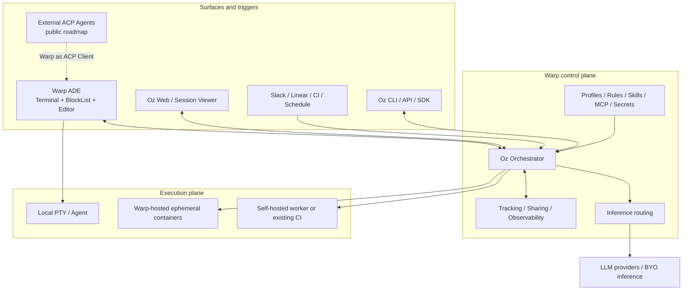

# Warp Comparison and COSH Positioning

[中文版](warp-comparison_zh.md)

## Scope and evidence rule

This comparison uses Warp's public product and architecture documentation. It
describes externally documented logical boundaries, not an inferred private
backend topology. Warp is a shipped product; the COSH Phase 0-2 side is a
target architecture whose implementation status is governed by this planning
set's acceptance reports.

## Warp's public logical architecture

Warp distinguishes its Agentic Development Environment from Oz, the
orchestration platform. Public enterprise documentation also separates a
Warp-hosted control plane from hosted or customer-hosted execution.



Publicly documented properties include:

- Warp is the day-to-day terminal and coding surface; Oz supplies local/cloud
  Agent orchestration, triggers, environments, hosts, API/SDK, and visibility.
- Cloud automation creates a tracked task, prepares a Docker environment,
  executes the Agent, publishes results, and destroys the ephemeral container.
- Enterprise self-hosted execution keeps code, commands, artifacts, secrets,
  and execution logs on customer infrastructure while orchestration,
  observability, inference routing, and enabled session sharing traverse the
  Warp control plane.
- The open client uses an ordered typed `BlockList`: terminal command/output
  blocks and rich Agent content share one virtualized stream.
- Warp's public ACP roadmap makes Warp an ACP Client so external Agent harnesses
  can use its native Agent UX and enable fully client-side local-model paths.
  The planning set does not treat that roadmap item as a completed production
  capability without a released implementation and conformance evidence.

Sources:

- [Warp Oz Platform](https://docs.warp.dev/platform/overview/)
- [Warp architecture and deployment](https://docs.warp.dev/enterprise/enterprise-features/architecture-and-deployment)
- [Warp environments](https://docs.warp.dev/platform/environments/)
- [Warp Block Model](https://www.warp.dev/blog/block-model-behind-warps-agentic-development-environment)
- [Warp ACP roadmap](https://github.com/warpdotdev/warp/issues/9233)
- [Warp bring-your-own-inference roadmap](https://www.warp.dev/blog/bring-your-own-inference-to-warp)

## Same-layer comparison

| Dimension | Warp / Oz | COSH Phase 0-2 target |
| --- | --- | --- |
| Product center | Agentic Development Environment plus programmable Agent orchestration | Local-first Agent OS gateway plus governed GuestOS execution |
| Primary workload | Software development, repository automation, cloud software workflows | Shell and OS operations, GuestOS/ECS diagnosis and controlled remediation |
| Main interaction model | Warp Terminal/ADE, Oz Web, integrations, CLI/API/SDK | Equal Shell, Web, CLI/API, and future channel attachments |
| Durable control unit | Oz Agent run/task and shared session transcript | COSH `Task` aggregate, independent `Run`, approval, delivery, and execution identities |
| Client UI model | Typed terminal and rich-content blocks in one `BlockList` | Channel-neutral task projections rendered as terminal cards, Web views, or channel messages |
| Runtime abstraction | Warp/Oz Agent and third-party harness direction | `AgentRuntimePort` with `CoshCoreBridge`, ACP v1 Client Bridge, and local model adapter |
| Execution environment | Local PTY; hosted ephemeral Docker; self-hosted worker or existing orchestrator | Local PTY; typed OS operators; registered GuestOS/ECS targets; later isolated remote connectors |
| Agent tool access | Terminal, files, Skills, MCP, profiles, rules, environment and platform policy | Every Shell, operator, Skill, MCP, and ACP tool intent passes through Capability Broker |
| Approval | Product permission controls and interactive approvals | Durable Task transition followed by target-bound permit and auditable execution |
| Cross-device | Cloud-backed Oz dashboard, sharing, Web/mobile monitoring | Gateway projections, cursored replay, Outbox delivery, explicit attachment leases |
| Offline/local inference | Fully client-side local harness and ACP path publicly described as planned | A first-class future Runtime adapter; Phase 0-2 preserves the boundary but does not claim the model runtime exists |
| ACP role | Planned client-side bridge from external harness to Warp UX | Client-side bridge from external Agent to COSH Task and OS governance |
| Remote protocol | Oz APIs and platform connectivity | COSH Gateway API; remote ACP is outside Phase 0-2 |
| Security boundary | Central platform policy with selectable execution placement | Installation identity, target grants, capability decision, permit, audit, checkpoint/evidence references |

## The important architectural difference

Warp's strongest architectural asset is the integrated developer surface: its
Block model lets humans and Agents work in one terminal/editor stream, while
Oz adds programmable orchestration and cloud visibility. Reproducing panes,
blocks, cloud run dashboards, or a generic coding Agent would place COSH in a
mature competitor's center of gravity.

COSH should instead make the OS side effect the center of its architecture:

```text
user or Agent intent
    -> durable Task decision
    -> identity and target grants
    -> capability evaluation / approval
    -> target-bound permit
    -> typed or interactive execution
    -> audit, checkpoint/evidence, and result projection
```

The terminal remains valuable, but it becomes one privileged attachment and
one possible execution host. DingTalk, Feishu, Web, CLI, and automation can
submit or observe the same Task without acquiring terminal or root authority.

## What COSH should learn from Warp

- Separate the product surface from the orchestration plane.
- Treat local and background execution as different placements of one tracked
  work object.
- Build UI from typed events and projections rather than scraping plain text.
- Make detach, reattach, transcript visibility, and intervention normal
  lifecycle behavior.
- Keep environments, Agent behavior, host placement, and per-run context as
  distinct configuration concepts.
- Expose programmatic APIs early enough that chat integrations are adapters,
  not special execution paths.

## What COSH should not copy in Phase 0-2

- A new terminal renderer or BlockList implementation.
- Pane, tab, or process-manager feature parity.
- A generic cloud coding-Agent control plane before local durability and OS
  governance work.
- A Warp-compatible private protocol inferred from UI behavior.
- ACP as a substitute for Task storage, channel delivery, identity, or policy.
- Remote ACP transport before the standard and COSH security ADR are stable.

## ACP strategic value in this comparison

Both products benefit from acting as ACP Clients because the user-facing
surface no longer needs a custom integration for every Agent harness. For COSH,
that interoperability has additional leverage: the same external Agent can be
placed behind COSH approvals, deterministic operators, target grants, audit,
and weak-network recovery.

ACP is therefore foundational at the Runtime boundary, but it is not the
foundation of the whole COSH system. The Task Plane and Capability Broker are
the durable and security foundations; ACP is the replaceability boundary.

## Positioning statement

> COSH is a local-first Agent OS gateway for individual developers, small
> teams, and GuestOS fleets. It makes Agent runtimes replaceable through ACP
> v1 while keeping every OS side effect durable, governed, auditable, and
> recoverable.
