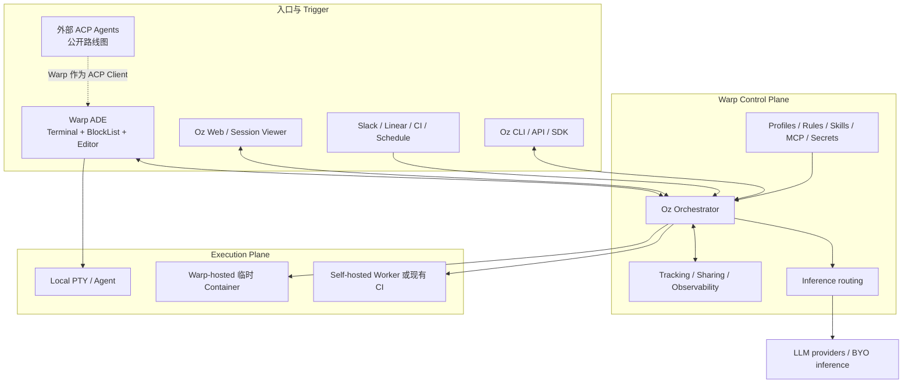

# Warp 对比与 COSH 定位

[English](warp-comparison.md)

## 范围与证据规则

本对比只使用 Warp 公开产品和架构资料，描述外部可确认的逻辑边界，不推断其
未公开的后端拓扑。Warp 是已交付产品；COSH Phase 0-2 是目标架构，实现状态以
本规划集的验收报告为准。

## Warp 公开逻辑架构

Warp 把 Agentic Development Environment 与编排平台 Oz 分开。公开企业文档
还把 Warp-hosted Control Plane 与托管或客户自建 Execution Plane 分开。



公开资料可以确认以下性质：

- Warp 是日常 Terminal 与 Coding Surface；Oz 提供本地/云端 Agent 编排、Trigger、
  Environment、Host、API/SDK 和可见性。
- Cloud Automation 创建 tracked task、准备 Docker environment、执行 Agent、发布
  结果，最后销毁临时 container。
- Enterprise self-hosted execution 把代码、命令、artifact、secret 和 execution log
  留在客户环境，但 orchestration、observability、inference routing 和已启用的
  session sharing 仍经过 Warp Control Plane。
- 开源客户端采用有序 typed `BlockList`，Terminal command/output block 与 Agent
  rich content 共用一条虚拟化 stream。
- Warp 公开 ACP 路线是让 Warp 充当 ACP Client，使外部 Agent harness 使用原生
  Agent UX，并打开全客户端端侧模型路径。没有发布实现与 conformance 证据时，
  本规划集不把这条路线图能力视为已稳定交付。

资料包括：

- [Warp Oz Platform](https://docs.warp.dev/platform/overview/)
- [Warp 架构与部署](https://docs.warp.dev/enterprise/enterprise-features/architecture-and-deployment)
- [Warp Environments](https://docs.warp.dev/platform/environments/)
- [Warp Block Model](https://www.warp.dev/blog/block-model-behind-warps-agentic-development-environment)
- [Warp ACP 路线图](https://github.com/warpdotdev/warp/issues/9233)
- [Warp BYO Inference 路线](https://www.warp.dev/blog/bring-your-own-inference-to-warp)

## 同层比较

| 维度 | Warp / Oz | COSH Phase 0-2 目标 |
| --- | --- | --- |
| 产品中心 | Agentic Development Environment 加可编程 Agent Orchestration | 本地优先 Agent OS Gateway 加受治理的 GuestOS Execution |
| 核心工作负载 | 软件开发、Repository Automation、Cloud Software Workflow | Shell 与 OS 运维、GuestOS/ECS 诊断和受控修复 |
| 主要交互模型 | Warp Terminal/ADE、Oz Web、Integration、CLI/API/SDK | 同级 Shell、Web、CLI/API 和未来 Channel Attachment |
| 持久控制单元 | Oz Agent run/task 与 shared session transcript | COSH `Task` aggregate，独立 `Run`、approval、delivery 和 execution identity |
| Client UI model | 单一 `BlockList` 中的 typed Terminal 与 Rich Content Block | Channel-neutral Task Projection，渲染成 Terminal card、Web view 或 Channel message |
| Runtime 抽象 | Warp/Oz Agent 与第三方 harness 方向 | `AgentRuntimePort` 后接 `CoshCoreBridge`、ACP v1 Client Bridge 与端侧模型 Adapter |
| Execution Environment | Local PTY、托管临时 Docker、自托管 Worker 或现有 Orchestrator | Local PTY、Typed OS Operator、已注册 GuestOS/ECS Target，后续隔离 Remote Connector |
| Agent Tool Access | Terminal、Files、Skills、MCP、Profile、Rule、Environment 和平台 Policy | 每个 Shell、Operator、Skill、MCP 和 ACP Tool Intent 都通过 Capability Broker |
| Approval | 产品权限控制与交互审批 | 持久 Task transition，随后签发 target-bound permit 并审计执行 |
| Cross-device | 云端 Oz Dashboard、Sharing、Web/Mobile Monitoring | Gateway Projection、Cursor Replay、Outbox Delivery、显式 Attachment Lease |
| Offline/Local Inference | 公开规划全客户端 Local Harness 与 ACP 路径 | 一等未来 Runtime Adapter；Phase 0-2 保留边界但不声称模型 Runtime 已存在 |
| ACP 作用 | 计划把外部 Harness 接进 Warp UX 的客户端 Bridge | 把外部 Agent 接进 COSH Task 与 OS Governance 的客户端 Bridge |
| Remote Protocol | Oz API 与平台连接 | COSH Gateway API；Remote ACP 不属于 Phase 0-2 |
| Security Boundary | 集中平台 Policy 与可选 Execution Placement | Installation Identity、Target Grant、Capability Decision、Permit、Audit 与 Checkpoint/Evidence Reference |

## 最重要的架构差异

Warp 最强的架构资产是集成开发界面。Block Model 让人和 Agent 在同一条
Terminal/Editor stream 中工作，Oz 再增加可编程编排和云端可见性。复制 pane、
block、cloud run dashboard 或通用 coding Agent，会让 COSH 进入成熟竞品的主场。

COSH 应把 OS 副作用放到架构中心：

```text
用户或 Agent intent
    -> 持久 Task decision
    -> Identity 与 Target Grant
    -> Capability Evaluation / Approval
    -> Target-bound Permit
    -> Typed 或 Interactive Execution
    -> Audit、Checkpoint/Evidence 和 Result Projection
```

Terminal 仍然重要，但它成为一个特权 Attachment 和一种 Execution Host。钉钉、
飞书、Web、CLI 与 Automation 可以提交或观察同一个 Task，却不会自动取得 Terminal
或 root 权限。

## COSH 应向 Warp 学习什么

- 把 Product Surface 与 Orchestration Plane 分开。
- 把 Local 与 Background Execution 视为同一个 tracked work object 的不同 placement。
- UI 从 typed event 和 projection 构建，而不是抓取纯文本。
- 把 detach、reattach、transcript visibility 和 intervention 变成普通生命周期能力。
- Environment、Agent Behavior、Host Placement 和 Per-run Context 使用不同配置概念。
- 尽早开放 programmatic API，使 Chat Integration 成为 Adapter 而不是特殊执行路径。

## Phase 0-2 不应复制什么

- 新 Terminal Renderer 或 BlockList 实现。
- Pane、Tab 或 Process Manager 功能对齐。
- 在本地持久性与 OS Governance 前先做通用 Cloud Coding-Agent Control Plane。
- 根据 UI 行为推断并兼容 Warp 私有协议。
- 用 ACP 替代 Task Storage、Channel Delivery、Identity 或 Policy。
- 在标准和 COSH Security ADR 稳定前使用 Remote ACP Transport。

## 对比中的 ACP 战略价值

两类产品都能从 ACP Client 获益，因为用户界面不再需要为每个 Agent harness 写一套
定制集成。对 COSH 来说还有额外价值，同一个外部 Agent 可以进入 COSH Approval、
确定性 Operator、Target Grant、Audit 和弱网恢复边界。

因此 ACP 是 Runtime Boundary 的基础，却不是整个 COSH 系统的基础。Task Plane 与
Capability Broker 分别提供持久性和安全基础，ACP 提供可替换性边界。

## 定位表述

> COSH 是面向个人开发者、小团队和 GuestOS Fleet 的本地优先 Agent OS Gateway。
> 它通过 ACP v1 让 Agent Runtime 可替换，同时保证每次 OS 副作用持久、受治理、
> 可审计、可恢复。
